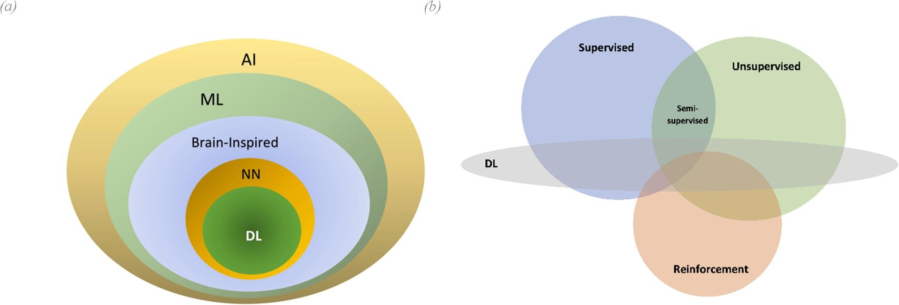

**Machine Learning (ML):** A way of achieving AI, where the machine learns from data to make predictions or decisions without being explicitly programmed.

In programming, we write **rules** to solve a problem. In machine learning, we provide the machine with **data** and let it **learn** the rules from the data.

Machine learning is a subfield of artificial intelligence (AI).

Source: [Augmenting organizational decision-making with deep learning algorithms: Principles, promises, and challenges](https://www.sciencedirect.com/science/article/pii/S0148296320306512)

## Machine Learning Development Process
Machine learning development process is an iterative workflow of steps. See more details in the [Machine Learning Development Process](machine_learning_development_process.md).

## Types of Machine Learning
Machine learning can be broadly categorized into several types based on the nature of the data and the learning process. The main types of machine learning are:

- Supervised Learning
- Unsupervised Learning
- Semi-Supervised Learning
- Self-supervised Learning
- Reinforcement Learning (RL)
- Transfer Learning

### Supervised Learning
Supervised learning is a type of machine learning where the model is trained on a labeled dataset. This means that the input data is paired with the correct output. The model learns (optimizes) to make predictions based on the input data by comparing its predictions with the correct output during the training process.

**Labeled data**: Data that has pairs of both the input data $X$ and the "correct" output $Y$. These $X$ and $Y$ mappings are used to train the model.

$Input(X) \rightarrow Output(Y)$

Supervised learning is when we provide our learning algorithm with examples (labeled data), where each example includes the correct answer $Y$ to learn from.

The model is trained on this labeled data to make predictions on new, unseen data. During the training process, the model optimizes itself by comparing its predictions with the correct output.

| Input (X) | Output (Y) | Application |
| --- | --- | --- |
| House features (e.g., size, location) | Price | House price prediction |
| Image | Label (e.g., cat, dog) | Image classification |
| Email | Spam or not spam | Email spam detection |
| Text | Sentiment (e.g., positive, negative) | Sentiment analysis |
| Audio | Transcription | Speech recognition |
| Stock prices | Future price | Stock price prediction |

A supervised learning algorithm typically consists of three key components:
- **Model (hypothesis function)**: A function that maps the input features to the predicted target value.
- **Cost Function**: A function that measures how well the model is performing by comparing the predicted versus actual target values.
- **Optimization Algorithm**: A method to minimize the cost function (the error between the predicted and actual target values) by adjusting the model parameters.

**Example of Tasks:** 
- [Regression](regression.md): Predicting a number (continuous value) such as house prices, stock prices, etc.
- [Classification](classification.md) : Predicting discrete classes or categories from a limited set of possible values, such as cat or dog, or numeric labels like 0, 1, 2, etc. (e.g., spam vs. non-spam emails, speech recognition, or cat vs. dog in an image).

> Regression models predict a number from infinitely many possible values, while classification models predict a category from a finite set of categories (or classes).

**Main supervised learning algorithms:** 
- [Regression](regression.md): Predict a number.
- [Classification](classification.md): Predict a category.
- [K-Nearest Neighbors (KNN)](knn.md)
- [Decision Forests, Random Forests, and Gradient Boosted Decision Trees](decision_forests.md)
- Neural Networks (when used with labeled data)

### Unsupervised Learning
Unsupervised learning is a type of machine learning where the model is trained on an **unlabeled** dataset. This means the model learns to make predictions based on the input data without being explicitly told what the correct output is. The model learns to identify patterns and structures in the data.

Unlike the supervised learnign where the training data comes with both $input(X)$ and $output(Y)$, in unsupervised learning, the data comes with only $input(X)$. The model learns to find structures in the data without being explicitly told what to look for.

**Main unsupervised learning algorithms:** 
- [Clustering](clustering.md): Grouping similar data points together, into clusters. e.g. Google News which groups similar news articles together. This happens without any supervision or labeled data. The algorithm learns to group similar data points together based on their features. Another example is customer segmentation in marketing.
- **Anomaly detection:** Identifying rare items, events, or observations that raise suspicions by differing significantly from the majority of the data. e.g. fraud detection.
- **Dimensionality reduction:** Compress data using fewer numbers.

### Semi-Supervised Learning
This is a hybrid of supervised and unsupervised learning, where the model is trained on a small amount of labeled data and a large amount of unlabeled data. Semi-supervised learning is useful when labeling data is expensive or time-consuming, but there is a large amount of unlabeled data available.

**Example tasks:** 
- Image classification with limited labeled images.
- Text categorization with few labeled documents and many unlabeled ones.

### Self-supervised Learning
Self-supervised learning is a specific form of unsupervised learning where the model generates its own supervisory signals from the data itself. This is a common approach in modern neural networks, particularly in natural language processing (NLP) and computer vision.

**Example tasks:** 
- LLMs (Large Language Models) are typically trained on large-scale corpora of text. For each position in the text sequence, the model predicts the next token (e.g., a word, subword, or character). During training, the "label" for each predicted token is simply the actual next token from the input sequence itself. Thus, the model is effectively trained using labels derived directly from its input data, eliminating the need for manually predefined or externally provided labels.
- Word embeddings (e.g., models like Word2Vec or BERT) where relationships between words are learned from large corpora.
- Learning image representations by predicting missing parts of images or predicting future frames in a video.

### Transfer Learning
Though not a traditional type of learning, transfer learning refers to using a pre-trained model on one task and adapting it to a different but related task. This is especially useful when there is not enough labeled data for the new task, but the knowledge gained from a different domain can be reused.

For example, we can use a neural network which is trained on a large dataset (of images of objects) with output layer for classifying let's say 1000 classes. These models are available in the form of **pre-trained** models in the open-source community. Then we can reuse this model by _further training_ on our specific task with a smaller dataset.

**Fine-tuning (Further training)** 
This further training process is called **fine-tuning**. This is usually done by keeping all the layers of pre-trianed model except the last one (output layer) and replace it with a new output layer for our specific task (e.g., classifying 10 classes of hand written digit images). Then we can train (e.g. using [gradient descent](gradient_descent_machine_learning.md)) the model on our specific task with a smaller dataset.

It can be done in multiple ways. We can either freeze the weights of the pre-trained model and only train the new output layer, or we can unfreeze some (or all) of the layers of the pre-trained model and train them along with the new output layer.
- Train the output layer only. This works well when the new task is similar to the original task and our dataset is small.
- Train the output layer and some (or all) of the layers of the pre-trained model. This works well when we have a larger datasets. This larger dataset is still much smaller than the original dataset used to train the pre-trained model, and this is the benefit of transfer learning.

Sometimes we can go further and replace (change the architecture and reset the parameters of) the last few layers of the pre-trained model with new layers for our specific task. This is called **feature extraction**. In this case, we freeze the weights of the pre-trained model and only train the new layers.

> **Notes:**
>
> The pre-trained model data types should be similar to the new task data types (e.g. images, audio, text, etc). For example, if we are using a pre-trained model for image classification, we should use it for image classification tasks, not for text classification tasks.
>
> Fine-tuning is specially useful when we have a small dataset for the new task. Let's say if we have a small dataset of 1000 images for our specific task, we can use a pre-trained model which is trained on a large dataset of millions of images. Then we can leverage the knowledge gained from the large dataset in the neural network layers of the pre-trained model and use it for our specific task.

**Neural Networks learns from Low-level to High-level Features** 
Transfer learning can be applied on any type of machine learning model, but it is most commonly used (and most effective) in deep learning models (neural networks). This is because deep learning models have a large number of parameters and layers, which learn complex features from low-level to high-level features layer by layer.

As discussed in [neural networks](neural_networks_overview.md#each-layer-learns-from-the-previous-layer), early layers of a neural network learn **low-level features** (e.g., edges, colors, textures) and as we go further in the network, the layers learn **higher-level features** (e.g., shapes, objects, etc.). So, if we are using a pre-trained model which is trained on a large dataset of objects, we can reuse the many of the layers (up to the last few layers) where the model learned transferable features which can be applied for classification of many things, animals, plants, handwritten digits, etc.

**Pre-training and Further Training** 
Pre-training is the process of training a model (from scratch) on a large dataset to learn general features. Further training (or fine-tuning) is the process of taking a pre-trained model and training it on a smaller, task-specific dataset to adapt it to a specific task.

**Reuse Pre-trained Model Parameters** 
When we say taking the pre-trained model and training it on a smaller dataset, we mean we initialize the model parameters (weights and biases) with the pre-trained model parameters values and then train the model on the new dataset from that point.

**Example tasks:** 
- Using a model trained on ImageNet to classify medical images with a smaller labeled dataset.
- Fine-tuning a language model like GPT for specific text classification tasks.

> Transfer learning is a powerful technique that allows us to leverage the knowledge gained from one task to improve performance on another related task. It is particularly useful when we have limited labeled data for the new task. It also helps to reduce the training time and computational resources required for training a model from scratch. Fine-tuning a pre-trained model (transfer learning) is often a good starting point for many machine learning tasks, especially in deep learning.

## Neural Networks
**Neural Networks (NNs)** are a type of machine learning where interconnected nodes (or "neurons") are layered to create an **artificial neural network**. This can be shallow (with one hidden layer) or deep (with multiple hidden layers). This [Neural Network Overview](/nn_overview.md) covers the basics.

Neural networks and deep learning can be used for all types of learning: supervised learning (e.g., image recognition, speech recognition, and language translation), unsupervised learning (e.g., clustering, dimensionality reduction, generative models), reinforcement learning (e.g., game playing and robotics), and semi-supervised learning.

**Deep neural networks**: These networks have more than two layers of nodes between the input and output layers, unlike shallow networks that have at most one layer between inputs and outputs.

Deep learning is a subfield of machine learning that employs algorithms inspired by the structure and function of the brain's neural networks. While it is correct to say that deep learning involves the use of neural networks, it specifically refers to networks with multiple layers.

On the other hand, there are algorithms with a simplified structure, typically having one or no hidden layers, called _shallow networks_. Examples of shallow learning methods include Linear Regression, Logistic Regression, Perceptron, Radial Basis Function Network (RBFN), and Single-Layer Autoencoder.

> [Shallow Learning](https://www.sciencedirect.com/science/article/pii/S2666165921000041) refers to the majority of machine learning models proposed prior to 2006, including shallow neural networks (neural networks with only one or no hidden layers).

### Deep Learning
Deep learning is based on **deep** neural networks. As discussed, not all neural networks are used for deep learning. The neural networks used in deep learning are **deep** neural networks, which have multiple layers of neurons. These include:

- **Multilayer Perceptrons (MLPs):** The simplest form of a neural network with multiple layers.
- **Convolutional Neural Networks (CNNs):** Designed to process grid-like data such as images, applying convolutional layers that pre-process data for the layers that follow.
- **Recurrent Neural Networks (RNNs):** Designed to work with sequence data, with neurons that have feedback connections, effectively forming a memory over the sequence.
- **Transformer Networks:** Designed to work with sequence data, but unlike RNNs, they allow for parallel computation and can directly attend to any point in the sequence.

While other machine learning algorithms can create models with multiple layers (like decision trees and support vector machines), the term "deep learning" is almost exclusively used to refer to techniques involving deep neural networks.

## Math for AI/ML
Although you don't need to be a math expert to work in the field of AI/ML, a solid understanding of the underlying math concepts is essential. The followings are the key concepts you should be familiar with:

**College Calculus and Linear Algebra**: You should be comfortable with (multivariable) derivatives and understand matrix/vector notation and operations.

**Probability Theory**: You should be familiar with basic probability distributions (e.g., continuous, Gaussian, Bernoulli) and be able to define concepts for both continuous and discrete random variables, including expectation, independence, probability distribution functions, and cumulative distribution functions.

See [Math for AI/ML](https://pooya.io/math/) section.

## Other Resources
- [AI/ML Resources](aiml_resources.md)
- [Machine Learning Workflow and Process](aiml_overview_workflow.md).
- [Glossary](glossary.md)
