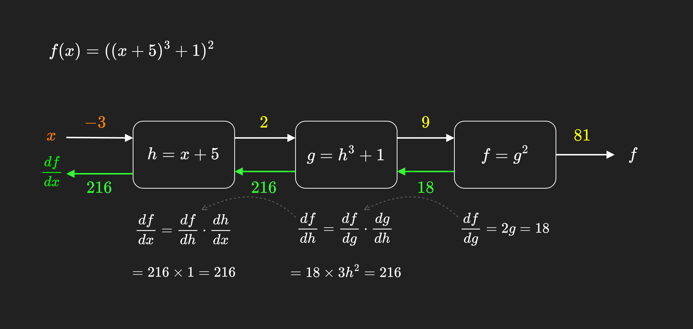
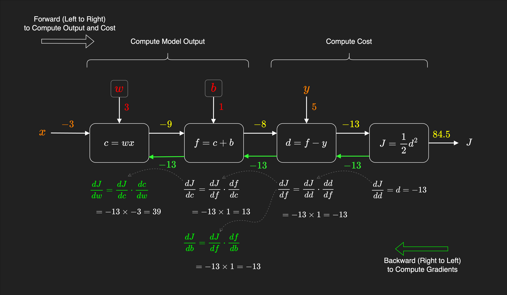

Computational Graph is a directed acyclic graph (DAG) that represents the building blocks of a model function in deep learning models. Deep learning models are complex functions that are composed of many smaller functions (linear transformations, and activation functions) and parameters.

Computational Graph is a way to efficiently break down this complex function into smaller building block functions and compute them efficiently. It is used to compute the forward propagation (Left to Right) to compute the output of the model function and the cost function, and the backward propagation (Right to Left) to compute the gradients (derivatives) of the loss function with respect to each parameter in the model.

- In **forward propagation (Left to Right)**, we start from the root fo the graph, the input data is passed through each building block function in the graph, and the output of each function is computed. Then we use the output of each function as input to the next function until we reach the end of the graph.

- In **backward propagation (Right to Left)**, we go the opposite direction, from the end of the graph backwards to the beginning. We compute the partial derivatives (gradients) of the loss function with respect to the output of each function in the graph using the chain rule. Then we keep going backward to compute the gradients of the cost function with respect to the all parameters (weights and biases) in the model.

> Note: In the backpropogation, we compute the gradient of the **loss** function with respect to each parameter for each sample in the dataset, then we average the gradients to find the **mean gradient** for that parameter over all samples in the dataset. So, in this way we compute the gradient of the **cost** function (average loss) with respect to each parameter. More on this in [Neural Networks - Backpropagation](../ai/neural_networks_backpropagation.md).

## Simple Graph with One Parameter
Let's consider composite function $f(x)$ as follows:

$$f(x) = ((x + 5)^3+1)^2$$

And let's compute our function $f(x)$ at the point $x = -3$.

We can represent this composit function as a computational graph as follows:

### Step 1: Forward Propagation to Compute the output (Left to Right)
In order to compute the output of the function $f(x)$, we need to compute the output of each function in the graph from **Left to Right**.

The input to the function:
$$x = -3$$

The building blocks of the function $f(x)$ are:
$$h= x + 5 = 2$$
$$g = h^3 + 1 = 9$$
$$f = g^2 = 81$$

So, the output of the function $f(x)$ when $x = -3$ is $81$.
$$f(x) = 81 \quad \text{at} \quad x = -3$$

### Step 2: Backward Propagation to Compute the Gradients (Right to Left)
Now let's compute the gradients (derivatives) of the function $f(x)$ with respect to $x$ at the same point $x = -3$.

For doing that, now we traverse backward from the end of the graph to the beginning (from right to left) and compute the gradients of each function and work our way back to the input $x$.

For the details of the chain rule for this example, see [here](../math/derivatives.md#simple-example).

The derivative of the function $f(x)$ with respect to $g$ at the point $x = -3$. We already calculated in the forward propagation that at this point $g = 9$, so using chain rule:

$$\frac{df}{dg} = 2g = 2 \times 9 = 18$$

The derivative of the function $f$ with respect to $h$ at the point $x = -3$. We know at this point $h = 2$, so using chain rule:

$$\frac{df}{dh} = \frac{df}{dg} \cdot \frac{dg}{dh} = 18 \times 3h^2 = 18 \times 3 \times 4 = 216$$

The derivative of the function $f$ with respect to $x$ at the point $x = -3$. So, using chain rule:

$$\frac{df}{dx} = \frac{df}{dh} \cdot \frac{dh}{dx} = 216 \times 1 = 216$$

So, the gradient of the function $f(x)$ with respect to $x$ at the point $x = -3$ is $216$.

$$\frac{df}{dx} = 216 \quad \text{at} \quad x = -3$$

As you can see, in calculating each derivative, we use the gradient of the previous function (from right to left) to compute the gradient of the next function. This is the power of the computational graph in computing the gradients of composite functions efficiently specially in deep learning models.

See the [Implementation of this example]( https://github.com/pooyavahidi/examples/tree/main/ai/computational_graph.ipynb) using PyTorch.

## Graph with Multiple Parameters
In the field of machine learning, we have models with many parameters (weights and biases) that need to be optimized. In this case, the computational graph becomes more complex and the gradients need to be computed with respect to all parameters in the model.

Let's see this in a simple example of a linear regression model with two parameters $w$ and $b$.

The model function for [Linear Regression]() with only one feature $x$ is:

$$f_{w,b}(x) = wx + b$$

The [Cost Function]() for Linear Regression is the Mean Squared Error (MSE):

$$J(w,b) = \frac{1}{2m} \sum_{i=1}^{m} (f_{w,b}(x_i) - y_i)^2$$

Where:
- $m$ is the number of samples in the dataset
- $x_i$ is the feature of the $i$-th sample.
- $y_i$ is the target value of the $i$-th sample.

Let's in our example consider a dataset with only one sample. So, the cost function becomes:

$$J(w,b) =\frac{1}{2} (f_{w,b}(x) - y)^2$$

Let's compute one round of forward prop, cost, and backward prop

Let's consider we have sample data of:

$$x = -3 \quad \text{and} \quad y = 5$$

And we have initial parameters:

$$w = 3 \quad \text{and} \quad b = 1$$

### Step 1: Forward Propagation to Compute the Output (Left to Right)

We break down the model to its building block functions:

$$c = wx = 3 \times -3 = -9$$
$$f = c + b = -9 + 1 = -8$$

So, the output of the model is:

$$f_{w,b}(x) = 8$$

### Step 2: Compute the Cost
We use the output of the model computed through the forward propagation to compute the cost function.

$$d = f - y = -8 - 5 = -13$$
$$J = \frac{1}{2}d^2 = \frac{1}{2} \times 13^2 = 84.5$$

So, the cost function is:
$$J(w,b) = 84.5$$

### Step 3: Backward Propagation to Compute the Gradients (Right to Left)
Now we reached to the end of the graph, at this point we reverse our direction and start going backward to compute the partial derivatives of the cost function with respect to the parameters $w$ and $b$ using the chain rule.

We go back **step by step** to reach the parameters $w$ and $b$.

$$\frac{dJ}{dd} = d = -13$$
$$\frac{dJ}{df} = \frac{dJ}{dd} \cdot \frac{dd}{df} = -13 \times 1 = -13$$

$$\frac{dJ}{dc} = \frac{dJ}{df} \cdot \frac{df}{dc} = -13 \times 1 = -13$$

Now we reached to the parameters $w$ and $b$:

$$\frac{dJ}{db} = \frac{dJ}{df} \cdot \frac{df}{db} = -13 \times 1 = -13$$

And

$$\frac{dJ}{dw} = \frac{dJ}{dc} \cdot \frac{dc}{dw} = -13 \times -3 = 39$$

So, the gradients of the cost function with respect to the parameters $w$ and $b$ are:

$$\frac{dJ}{dw} = 39 \quad \text{and} \quad \frac{dJ}{db} = -13$$

See the [Implementation of this example]( https://github.com/pooyavahidi/examples/tree/main/ai/computational_graph.ipynb) using PyTorch.

## Automatic Differentiation (autograd)
Creating and computing a computational graph for a deep learning model is a powerful but complex and effortful task. Deep learning frameworks such as TensorFlow and PyTorch provide **automatic differentiation** (also known as **autograd** or **autodiff**) feature that creates the computational graph and computes the gradients of each node in the graph automatically.

## Resources
- [gentle introduction to autograd in PyTorch](https://pytorch.org/tutorials/beginner/blitz/autograd_tutorial.html).

- [Automatic Differentiation with `torch.autograd`](https://pytorch.org/tutorials/beginner/basics/autogradqs_tutorial.html)
- [Video: PyTorch Autograd Explained](https://www.youtube.com/watch?v=MswxJw-8PvE)
