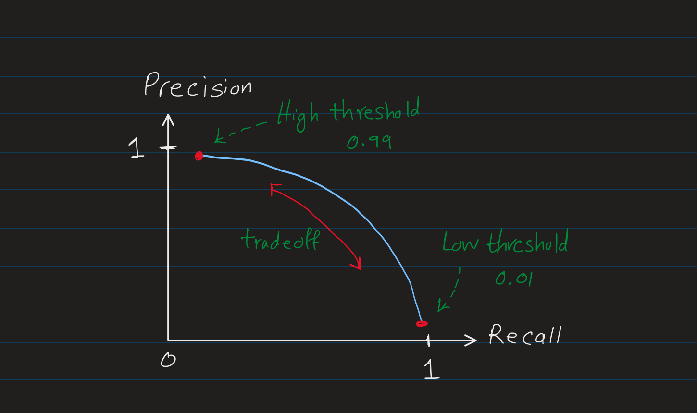

Evaluation metrics are used to assess the performance of a trained model on _valiation sets_ (also called _cross validation sets_). See [cross-validation](cross_validation_machine_learning.md) for more details.

So, at this stage, we have trained one or multiple models using the training set, and now we want to evaluate the model performance using the validation set. We choose the right evaluation metrics based on the type of the model and the task.


## Regression Metrics
The common metrics for regression tasks include:
- **Mean Squared Error (MSE)**: Measures the average squared difference between predicted and actual values.
- **Mean Absolute Error (MAE)**: Measures the average absolute difference between predicted and actual values.
- **Root Mean Squared Error (RMSE)**: The square root of MSE, providing an error metric in the same units as the target variable.
- **R-squared (R^2)**: Represents the proportion of variance in the target variable that can be explained by the model. A higher R^2 indicates a better fit.

**Mean Squared Error (MSE)**<br>
This metric is exactly what we used in the cost function of the linear regression model during the training process. So, it means we evaluate the model performance using the same metric, but on the _cross validation set_.

$$J_{cv}(\theta) = \frac{1}{m} \sum_{i=1}^{m} (f_\theta({x_{cv}}^{(i)}) - {y_{cv}}^{(i)})^2$$

Where:
- $J_{cv}(\theta)$ is the cost function on the cross-validation set on the model parameters $\theta$.
- $m$ is the number of samples in the cross-validation set.
- $f_\theta({x_{cv}}^{(i)})$ is the predicted value of the model on the cross-validation set.
- ${y_{cv}}^{(i)}$ is the actual value of the model on the cross-validation set.

> Note: In evaluating the model performance using error metrics, we don't use the regularization term. The regularization term is used to prevent overfitting during the training process, but when we evaluate the model performance, we only use the cost function (e.g. MSE) without the regularization term.


## Classification Metrics
Accuracy, Precision, Recall, F1 Score, ROC-AUC

> **Cost-Sensitive Evaluation:** In some applications, the cost of false positives and false negatives can be different. Adjust your evaluation metrics to reflect these costs.

### Precision and Recall
In classification tasks, especially with imbalanced (skewed) datasets, accuracy alone may not be sufficient.

**Imbalanced Datasets**<br>
In many real-world scenarios, datasets such as fraud detection, medical diagnosis, and rare event prediction are often imbalanced. Imbalanced means that the number of samples in one class is much larger than the other class, for example, negative class (y=0) dominates.


For example, we have a binary classification task which detect a rare disease. Let's say we have a dataset with occurance rate of the disease (y=1) is only 1% in the dataset and 99% of the samples are negative (y=0):

$$
\begin{aligned}
  \begin{cases}
    y = 1 & \text{if the sample has the disease} \\
    y = 0 & \text{if the sample does not have the disease}
  \end{cases}
\end{aligned}
$$

This dataset is a highly imbalanced dataset where (y=0) dominates.

**Naive Model**<br>
If we have a naive model which predicts all samples as negative (y=0), then the accuracy of the model is 99% (as 99% of the samples are negative).

This naive model can be a simple line of code (not even a machine learning algorithm) which outputs negative (y=0) regardless of the input.

```python
def naive_model_predict(x):
    return 0
```
The accuracy of the above model (code) is 99%, as it predicts all samples as negative (y=0), and since 99% of the samples are negative, the model predicts 99% of the samples correctly. So, if our way of evaluating the model performance is just rely on the accuracy, then the above piece of code is a great model with 99% accuracy!

Obviously, if we train a model which is as good as the naive model like above, then it's like we haven't trained any model at all. So, we need to find a better way to evaluate the model performance for classification tasks with imbalanced datasets.

**Problem with Accuracy as Evaluation Metric**<br>
If your model's error rate is suspiciously close to or lower than the occurance rate (like 1% error in above), it suggests the model might just be a slightly improved version of the naive approach - mostly predicting the majority class and missing many positive cases.

In general, in imbalanced datasets, accuracy (error rate) can't tell us if this model performs well or not. For example if we have trained 3 different models, and the validation error of them are 1%, 0.7% and 1.5% respectively, we can't just say that the model with 0.7% is the best one. In fact, the model with 1.5% error rate might be a better one as it catches more positive samples (y=1) than the other two models, in particular in cases where missing cases (false negatives) is typically far more costly than false alarm (false positives).

Therefore, we need to use other metrics such as Percision/Recall to e valuate the model performance of the classification tasks with imbalanced datasets.


**Confusion Matrix**<br>
This is a simple table that summarizes the performance of a classification model. The columns represents the **Actual Classes** and the rows represents the **Predicted Classes**. The confusion matrix is a $n \times n$ matrix, where $n$ is the number of classes.

In the above example, we have a binary classification task (y=0 and y=1), so the confusion matrix is a $2 \times 2$ matrix.

| | Actual 1 | Actual 0 |
|-|-|-|
| **Predicted 1** | True Positive (TP) | False Positive (FP) |
| **Predicted 0** | False Negative (FN) | True Negative (TN) |

Definitions:
- **True Positive (TP)**: The number of samples which model predicted as _Positive_ ($\hat{y}=1$) and they are _Truly_ positive (y=1).
- **False Positive (FP)**: The number of samples which model predicted as _Positive_ ($\hat{y}=1$) but in reality they are _NOT_ positive (y=0). Hence, the word _False_.
- **False Negative (FN)**: The number of samples which model predicted as _Negative_ ($\hat{y}=0$) but in reality they are _NOT_ negative (y=1). Hence, the word _False_.
- **True Negative (TN)**: The number of samples which model predicted as _Negative_ ($\hat{y}=0$) and they are _Truly_ negative (y=0).


**Precision**<br>
Precision tells us, of all the samples that the model predicted as positive $\hat{y}=1$, how many of them are actually positive (y=1).
$$
\text{Precision} = \frac{\text{True Positive}}{\text{Predicted Positive}} $$

Which can be rewritten as:

$$
\text{Precision} = \frac{\text{True Positive}}{\text{True Positive} + \text{False Positive}}
$$

Precision is a fraction of samples that are correctly predicted as positive (TP) over the total number of samples that model predicted as positive, correctly (TP) or incorrectly (FP).

Intuitively, precision means out of all the samples which our model identified as positive (y=1), how many of them are actually positive (y=1).

**Recall (Sensitivity)**<br>
Recall tells us, of all the samples that are actually positive (y=1), how many of them we correctly predicted.

$$\text{Recall} = \frac{\text{True Positive}}{\text{Actual Positive}}$$

Which can be rewritten as:

$$
\text{Recall} = \frac{\text{True Positive}}{\text{True Positive} + \text{False Negative}}
$$

Intuitively, recall means out of all postive samples, how many our model correctly identified.

**Example**<br>
Let's say we have a dataset with 100 samples, and less imbalanced than the previous example, with 15% of the samples are positive (y=1) and 85% of the samples are negative (y=0). The confusion matrix of the model is as follows:

| | Actual 1 | Actual 0 |
|-|-|-|
| **Predicted 1** | 8 (TP) | 2 (FP) |
| **Predicted 0** | 7 (FN) | 83 (TN) |

The output of the model as shown in the confusion matrix is as follows:
- We have $15$ samples which are actually positive (y=1) which our model predicted $8$ of them correctly (TP) and missed $7$ of them (FN).

- We have $85$ samples which are actually negative (y=0) which our model predicted $83$ of them correctly (TN) and $2$ of them incorrectly (FP).

$$\text{Precision} = \frac{TP}{TP + FP} = \frac{8}{8 + 2} = \frac{8}{10} = 0.8$$

It means from all the patients that our model flagged as positive, 80% of them actually have the disease.

$$\text{Recall} = \frac{TP}{TP + FN} = \frac{8}{8 + 7} = \frac{8}{15} \approx 0.53$$

**Intuitions:**<br>
When our model says a patient has a disease, there is a 80% chance that the patient actually has the disease (Precision). Also our model can catch 53% of the patients that actually have the disease, or in other words, our model misses 47% of the patients that actually have the disease (Recall).

> Note: Using Precision and Recall you can catch the Naive model. For example, if we have a naive model which predicts all samples as negative (y=0), then True Positive (TP) and False Positive (FP) are both 0, which means the Recall = 0, and the Precision = $\frac{0}{0}$. So, we can weed out the naive models using Precision and Recall as evaluation metrics.


#### Trade-off between Precision and Recall
In the ideal case, we want to get high Precision and Recall. However, these two metrics are in **tension** with each other.


Let's say our classification model which uses a sigmoid function to predict the probability of $y=1$ or $y=0$, has a threshold of $0.5$ to classify the samples.

$$
\begin{aligned}
  \begin{cases}
    f_\theta(x) \geq 0.5 & (\hat{y}=1) \\
    f_\theta(x) < 0.5 & (\hat{y}=0)
  \end{cases}
\end{aligned}
$$

Let's say we in a scenario which getting false positives (FP) is costly. For example, a medical test which is invasive and expensive with high risk of complications. In this case, we want to minimize the number of false positives (FP), which means when our model predicts a sample as positive (y=1), we want it to be with high confidence. So, we want to increase our Precision.

To increase the Precision, we can increase the threshold, let's say from $0.5$ to $0.7$. Then it means the model predicts the samples with probability greater than $0.7$ as positive (y=1).

$$
\begin{aligned}
  \begin{cases}
    f_\theta(x) \geq 0.7 & (\hat{y}=1) \\
    f_\theta(x) < 0.7 & (\hat{y}=0)
  \end{cases}
\end{aligned}
$$

Then in this case, we have increased the chance of missing the actual positive samples. However, this will decrease the Recall.

$$
\text{Recall} = \frac{\text{True Positive}}{\text{Actual Positive}}
$$

The number of Actual Positive samples (y=1) is fixed, but the number of True Positive (TP) samples is decreased, as our threshold has a more strict condition to classify a sample as positive (y=1). So, the number of True Positive (TP) samples is decreased, which means the Recall is decreased.

In another scenarion, if we are detecting a disease which very dangerous and we want our model to predict positive (y=1) even if it's not very confident about it. Then we want to decrease the threshold, let's say from $0.5$ to $0.3$.


$$
\begin{aligned}
  \begin{cases}
    f_\theta(x) \geq 0.3 & (\hat{y}=1) \\
    f_\theta(x) < 0.3 & (\hat{y}=0)
  \end{cases}
\end{aligned}
$$

Then in this case, we have decreased the chance of missing the actual positive samples. However, lowering the threshold means that we are more likely to classify a sample as positive (y=1) even if it's not very confident about it. So, we along with the True Positive (TP) predictions, we inevitably drag in some False Positive (FP) predictions as well. Hence, decrease in Precision.


**Precision-Recall Curve**<br>
So, as we increase the threshold, the Precision increases but the Recall decreases. Similarly, if we decrease the threshold, the Recall increases but the Precision decreases (i.e. we detect more positive samples, but many of them are not actually positive), hence the **tension** between Precision and Recall. See the following curve:




Raising your score-threshold (making the classifier more **picky** about what counts as positive) typically increases precision (fewer false positives) but decreases recall (more false negatives).


- High precision: few healthy people get falsely alarmed (low FP).
- High recall: few sick people go undetected (low FN).

**Choosing the Right Threshold**<br>
In many cases, we choose the threshold based on domain knowledge, the requirements of the task, and the cost of false positives and false negatives.

- If false positives are very costly (e.g. sending spam alerts to doctors), you favor high precision.

- If false negatives are very costly (e.g. missing a cancer diagnosis), you favor high recall.

For example, in a rare-disease setting you often care more about **recall** (so you don’t miss true cases), but you must also balance it against precision (to avoid overwhelming follow-up tests with too many false positives). So, in this case, the lower threshold is preferred.

However, if we don't have a strong preference for either precision or recall, we can use the **F1 Score** to find a balance between the two.

#### F1 score
F1 score is the harmonic mean of Precision and Recall. It is a single score that balances both precision and recall in one number.

Let's say we have trained three different models, and the Precision and Recall of them are as follows:
| Model | Precision (P) | Recall (R) |
|-|-|-|
| Model 1 | 0.4 | 0.55 |
| Model 2 | 0.1 | 0.8 |
| Model 3 | 0.01 | 0.99 |


The formula for F1 Score is:
$$

F_1 = \frac{2}{\frac{1}{Precision} + \frac{1}{Recall}} = \frac{2PR}{P + R}
$$

F1 score combines these two numbers into a single score with emphasize on the lower of the two. Looking at the above formula, as either precision or recall approaches zero, the denominator approaches infinity, and thus the F1 score approaches zero. This means that if either precision or recall is very low, the F1 score will also be very low.

> **F1 Score** (also written as $F_1$-score) is part of family of metrics called **F-score**.
>
> The F-score is harmonic mean of two numbers of Precision and Recall. In general, the harmonic mean $H$ of $n$ positive values $x_1, x_2, \dots, x_n$ is:
>
>$$
>H \;=\;\frac{n}{\displaystyle\sum_{i=1}^n \frac1{x_i}}
>$$
> The harmonic mean gives you a _rate‐balanced_ average that can never exceed the arithmetic mean, and that closely reflects the smaller input. Think of the harmonic mean as the _fair average_ when you’re combining rates or ratios and want your overall score to really reflect your weakest link.
>
>In F1 score, when we have two numbers, $n=2$, and $x_1 = \text{Precision}$, $x_2 = \text{Recall}$, this becomes:
>
>$$
>H \;=\;\frac{2}{\displaystyle\frac1{\!P} + \frac1{\!R}}
>$$
> Because the harmonic mean is dominated by the smaller of its inputs, if either $P$ or $R$ goes to zero then $\tfrac1P+\tfrac1R$ (the denominator) goes to infinity, and hence $F_1\to0$.

We could also aruge that instead of using the harmonic mean, we could use the simple average of Precision and Recall. However, the harmonic mean is more appropriate in this case because it punishes low values more than the arithmetic mean. In other words, if either precision or recall is very low, the F1 score will also be low.

Let's calculate both average and F1 score for the above models:
| Model | Precision (P) | Recall (R) | Average (A) | F1 Score |
|-|-|-|-|-|
| Model 1 | 0.4 | 0.55 | 0.475 | 0.46 |
| Model 2 | 0.1 | 0.8 | 0.45 | 0.18 |
| Model 3 | 0.01 | 0.99 | 0.5 | 0.02 |

Using average, we would say model 3 is the best model, however, model 3 predict postivie for almost all the samples (similar to the naive model), but has a very low precision, meaning out of every 100 samples it predicts as positive, only 1 of them is actually positive. So, model 3 is not a good model at all, and using average to score the models is misleading.

However, F1 score (the harmonic mean) takes the average of Precision and Recall with emphasizing on the lower of the two. So, model 1 with the low precision, or model 2 with low recall, gets lower F1 score (a _fair average_), and model 1 is the best model with the highest F1 score.


## Clustering Metrics
Silhouette Score, Davies-Bouldin Index, Calinski-Harabasz Index

## Time Series Metrics
Mean Absolute Error (MAEP), Mean Squared Error (MSE). Root Mean Squared Error (RMSE),
Mean Absolute Percentage Error (MAPE), Symmetric Mean Absolute Percentage Error (SMAPE)

**Domain-Specific Considerations:** Some domains may require specific evaluation strategies or metrics.

## Choosing the Right Metric
- Metrics like MAE, RMSE, and MAPE provide a standardized way of measuring error across different models. They quantify how far off predictions are from actual values, regardless of the underlying model. These metrics allow for an objective comparison of model performance by providing a single, quantifiable measure of error. This facilitates the evaluation of which model performs better on a specific task.

- In scenarios with highly imbalanced data, precision, recall, and F1 score might be more informative for classification tasks because they provide a clearer picture of how well the model performs on the minority class

- Probabilistic Models: For models that output probabilities (e.g., some classifiers), metrics like log loss or AUC-ROC might provide additional insights into model performance beyond what MAE or RMSE can offer.
