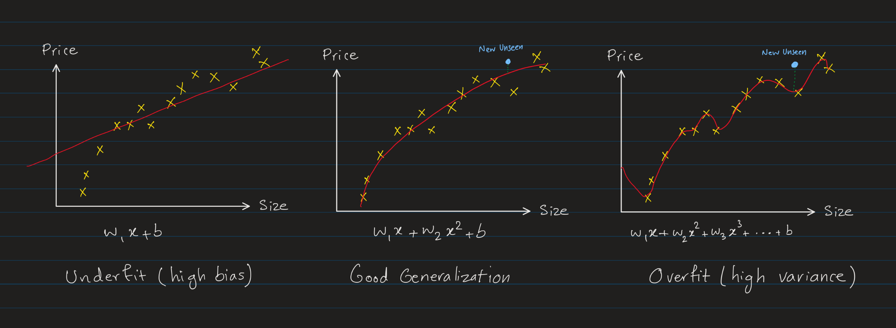

Generalization is the ability of a machine learning model to perform well on unseen data by capturing the underlying patterns in the training data rather than memorizing it.

When a model **generalizes well**, it can make accurate predictions on new, unseen data that it hasn't seen before.

Generalization is a central goal in machine learning, as the ability to generalize well is a key indicator of the model's ability to perform well in the real world. Generalization is the opposite of overfitting, which occurs when a model performs well on the training data but poorly on new data. Generalization is typically evaluated by measuring a model's performance on a held-out validation dataset, which is separate from the training data. A model that generalizes well will perform well on both the training and validation datasets, while a model that overfits will perform well on the training data but poorly on the validation data.

Generalization is a key challenge in machine learning, as it requires models to learn the underlying patterns in the data without memorizing the training examples. Techniques for improving generalization include regularization, dropout, early stopping, and data augmentation.

**Fitting** 
Fitting refers to the process of training the model (going through [gradient descent](gradient_descent.md) or other optimization algorithms) which is the process of finding the best parameters that minimize the difference between the predicted values and the actual values in the training data.

The goal of training is to find the parameters that allow the model to _generalize_ well to new, unseen data.

> Words like "fitting" and "training" are often used interchangeably in machine learning.

**Underfitting (High Bias):** 
A model is too simple to capture the underlying patterns in the data, resulting in high training and test error. Model performs poorly on both training and test (unseen) data.

_Simple Models usually have High Bias_

**Overfitting (High Variance):** 
A model is too complex, capturing noise and random details in the training data, leading to low training error but high test error. Model performs well on training data but poorly on test (unseen) data.

_Complex Models usually have High Variance_

**Bias-Variance Tradeoff:** 
The key goal in machine learning is to find the sweet spot between underfitting and overfitting (tradeoff between bias and variance) where the model generalizes well.

- Underfitting is associated with high bias and low variance.
- Overfitting is associated with low bias and high variance.

The following image illustrates these three scenarios using example of house price prediction model based on the size of the house:

We can see int he above image:
- The underfit model (left) has high bias and it does not fit well to the training data.

- The overfit model (right) has low bias but high variance, capturing noise and random fluctuations in the training data, which means it does very well on the training data but poorly on new unseen data. The model here is too complex (too many features and high polynomial degree) and memorizes the training data *too well*. It performs very well on the training data becasue it has has captured all the noises and random fluctuations in the training data. But when it sees new unseen data, it performs poorly.

- Simple models (left) have high bias and low variance, meaning they are too simple to capture the underlying patterns in the data. They perform poorly on both training and validation (or unseen) data.

- Complex models (right) have low bias and high variance, meaning they are too complex and capture noise and random details in the training data. They perform well on training data but poorly on validation (or unseen) data.

- The balanced model (center) has low bias and low variance, capturing the underlying patterns in the data without memorizing the training examples. This is tradeoff between bias and variance where the model _generalizes_ well to new unseen data.

Let's say $J_{train}$ is the training error and $J_{validation}$ is the validation error. We can say:
| Model Type | $J_{train}$ | $J_{validation}$ | Comparison |
|-|-|-|-|
| Underfitting | High | High | $J_{train} \approx J_{validation}$ |
| Overfitting | Low | High | $J_{train} \ll J_{validation}$ |
| Balanced | Low | Low | $J_{train} \approx J_{validation}$ |

In the following image, the x-axis represents the models with increasing complexity (from left to right), and the y-axis represents the error of the model.
- The less complex models have higher bias and higher error as they are too simple to capture the underlying patterns in the data.
- The high complex models have higher variance as they are too complex and capture noise and random details in the training data.
- The more complex the model, the better it fits the training data. Hence, the training error decreases as the model complexity increases. However, as model complexity increases, it first reach to a point of balanced bias and variance, where the model generalizes well (model 5 in this example). After that point, the model starts to overfit the training data and validation error increases again.

**Model Evaluation**: 
[Model Evaluation](model_evaluation_machine_learning.md) involves the methods and metrics (e.g., cross-validation, test accuracy, precision-recall) used to assess the generalization performance and ensure that the model is not overfitting or underfitting.

## Underfitting (High Bias)
Underfitting happens when a machine learning model is too simple to capture the underlying patterns in the data. It’s like a student who only glances at the study material and misses the key concepts, leading to poor performance on both practice tests (training data) and real exams (new data).

Underfitting occurs when a model has high bias and fails to learn the relationships between input features and target outputs in the training data. This results in both high training error and high validation/test error.

**High Bias**: 
Underfit models have high bias, meaning they have tendency to make overly simplistic assumptions about the data.

It's like having a preconceived notion that everything is straightforward, so the model oversimplifies and ignores the complexity of the patterns in the data. For example, fitting a straight line (a simple assumption) to a curved dataset shows a bias towards linearity, which leads to underfitting because the model isn't flexible enough to capture the true relationships.

A **biased model** in the context of underfitting is like a stubborn student who sticks rigidly to their initial assumptions and refuses to adapt or learn from new information, even when the data clearly shows a more complex pattern. This "stubbornness" prevents the model from capturing the true relationships in the data, leading to oversimplified predictions and poor performance.

> Words **high bias** and **underfitting** are often used interchangeably in machine learning.

**Characteristics of Underfitting:**
- Low training accuracy.
- Low test/validation accuracy.
- Indicates the model has not captured the complexity of the data.

In practice, if $J_{train}$ is the training error and $J_{validation}$ is the validation error, we can say:
- $J_{train}$ is high (poor fit to training data).
- $J_{validation}$ is also high (poor fit to validation data).

**Example:** 
Using a simple linear regression model to fit data that has a nonlinear relationship (e.g., a quadratic pattern). A straight line won't be able to capture the curve in the data, resulting in underfitting.

**How to Address Underfitting:**
1. **Increase Model Complexity**: Use a more complex model that can better capture the data's patterns (e.g., a deeper neural network or higher-order polynomial).
2. **Improve Feature Engineering**: Add relevant features or transform existing features to better represent the data.
3. **Decrease Regularization**: Reduce overly strict regularization constraints (e.g., lower $L_1$ or $L_2$ penalties).
4. **Train Longer**: Allow the model more time to converge to the optimal solution.

## Overfitting (High Variance)
Overfitting happens when a machine learning model learns not just the general patterns in the training data, but also the noise or random details that don't apply to unseen data. It’s like a student memorizing answers instead of understanding the concepts, which makes them perform well on practice tests (training data) but poorly on the real exam (new data).

Overfitting occurs when a model is too complex relative to the amount and quality of the training data, resulting in excessively low training error but high validation or test error. Mathematically, it implies that the model has high variance and fails to generalize to new data.

**High Variance**: 
Overfit models have high variance, meaning they are overly sensitive to the specific data they were trained on.

A model with high variance is like an overly eager student who tries to memorize every single detail of the study material, including irrelevant or accidental errors. While this approach might lead to perfect performance on practice tests (training data), it fails when presented with new questions (test data) because the memorized specifics don't generalize.

The word _variance_ refers to the model's sensitivity to the specific data it was trained on. Imagine training the same type of model on multiple different samples of data (drawn from the same distribution). A **high-variance model** produces significantly different predictions for each sample because it tries to capture every detail, including the noise and randomness in that sample set. So, it means the model's predictions vary a lot depending on the specific data it was trained on.

> Words **high variance** and **overfitting** are often used interchangeably in machine learning.

**Characteristics of Overfitting:**
- High training accuracy.
- Low test accuracy or validation accuracy.

In practice, if $J_{train}$ is the training error and $J_{validation}$ is the validation error, we can say:
- $J_{train}$ is low (good fit to training data).
- $J_{validation}$ is high (poor fit to validation data).

**Example:** 
Consider fitting a polynomial to a dataset:
- A simple model (e.g., a straight line) may underfit the data, failing to capture its true complexity.
- A very complex model (e.g., a high-degree polynomial) may overfit, capturing every tiny fluctuation in the training data which performs very well on the training data but poorly on new unseen data.

**How to Address Overfitting:**
1. **Increase Training Data**: More data helps the model learn the true patterns and reduces overfitting.

2. **Feature Selection and Reduce Model Complexity**: Choose the most relevant features and reduce the model's complexity to prevent it from capturing noise.

3. **Regularization**: Add constraints like $L_1$ or $L_2$ regularization to penalize large weights.

4. **Early Stopping**: Stop training as soon as the validation error stops decreasing.

### Increase Training Data
Collecting more data is a very effective way to address overfitting, which we should try first if possible. However, collecting more data is not always feasible as we have so much data available to us, or collecting more data might be expensive or time-consuming.

With the larget training data, the model can learn to generalize better to new unseen data even with a complex model (e.g. high polynomial degree) and numerous features.

**Model Capability and Increasing Training Data** 
Even though increasing training data is a very effective way to improve the model's performance, if the model has high bias initially, it most likely will not improve the model's performance even with more data. High bias models are too simple (incapable) to learn the underlying patterns in the data. So, increasing more training data will not improve the model's performance.

High Variance models are in general more capable of learning the underlying patterns in the data. Therefore, they are sensitive to all the noise and random fluctuations in the training data. As we increase the training data, the model will be exposed to more examples and patterns, which will help it to learn the true underlying patterns in the data and generalize better to new unseen data.

Let's plot the learning curves (error vs training set size) for a model with high bias and high variance.

In the left side, we have a model which has high bias. Both the training $J_{train}$ and cross validation $J_{cv}$ errors are high, and there is a gap between them and the performance goal. Increasing the training data on a high bias model will not help to reduce that gap, as model is not capable enough to learn pattern in the data regardless of how much more data we add.

In the right side, we have a model which has high variance. This model has a higher capability to learn and we can see that the training error $J_{train}$ is low and the cross validation error $J_{cv}$ get closer to the performance goal as we increase the training data.

#### Tips and Techniques for Adding More Data
- Before increasing the training data, first check if the model has high bias or not. If the model has high bias, then we should first fix that before increasing the training data.
   - **model has high variance**, then increasing the training data is a good way to improve the model's performance.

   - **model has high bias**, increasing the training data will not help to improve the model's performance by itself.

- If we have a large amount of training data, instead of using all of it for the training, we can just use a small subset of it initially to train the model and then examine the learning curves and other metrics to see if the model is overfitting or underfitting. Then introduce more data to the training set. This could help to guide us in the right direction in trade-off between bias and variance and better generalization.

- While increasing the training data, helps to reduce the high variance, we can't do the reverse to fix high bias. In other words, reducing the training data will **not** help to reduce the high bias. It may reduce the training error, but it hasn't helped the capability of the model to learn the underlying patterns and it will generalize poorly to the validation and test data.

- Add more data of types which the step of [Error Analysis](model_evaluation_machine_learning.md#error-analysis) indicated it might be useful. Instead of getting any types of new data, we can focus on the types of data that the model is struggling with.

 - **Data Augmentation**: If we can't collect more data, we can use data augmentation techniques to artificially increase the size of the training dataset.
   - Modify existing training data: For example, in an image classification task, we can create new images by applying transformations to the existing images. Modifications like rotation, scaling, flipping, and adding noise to the existing images.

   - Generate synthetic data: Generate synthetic new data points to address imbalances in the dataset or the areas which model struggles with. Techniques like SMOTE (Synthetic Minority Over-sampling Technique) or Generative models can be used to create synthetic data points.

### Feature Selection and Reduce Model Complexity
There are several ways to simplify a model. One of the most common ways is to reduce the number of features. [**Feature selection**](feature_engineering.md#feature-selection) is an important technique to choose the most relevant features to train the model.

In Particular, the large number of features with a small number of training examples is a common cause of overfitting.

Sometimes even after feature selection, we still have many features that are relevant to our model and we don't want to exclude them from our training. In such cases either
we can use [**dimensionality reduction techniques**](feature_engineering.md#dimensionality-reduction) to reduce the number of features.

If after all of the above, we still have a large number of relevant features, we can either go for other techniques like [**regularization**](#regularization) or use more capable models like [**neural networks**](neural_networks.md) which can handle a large number of features as they can automatically learn important feature interactions and representations through their hidden layers

The other way to simplify the model is to reduce the model's complexity. For example, in the case of linear regression, we can reduce the polynomial degree of the model. In the case of neural networks, we can reduce the number of layers or the number of neurons in each layer.

> Remember, more complex models captures more noise and random fluctuations in the training data. They try to learn the training data too well which leads to inability to generalize well to new unseen data.

### Regularization

Let's say we have a polynomial regression model as the following:

$$f_{\vec{\mathbf{w}},b}(x) = w_0 + w_1x + w_2x^2 + w_3x^3 + \ldots + w_nx^n + b$$

The more the coefficients of $x$ in the polynomial, the more wiggly the curve will be, and as we reduce the coefficients of $x$ in the polynomial, the sharpness of the curve will be dampened down and it becomes smoother and less wiggly.

The following plot shows the difference between high, low and zero coefficients in a polynomial.

The blue curve has high coefficients:

$$ f(x) = -650x - 50x^2 + 170x^3 + 20x^4 + 60x^5 + 175x^6 - 15x^7 - 105x^8 + 35 $$

The orange curve has lower coefficients (divided by 5):

$$ f(x) = -130x - 10x^2 + 34x^3 + 4x^4 + 12x^5 + 35x^6 - 3x^7 - 21x^8 + 7 $$

The green line is when all the coefficients are zero:
$$ f(x) = 0 \times x + 0 \times x^2 + 0 \times x^3 + 0 \times x^4 + 0 \times x^5 + 0 \times x^6 + 0 \times x^7 + 0 \times x^8 + 35  = 35 $$

As we can see, if we make our coefficients too small (near zero), the curve becomes a straight line. If we make the coefficients too large, the curve becomes very wiggly with sharp turns.

So, we can get this intuition that as we decrease the coefficients of $x$ in the polynomial, the curve becomes smoother and less wiggly (going towards a straight line). If you recall, the straight line was the underfit model. So, the idea of regularization is to find the right balance between the overfitting and underfitting by controlling the coefficients of $x$ in the polynomial.

> In general, by reducing the value of $w_j$ (coefficients) for feature $x_j$, we reduce the effect of that feature in the model. As the $w_j$ gets smallet, the contribution of the feature $x_j$ in the model becomes less and less.

In regularization, we implement this idea by penalizing the model for having large coefficients (parameters $w_j$) to avoid overfitting (sharp turns in the curve). We want the model to have small (but not too small) coefficients to make the curve smooth which fit the data in a more balanced way.

As we discussed above, we want to find a way to penalize the model for having large coefficients. However, we already have a mechanism to penalize the model, cost function. The job of cost function is to penalize the model for making wrong predictions (i.e., the difference between the predicted value and the actual value). We can extend our cost function to also penalize (regularize) the model for having large coefficients.

$$
J(\vec{\mathbf{w}}, b) = \frac{1}{m} \sum_{i=1}^{m} L(f_{\vec{\mathbf{w}},b}(\mathbf{x}^{(i)}), y^{(i)}) + \textcolor{red}{\frac{\lambda}{2m} \sum_{j=1}^{n} w_j^2}
$$

where:

- $L$ is the loss function (e.g., mean squared error).
- $m$ is the number of training examples.
- $\lambda$ is the regularization parameter (hyperparameter) which controls the strength of regularization.
- $n$ is the number of features.
- $w_j$ is the $j^{th}$ parameter (weight) of the model for the feature $x_j$.

**Notes:**
  - The division by $m$ is generally used to keep the regularization term on the same scale as the cost function (average losses over $m$ examples). It turns out, if we scale both terms in the same way, we can choose a better value for $\lambda$.
  - The additional factor of $\frac{1}{2}$ is purely for mathematical convenience. It makes the derivative of the regularization term simpler as $2$ and $\frac{1}{2}$ cancel out each other when we differentiate. It has no effect on the optimization process.

  - By convention, we don't apply regularization to the bias term $b$ because it has a very little difference in practice. The more common practice is to penalize only the weights $w_j$.

**Extended Cost Function with Regularization:** 
Now our new cost function is made up two terms, the first term is the average of loss functions and the seconds term is the regularization term:

$$
J(\vec{\mathbf{w}}, b) = \frac{1}{m} \sum_{i=1}^{m} \left[ L(f_{\vec{\mathbf{w}},b}(\mathbf{x}^{(i)}), y^{(i)}) \right] + \underbrace{\frac{\lambda}{2m} \sum_{j=1}^{n} w_j^2}_{\text{Regularization term}}
$$

As we discussed, the goal of training is to minimize the cost function. So, it means as we try to minimize the average losses (first term), we also try to minimize the regularization term (second term). Reducing the regularization term means reducing the parameters $w_j$.

In simple terms, we penalize the model for both having large losses **and** large parameters. The minimizing the first term makes the model to fit the data well and minimizing the second term makes the model to keep parameters small while at the same time fitting the data well.

$$
\text{min (cost)} = \text{min} [ \text{Average Loss term + regularization term}]
$$

#### Gradient Descent with Regularization
Let's use linear regression as an example to understand how regularization works in Gradient Descent algorithm.

Gradient Descent:

$$\begin{align*} \text{repeat }&\text{until convergence: } \lbrace \newline
& w_j = w_j -  \alpha \frac{\partial J(\vec{\mathbf{w}},b)}{\partial w_j} \; & \text{for j = 0..n-1}\newline
&b\ \ = b -  \alpha \frac{\partial J(\vec{\mathbf{w}},b)}{\partial b}  \newline \rbrace
\end{align*}$$

Now our $J$ has an additional term (regularization term):

$$\frac{\lambda}{2m} \sum_{j=1}^{n} w_j^2$$

The partial derivative of this term in respect to $w_j$ is:

$$\frac{\partial}{\partial w_j} \left( \frac{\lambda}{2m} \sum_{j=1}^{n} w_j^2 \right) = \frac{\partial}{\partial w_j} \left( \frac{\lambda}{2m} (w_1^2 + w_2^2 + ... + w_n^2) \right) = \frac{\lambda}{m} w_j$$

Since we are taking the partial derivative in respect to $w_j$, the derivative of $w_j^2$ is $2w_j$ and the derivative of all the other terms is $0$.

So, the Gradient Descent algorithm for linear regression with regularization can be written as:

$$
\begin{align*} \text{repeat }&\text{until convergence: } \lbrace \newline
& w_j = w_j - \alpha \left[ \frac{1}{m} \sum\limits_{i = 1}^{m} (f_{\vec{\mathbf{w}},b}(\vec{\mathbf{x}}^{(i)}) - y^{(i)})x^{(i)}_j + \frac{\lambda}{m} w_j \right] \; & \text{for j = 0..n-1}\newline
& b = b - \alpha \frac{1}{m} \sum\limits_{i = 1}^{m} (f_{\vec{\mathbf{w}},b}(\vec{\mathbf{x}}^{(i)}) - y^{(i)}) \newline \rbrace
\end{align*}
$$

Recall that we don't regularize the bias term $b$, so the gradient descent update rule for the bias term $b$ remains the same.

**Intuition**: 
At each step of the gradient descent update rule for $w_j$:

$$ w_j = w_j - \alpha \left[ \frac{1}{m} \sum\limits_{i = 1}^{m} (f_{\vec{\mathbf{w}},b}(\vec{\mathbf{x}}^{(i)}) - y^{(i)})x^{(i)}_j + \frac{\lambda}{m} w_j \right] $$

If we move around the terms:

$$
w_j = w_j (1 - \alpha \frac{\lambda}{m}) - \underbrace{\alpha \frac{1}{m} \sum\limits_{i = 1}^{m} (f_{\vec{\mathbf{w}},b}(\vec{\mathbf{x}}^{(i)}) - y^{(i)})x^{(i)}_j}_{\text{Original Part}}
$$

So, we added a term $w_j (1 - \alpha \frac{\lambda}{m})$ to the original part of the gradient descent update rule.

Knowing the $\lambda$ is a positive number, and $\alpha$ is a small positive number, the term $1 - \alpha \frac{\lambda}{m}$ is always less than $1$.

For example, if $\lambda = 1$ and $\alpha = 0.001$ for $m= 1000$ examples, then:
$$1 - \alpha \frac{\lambda}{m} = 1 - 0.001 \times \frac{1}{1000} = 0.999999$$
$$w_j = 0.999999 \times w_j - \text {Original Part}$$

So, what regularization is doing at each step is mutltiplying the weight $w_j$ by a number less than $1$ which in effect **shrinks** the weights a little bit at every step. This is to prevent the weights from growing too large and overfitting the model.

#### Choosing the Right Value for $\lambda$
The regularization parameter $\lambda$ controls the strength of regularization. A higher value of $\lambda$ penalizes the model more for having large parameters. Choosing a very high value of $\lambda$ will force the model to have very small parameters. Recall in the above plot of polynomial function $f(x)$, choosing a very small (near zero) coefficients will make the curve to be a straight line $f(x) = b$ which is the underfit model.

So, there is a tradeoff in choosing the right value of $\lambda$. If:
- **$\lambda$ = 0:** No regularization. The model can have any value of parameters.
- **$\lambda$ is too small:** Low regularization. The parameters are allowed to grow too large, leading to overfitting (high bias).
- **$\lambda$ is too large:** Heavy regularization. The parameters forced to become too small, leading to underfitting (high variance).

In practice, we use cross-validation to find the best value of $\lambda$ that minimizes the validation error. In other words, we train number of models with different values of $\lambda$ and then evaluate the performance of each model on the validation set. The value of $\lambda$ that used to train the model that performs best on the validation set is chosen as the final value of $\lambda$.

In the following image, we plot the training and validation errors as a function of $\lambda$. Let's assume we use the previous polynomial regression model which is a complex model with high degree polynomial.

- $\lambda$ is too small (left): The $J_{train}$ is low (good fit to training data) but $J_{validation}$ is high (poor fit to validation data). The model is overfitting (high variance).
- $\lambda$ is too large (right): The $J_{train}$ is high as we penalize the model for having large parameters and made it flat. The $J_{validation}$ is also high as the model is underfitting (high bias).
- $\lambda$ is just right (middle): The $J_{train}$ is low (good fit to training data) and $J_{validation}$ is also low (good fit to validation data). The model is balanced and generalizes well. This value may not be always exactly in the middle, but it is the value that minimizes the validation error.

#### Regularization in Neural Networks
Similar to above, we can add a regularization term to the cost function of a neural network.

$$
J(\vec{\mathbf{w}}, b) = \frac{1}{m} \sum_{i=1}^{m} L(f_{\vec{\mathbf{w}},b}(\mathbf{x}^{(i)}), y^{(i)}) + \frac{\lambda}{2m} \sum_{l=1}^{Layers} \sum_{j=1}^{n_l} \sum_{k=1}^{n_{l-1}} (w^{(l)}_{jk})^{2}
$$

where:
- $Layers$ is the number of layers in the neural network.
- $n_l$ is the number of neurons in layer $l$.
- $n_{l-1}$ is the number of neurons in layer $l-1$. This gives the number of weights connecting layer $l$ to layer $l-1$, which is weights of each neuron in layer $l$ (in a fully connected layer).
- $w^{(l)}_{jk}$ is the weight connecting neuron $j$ in layer $l$ to neuron $k$ in layer $l-1$.

In simple terms, the regularization term is the sum of the squares of all the weights in all the neurons in all the layers of the neural network.

> Similar to linear regression, we don't apply regularization to the bias terms in the neural network.

We can write it using a simpler notation using $\theta$ to represent all the parameters (weights in this case) in the neural network:

$$
J(\theta)
= \frac{1}{m}\sum_{i=1}^m L\bigl(f_{\theta}(x^{(i)}),\,y^{(i)}\bigr)
+ \underbrace{\frac{\lambda}{2m}\,\sum_i \theta_i^2}_{\text{Regularization term}}$$

Where:
- $\theta$ denotes the concatenation of all weight matrices
   $\{W^{(1)},W^{(2)},\dots,W^{(L)}\}$.
- $L(f_{\theta}(x^{(i)}),y^{(i)})$ is the loss function of example $i$.

Regularization term is also called **weight decay**. It is a common technique used in deep learning to prevent overfitting by penalizing large weights in the model. The term "weight decay" refers to the idea that the weights are "decaying" or being shrunk slightly on every update step, which helps to prevent them from growing too large and overfitting the model to the training data.

#### L1 and L2 Regularizations
L1 (Lasso) and L2 (Ridge) regularizations are two common types of regularization techniques. L2 regularization is more common and widely used in practice.

L2 is exactly what we discussed above. It defined as:

$$
\frac{\lambda}{2m} \sum_{j=1}^{n} w_j^2
$$

L1 regularization is defined as the sum of the absolute values of the weights:

$$
\frac{\lambda}{m} \sum_{j=1}^{n} |w_j|
$$

> Regularization is a technique to prevent overfitting. However, it's implemented differently for different algorithms. For example, in neural networks and linear regression it's implemented by penalizing the model for having large parameters. In decision trees, it's implemented by limiting the depth of the tree or the number of leaf nodes.

## Diagnosing Bias and Variance

After we establish a baseline model, trained our new model, and evaluated the model performance on the validation set, we need to check if the model is underfitting (high bias) or overfitting (high variance). This is done by comparing the performances of baseline, model training, and model evaluation.

Diagnosing bias and variance is an ongoing process, meaning that we diagnose the bias and variance after each cycle of training-evaluation-improvement to see where are we in the trade off of bias and variance.

Let's say we have a regression model and we use Mean Squared Error (MSE) as the evaluation metric.
We have 3 performance metrics:
- **Baseline Performance Error**: Percentage of errors in the baseline model.
- **Training Error**: Percentage of model errors on the training set.
- **Validation Error**: Percentage of model errors on the validation set.

> Baseline performance error as discussed could be a human performance, external model performance, or a simple model performance. So, depending on where did it come from it could be a starting point or the ideal model performance.
>
> For example, if the baseline performance is the result of a expert human performance, then the baseline performance is the **ideal** model performance and could be used as our **goal**. However, if the baseline performance is the result of a simple model which we trained initially, then the baseline performance is just a **starting point**.

Let's assume in this example our baseline performance is the **ideal** model performance.

**Underfitting (High Bias)**: 
This happens when the gap between the baseline and training error is high. This means that the model is not capable (too simple) of learning the training data.

$$\text{Baseline Error} \ll \text{Training Error}$$

**Overfitting (High Variance)**: 
This happens when the gap between the **training error** and **validation error** is high. This means that the model is too complex and is learning the noise in the training data, which performs well on the training set but poorly on the validation set (unseen data).

$$\text{Training Error} \ll \text{Validation Error}$$

**Example**: 
Let's say we have the following scenarios:

| Bias-Variance | Baseline Error | Training Error | Validation Error |
|-|-|-|-|
| High Variance (Overfitting) | 10% | 11% | 20%
| High Bias (Underfitting) | 10% | 20% | 25%
| Good Fit | 10% | 11% | 12%

> Note: The above numbers are just for illustration purposes. The actual thresholds for high bias, high variance, and good fit will depend on the problem and the data and is different case by case. For example, in some cases, even 1% difference in the training and validation error could be considered as overfitting, etc.

In case of underfitting, we usually don't need to even progress to the validation set. We can conclude the high bias from comparison of the baseline and training error without even evaluating the model on the validation set.

### Learning Curves
Learning curves are a powerful tool for diagnosing bias and variance in machine learning models. They plot the training and validation error as a function of the training set size. By analyzing this curve, we can gain insights into the model's performance and identify potential issues.

See [Increasing Training Set Size and Learning Curves](generalization_machine_learning.md#increase-training-data) for more details.

### Bias and Variance in Linear Regression

Let's say we have a regularized linear regression model as follow:

$$J(\theta) = \frac{1}{2m} \sum_{i=1}^{m} (h_\theta(x^{(i)}) - y^{(i)})^2 + \lambda \sum_{j=1}^{n} \theta_j^2$$

Where:
- $J(\theta)$ is the cost function
- $h_\theta(x^{(i)})$ is the model prediction (also noted as $y^{(i)}$ or $f_\theta(x^{(i)})$)
- $y^{(i)}$ is the actual value
- $m$ is the number of training examples
- $n$ is the number of features
- $\lambda$ is the regularization parameter
- $\theta$ is the model parameters (weights)
- $x^{(i)}$ is the input feature vector for the $i^{th}$ training example

Let's say this model has unacceptable large errors in prediction, what are the possible actions to fix this? First we need to diagnose the problem if it's high bias (underfitting) or high variance (overfitting). We can do this by comparing the training and validation errors and learning curves explained above. Then to solve the problem, we can take the following actions:

|Problem|Action|
|-|-|
|High Bias (Underfitting)| - Increase model complexity (e.g. add polynomial features, use neural networks, etc) - Decrease regularization $\lambda$ - Get more features  |
|High Variance (Overfitting)| - Reduce the features - Increase regularization $\lambda$ - Get more training data  |

There are other actions which could be taken to fix the high bias and high variance, but the point of above example, is to show that more often than not, we are dealing with high bias (overfitting) and high variance (underfitting) and our task is to first diagnose the problem and then take the right action to fix it (i.e. balance the bias and variance).

### Bias and Variance in Neural Networks
[Neural Networks](neural_networks_overview.md) by design are much more capable of learning complex patterns in the data. They are very flexible in terms of the model architecture which allows us to create as complex models as we want. So, because of this ability, in the tradeoff between bias and variance, neural networks are usually more prone to overfitting (high variance) than underfitting (high bias).

This is why large neural networks are **low bias** machines. If we make a neural network large enough, we can almost always fit (balance between bias and variance) the training data well. This is one of the reasons behind the increasing popularity of deep learning.

We can use the following guidance to diagnose bias and variance in neural networks and take the right actions to fix the problem

In the above flow:
- Larger Network: It means either adding more hidden layers (deeper) or adding more neurons in the hidden layers (wider), or both. Also other factors such as types of the layers, activation functions, number of epochs, batch size, and other hyperparameters can be explored to increase the model capability.
- Both increasing the size of the neural network and increasing the training data have limits. As networks get larger, they are much more demanding in terms of computational resources and time. Also, adding more data may not always be possible.

**Small or Large Neural Networks** 
Intuitively, we may think that the larger neural networks (being more complex) are prone to overfitting (high variance). It turns out that a large neural network usually do as well or better than a small neural network as long as the [regularization](generalization_machine_learning.md#regularization-in-neural-networks) is used properly.

Therefore, it's a good idea to go for a larger networks as much as your computational resources, budget and time allow.
