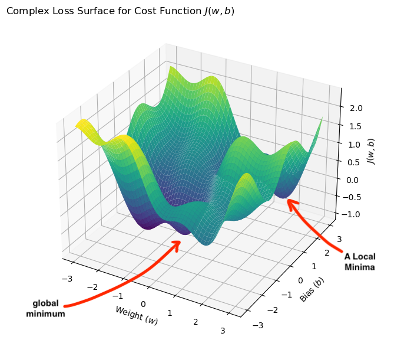
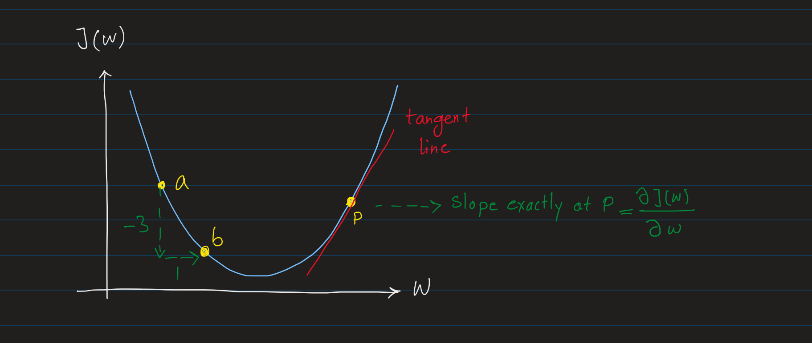
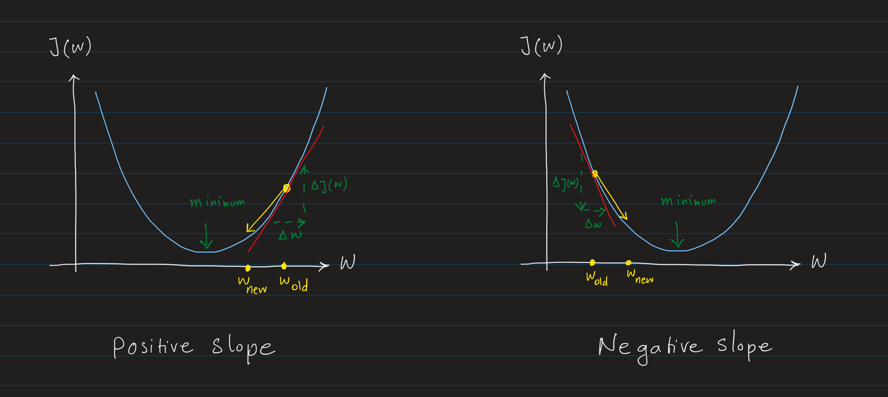
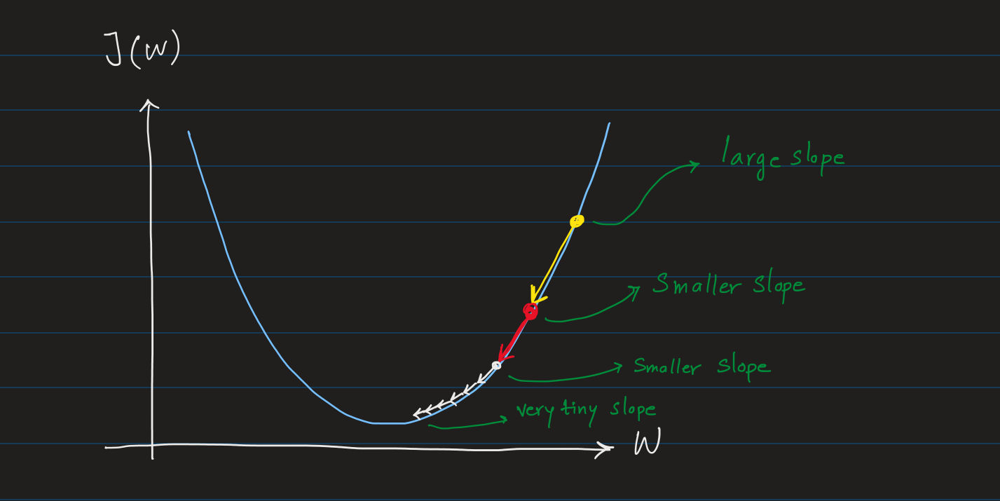
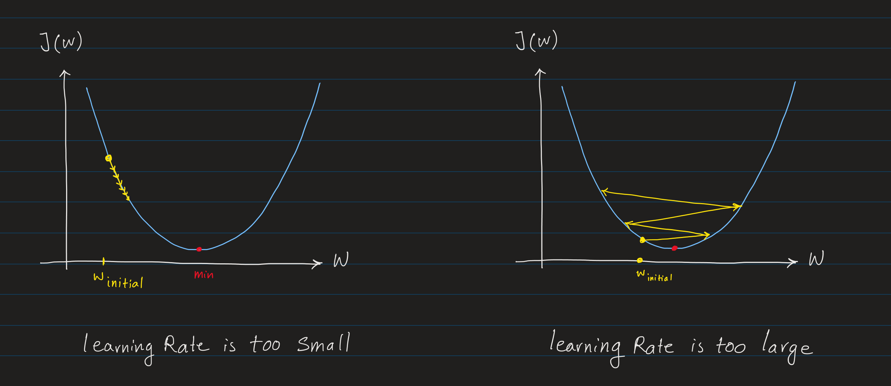

# Gradient Descent
Gradient descent is an iterative optimization algorithm that finds a local minimum of a differentiable function by repeatedly stepping in the direction of the steepest descent, which is given by the negative of the function's first derivative (gradient).

Gradient Descent is a _first order_ optimization algorithm, meaning it uses the first derivative (gradient) of the function to update the parameters. This makes it computationally simpler than _second order_ methods like Newton's method, which uses the second derivative (Hessian matrix).

Gradient Descent is the most common algorithm used for minimizing the cost function of many machine learning models, from linear regression to the most complex neural networks.


## Loss Surface
Loss Surface is a graphical representation of a model's loss function in relation to its parameters (e.g., weights and biases). It shows how the loss changes as parameters vary, helping visualize the optimization process.

In more technical terms, the loss surface is the plot of the cost function $J(w,b)$ against the model's parameters $w_0, w_1, ...$ and $b$.

For example, in a model such as linear regression and cost function such as Mean Squared Error, the loss surface is a parabolic curve in three dimensions. This model has a single weight $w$ and bias $b$, so the loss surface is a 3D plot which x-axis is the weight $w$, y-axis is the bias $b$, and z-axis is the loss $J(w,b)$.

For example, using the Mean Squared Error loss function, which defines:

$J(w,b)=\frac{1}{2m} \sum\limits_{i = 0}^{m-1} (wx^{(i)} + b - y^{(i)})^2$


[**Convex**](https://developers.google.com/machine-learning/glossary#convex-function) surfaces such as _square error loss_ has a single global minimum, making optimization easier. **Non-convex** surfaces have multiple local minima, making optimization more challenging.

This curve represents the relationship between the weight value and the loss value. The lowest point on this curve corresponds to the weight value that minimizes the loss function, which is the goal of the training process. This point is where the gradient (derivative of the loss function with respect to the parameters) is near or at zero, indicating that the model has found the minimum of the loss function for that weight.

However, in more complex models, such as neural networks, the cost function could have a complex surface with more than one global minimum. These are called **local minima**. The lowest point in the entire function is called the **global minimum**. These surfaces are called **non-convex**. These surfaces often feature local minima, saddle points, and a global minimum, which optimization algorithms aim to find.

The cost function $J$ shown below, has a complex surface with multiple local minimas, and one global minimum.



> Note, in more complex model the loss surface may not be a simple parabolic curve, but the concept of finding the minimum of the loss function still applies.


## Gradient Descent Algorithm
Gradient descent is like finding your way down a hill in foggy weather. Imagine you're standing somewhere on the hill, but you can’t see the whole landscape—only the slope directly under your feet. To get to the bottom, you take small steps downhill, always choosing the direction that goes **steepest** downward (this is your gradient). Each step brings you closer to the valley (the minimum). The size of your steps matters too—if they're too big, you might overshoot the valley; if they're too small, it’ll take forever to get there. Gradient descent is how machines learn by adjusting their parameters (weights and biases) to minimize errors, or "find the lowest point" on a mathematical loss surface.

Formally, gradient descent is an iterative optimization algorithm used to minimize a function $f(\theta)$ (the model), where $\theta$ represents all the parameters. At each step, it updates the parameters $\theta$ in the direction opposite to the gradient  $\nabla f(\theta)$ of the function, as the gradient points in the direction of the steepest ascent, the update rule is:

$$\theta_{t+1} = \theta_t - \eta \nabla_{\theta} J(\theta_t)$$

Where:
- $\theta_t$ represents the parameters (weights and biases) at step $t$ (current parameters).
- $\theta_{t+1}$ represents the updated parameters at step $t+1$.
- $\eta$ is the learning rate.
- $\nabla_{\theta} J(\theta_t)$ is the gradient of the cost function $J$ with respect to the parameters $\theta_t$.

The gradient represents the slope, which is mathematically equal to the derivative of the function at a given point. It points in the direction of the steepest ascent (or descent for minimization) on the loss surface, indicating how much the error changes as each weight is adjusted. The gradient is fundamental to optimization techniques like gradient descent, where it **guides** the iterative updates to minimize the cost function.


Gradient Descent steps:

1. **Initialize Parameters:** Start with an initial guess for the parameters $\theta$ (weights and biases).

2. **Compute the Cost Function:** Calculate the cost function $J(\theta)$ with the current values of $\theta$. Also called the **forward pass**.

3. **Compute the Gradient:** Calculate $\nabla_{\theta} J(\theta)$, which is the partial derivative of the cost function $J(\theta)$ with respect to the parameters $\theta$. This step is also called the **backward pass** or [**backpropagation**](https://developers.google.com/machine-learning/glossary#backpropagation).

4. **Update the Parameters:** Update all parameters $\theta$ simultaneously in the opposite direction of the gradient (to descent down the hill) by a small step size $\eta$ (learning rate) which the new parameters $\theta_{t+1}$ is calculated as:

    $\theta_{t+1} = \theta_t - \eta \nabla_{\theta} J(\theta_t)$.

5. **Repeat until Convergence:** Repeat from step 2, for multiple iterations until we reach a point where parameters $\theta$ don't change much with each iteration, and the cost function doesn't decrease significantly. This is called **convergence**.

An **iteration** is a complete cycle of updating the model parameters (weights and biases) based on the gradient of the cost function. One iteration is from step 2 to step 4.

> In the following sections, to show more details instead of $\theta$, we use $w$ (weights) and $b$ (biases) and instead of $J(\theta)$ we use $J(w,b)$ to represent the cost function of the model with respect to the parameters $w$ and $b$.
>
> Also instead $\nabla_{\theta} J(\theta)$, we use $\frac{\partial J(w,b)}{\partial w}$ and $\frac{\partial J(w,b)}{\partial b}$ to represent the partial derivatives of the cost function $J(w,b)$ with respect to the parameters $w$ and $b$.

### 1. Initialize Parameters
The first step in the gradient descent algorithm is to initialize the parameters $w$ and $b$ with some initial values. These initialization can be done using different strategies:

- **Zero Initialization:** Initialize the parameters with zeros. This is a simple strategy but may not work well for all models, especially deep neural networks, where all neurons in the same layer would have the same weights and biases.

- **Random Initialization:** Initialize the parameters with random values. This is common in deep learning models, where the weights are initialized with small random values to break symmetry and prevent the model from getting stuck in local minima.

- **Xavier Initialization:** Initialize the parameters with random values drawn from a Gaussian distribution with zero mean and variance $\frac{1}{n}$, where $n$ is the number of input units to the neuron. This is a common initialization strategy for deep neural networks.

### 2. Compute the Cost Function
In this step, we calculate the cost function $J(w,b)$ with the current values of the parameters $w$ and $b$. The cost function is a measure of how well the model is performing on the training data. It quantifies the difference between the predicted values and the actual values.

The cost function is the average of the loss function over all training examples.

As we discussed, we choose our model based on the problem we are trying to solve. For example, in linear regression, the cost function is the Mean Squared Error (MSE). Accordingly, the specific type of cost function depends on the model and the problem we are trying to solve is chosen.

In general, the cost function is calculated as:

$$J(w,b) = \frac{1}{m} \sum\limits_{i = 0}^{m-1} L(y^{(i)}, \hat{y}^{(i)})$$

where:
- $J(w,b)$ is the cost function.
- $m$ is the number of training examples.
- $L(y^{(i)}, \hat{y}^{(i)})$ is the loss function, which measures the difference between the actual value $y^{(i)}$ and the predicted value $\hat{y}^{(i)}$ for the $i^{th}$ example.

For further details, see [Loss and Cost Functions](loss_and_cost_functions.md).


### 3. Compute the Gradient

At each step of the gradient descent algorithm, we calculate the derivative of the cost function with respect to each parameter. In other words, we calculate the rate of change of the cost function with respect to each parameter. This tells us how much the cost function will change if we change the parameters slightly in a particular direction.

The following is the **derivative** of the cost function $J(w,b)$ with respect to the parameters $w$ and $b$:

$$\frac{\partial J(w,b)}{\partial w}$$
$$\frac{\partial J(w,b)}{\partial b}$$

Intuitively, this derivative tells us in which direction we should move to descent down the hill (minimize the cost function).


**Derivative** is part of calculus that represents the rate of change of a function at a given point. To be mathematically precise, the above term is the [**partial derivative**](https://developers.google.com/machine-learning/glossary#partial-derivative) of the cost function $J(w,b)$ with respect to the parameters $w$ and $b$. The _partial_ derivative is calculating the derivative (rate of change) of the cost function with respect to a single parameter while keeping all other parameters constant.

So, for $J(w,b)$, as we have two parameters $w$ and $b$, we need to calculate two partial derivatives: $\frac{\partial J(w,b)}{\partial w}$ and $\frac{\partial J(w,b)}{\partial b}$, one for each parameter while keeping the other constant.


#### multi-dimentional surface and partial derivatives

$J$ is a function of $w$ and $b$, so it's a 3D plot of $w$, $b$, and $J$. Also the number of parameters can be more than 2, so the cost function $J$ can be a function of $n$ parameters $w_1, w_2, ..., w_n$. In that case, the cost function $J$ is a plot of $w_1, w_2, ..., w_n$, and $J$, which is a multi-dimensional surface.

However, the partial derivatives are calculated for each parameter separately while keeping all other parameters constant. For example, the partial derivative of $J$ with respect to $w_1$ is calculated while keeping $w_2, w_3, ..., w_n,b$ costant. So, the partial derivative of $J$ with respect to $w_1$ is a 2-dimensional plot of $w_1$ and $J$ while keeping all other parameters constant.

For example, the partial derivative of the cost function $J(w,b)$ with respect to the parameter $w$ is when we calculate the derivate of $J$ with respect to $w$ while keeping $b$ constant.

$$\frac{\partial J(w)}{\partial w}$$

> Derivative of a function at a point gives the _slope_ of the _tangent line_ to the function at that point. In the context of gradient descent, the derivative of the cost function tells us the slope of the cost function at a particular point in the parameter space. This slope guides us in the direction of the steepest descent (down the hill) to minimize the cost function.

#### Slope and Tangent Line
**Slope** is the ratio of the vertical change to the horizontal change between two distinct points. In other words the "_rise_ over the _run_":

$$\text{slope} = \frac{\text{rise}}{\text{run}}$$


For example in 2D plane of $x$ and $y$ coordinates, the slope of the tangent line passing through two points $(x_1, y_1)$ and $(x_2, y_2)$ is:

$$\text{slope} = \frac{y_2 - y_1}{x_2 - x_1}$$


**Partial Derivative (Instantaneous Slope)**

The **partial derivative**, gives the **instantaneous rate of change** at a single point. Instead of measuring the slope between two distinct points, the partial derivative looks at how the function changes as you make an infinitesimally small change in one variable (in your case, $w$) while holding all other variables constant.



Slope between two points of $a$ and $b$:

$$\text{slope} = \frac{\text{rise}}{\text{run}} = \frac{\Delta J(w)}{\Delta w}=\frac{-3}{1} = -3$$

Slope of $-3$ is a _negative_ slope, which means the function is decreasing as $w$ increases.

Now, to find the **exact** slope at any point like $p$, we need to draw a _tangent line_ at that point to find the slope of the function at that point.

**Tangent Line** is a straight line that touches a curve at a single point. The slope of the tangent line at that point is the derivative of the function at that point. The derivative gives the rate of change of the function at that point.

In order to find the slope at point $p$, we need to make the change in $w$ extremely small (infinitesimally small) to capture the exact rate of change at that point. This is expressed as:

$$\frac{\partial J(w)}{\partial w} = \lim_{\Delta w \to 0} \frac{\Delta J(w)}{\Delta w}$$

This limit gives us the **exact slope** at a particular point, also known as the **instantaneous rate of change** of the function $J(w)$ with respect to $w$.

The partial derivative is essentially the limit of the slope as the two points get closer and closer together, until they are infinitesimally close.


>The derivative is a more precise, continuous version of the slope, calculated as $\Delta w$ approaches an extremely small value. It maximizes the resolution (or sensitivity) of how the function $J(w)$ changes as $w$ changes. To increase this resolution, we need to make the changes in $w$ extremely small to capture the smallest impact on the function. That’s why we express this as $\lim_{\Delta w \to 0}$, where the change in $w$ becomes vanishingly small to capture the exact rate of change (with the highest resolution) at any given point.

Thus:

$$\text{slope exactly at any given point} = \frac{\partial J(w)}{\partial w}$$
"slope at any given point" means the rate of change of the function $J(w) with respect to $w$ at that point.

Further reading on [Slope and Tangent Line](../math/derivatives.md#slope-and-tangent-line).

### 4. Update the Parameters:
Once we have calculated all gradients for every parameter ($w$ and $b$), we then apply them to update the parameters **simultaneously.** This means that all weights and biases are **updated together in a single step**. This update happens only after gradients for every parameter have been computed.

We update the parameters $w$ and $b$ in the opposite direction of the gradient (to descent down the hill) by a small step size $r$ (learning rate).

$$w_{\text{new}} = w_{\text{current}} - \alpha \frac{\partial J(w,b)}{\partial w}$$
$$b_{\text{new}} = b_{\text{current}} - \alpha \frac{\partial J(w,b)}{\partial b}$$

where:
- $w_{\text{new}}$ and $b_{\text{new}}$ are the updated values of the parameters.
- $w_{\text{current}}$ and $b_{\text{current}}$ are the current values of the parameters.
- $\alpha$ is the learning rate, which controls the step size in the parameter space.

#### Moving Towards the Minimum



In the Positive Slope:

$\text{slope}= \frac{\partial J(w)}{\partial w} > 0$

$w_{\text{new}} = w_{\text{current}} - \alpha \times \text{postive number}$

$w_{\text{new}} < w_{\text{current}}$

So, when the slope is positive, the new value of $w$ is less than the current value of $w$. This means we move in the opposite direction of the slope (down the hill) to minimize the cost function.

In the Negative Slope:

$\text{slope}= \frac{\partial J(w)}{\partial w} < 0$

$w_{\text{new}} = w_{\text{current}} - \alpha \times \text{negative number}$

$w_{\text{new}} > w_{\text{current}}$

So, when the slope is negative, the new value of $w$ is greater than the current value of $w$.

In both cases, we want to find the direction which moves us towards the minimum of the cost function, which means we move in the **opposite** direction of the slope.


For further details, see this [Refresher on Positive and Negative slops](https://www.khanacademy.org/math/algebra/x2f8bb11595b61c86:linear-equations-graphs/x2f8bb11595b61c86:slope/v/positive-and-negative-slope)


#### Learning Rate
[**learning rate**](https://developers.google.com/machine-learning/crash-course/linear-regression/hyperparameters#learning_rate) and **step size** are used interchangeably in machine learning. It determines how much we move in the direction of the gradient at each iteration.

The learning rate is one of the most important _hyperparameters_ in the gradient descent algorithm. It directly affects the size of movements (descents) towards the minimum of the cost function. So, choosing the right learning rate is crucial.

$$w = w - \textcolor{red}{\alpha} \frac{\partial J(w,b)}{\partial w}$$

> Learning rate is also represented by $\eta$ (pronounced "eta") in many machine learning literature.


**Size of Slop and Learning Rate**
the steps in gradient descent are identical because the movement size depends on both factor, the gradient's magnitude (slope of the cost function at that point), and the learning rate. Assuming the learning rate is fixed, the size of the step depends on the slope (derivative) of the cost function at that point.

At ever step, we reduce $\alpha\frac{\partial J(w,b)}{\partial w}$ from the current value of $w$ to move towards the minimum of the cost function. So, considering fix $\alpha$, the larger the slope is, the larger the step size is, and the smaller the slope is, the smaller the step size is.




In the above image, we can see the larger the slope is, the larger the step size, and when we get close to the minimum, the step gets smaller as the slope gets smaller.


**Too Small or Too Large Learning Rate**



**When the learning rate is too small**: The gradient descent may work, but it will be too slow.

As we saw earlier, the slope is the key factor in the size of the step. So, these small steps get even smaller as we go down the hill (slope gets smaller).

**When the learning rate is too large**: The gradient descent may overshoot the minimum and never converge (diverge).

Again here as we can see from the image, the overshooting gets larger as we go up the hill (slope gets larger). So, instead of going down the hill towards the minimum, the gradient descent algorithm may overshoot and diverge (gets further away from the minimum).


### 5. Repeat until Convergence:

We repeat steps of backward pass, forward pass and updating the parameters (steps 2 to step 4) for number of iterations, until we reach a point (a local or global minimum) where the cost function doesn't decrease further. In other words, parameters $w$ and $b$ don't change much with each iteration, and the cost function doesn't decrease significantly. This is called [**convergence**](https://developers.google.com/machine-learning/glossary#convergence).

> Gradient descent may not always reach the global minimum, especially when the loss surface is non-convex with multiple local minima or saddle points. In such cases, the algorithm might get stuck in a local minimum. However, advanced techniques like momentum-based methods or adaptive learning rates can help improve convergence and avoid these pitfalls. We'll explore these strategies later.
>
> Thus, convergence does not guarantee that the algorithm found the global minimum; it only means the algorithm has reached a point where the gradient is close to zero (or sufficiently small). Advanced optimization techniques help mitigate these risks by increasing the chances of escaping such points.

## Epochs and Iterations
[_Epochs_](https://developers.google.com/machine-learning/crash-course/linear-regression/hyperparameters#epochs) is the number of times the model sees the entire dataset. In other words, one epoch is a complete pass (forward pass, backward pass, and parameter update) over the entire training dataset. Whereas each _iteration_ is the number of updates the model makes to the parameters during the training process.


**Epochs:**
- One full cycle through the entire dataset.
- One epoch consists of going through all the training samples exactly once.
- If you have a training set of 10,000 samples, then a single epoch means you perform training steps that collectively use all 10,000 samples one time.

**Iterations:**
- One complete round of _parameters update_ (includes forward pass, backward pass, and parameter update), which applies on a single example in SGD, or a batch of examples in mini-batch gradient descent, or entire dataset in batch gradient descent.
- **Batch Gradient Descent:** One iteration corresponds to processing the entire training set and updating the parameters once. So, with 10,000 samples, one epoch contains one iteration.
- **Stochastic Gradient Descent (SGD with batch size 1):** One iteration corresponds to processing a single training sample. So, with 10,000 samples, one epoch contains 10,000 iterations, which means the model's parameters are updated 10,000 times.
- **Mini-Batch Gradient Descent:** One iteration corresponds to using number of samples in a batch to compute the gradient and update the parameters. For example, with a batch size of 100 and 10,000 samples, one epoch contains 100 iterations, which means 100 times the model's parameters are updated.


### Gradient Descent Summary:
We can simply summarize all the steps of the Gradient Descent algorithm for $n$ parameters as follows:

$$
\begin{align*} \text{repeat}&\text{ until convergence: } \lbrace \newline
& w_j = w_j -  \alpha \frac{\partial J(\vec{\mathbf{w}},b)}{\partial w_j} \; & \text{for j = 0..n-1}\newline
&b\ \ = b -  \alpha \frac{\partial J(\vec{\mathbf{w}},b)}{\partial b}  \newline \rbrace
& \text{ simultaneous update}
\end{align*}
$$

where:
- $J$ is the cost function.
- $n$ is the number of parameters (weights).
- $w_j$ represents the $j^{th}$ parameter (weight) of the model.
- $\vec{\mathbf{w}}$ represents all weights.
- $b$ represents the bias term.
- $\alpha$ is the learning rate.

> **Simultaneous Update:** At each step of the algorithm, the parameters update applies to all parameters (weights and biases) at the same time. In other words, we don't want to first update the weights and then update the biases based on the updated weights. Instead, we want to update all parameters based on the snapshot of the current parameters at any given time.

We can also write this in a more general form for multiple parameters:
$$\begin{align*} \text{repeat}&\text{ until convergence: } \lbrace \newline
& \theta = \theta - \alpha \nabla_{\theta} J(\theta) \newline \rbrace
\end{align*}$$

where:
- $\theta$ represents all parameters (weights and biases).
- $\nabla_{\theta} J(\theta)$ is the gradient of the cost function $J$ with respect to all parameters $\theta$ (weights and biases).

**Note:**<br>
The cost function $J$ could be made of more than just the average of the loss function over all training examples. For example, the cost function could also include [**regularization term**](generalization.md#regularization) to prevent overfitting. So, when we refer to the cost function $J$, we refer to all of the cost function components, including the loss function and regularization terms.

> This whole process of running iterations of the Gradient Descent algorithm, is called **training** or **fitting** the model. The goal of training is to find the best values of the parameters (weights and biases) that minimize the cost function $J$.

We can simply state the training (Gradient Descent) process as many epochs (cycles through the entire dataset):

```sh
for each epoch:
    for each iteration (batch):
        forward pass  # Calculate predictions
        compute cost  # Compare predictions with actual values
        backward pass (backpropagation)  # Compute the gradients
        update all parameters simultaneously # Reduce the cost
```

**Learning Curve (Plot of Cost vs Iterations)**

Plotting the cost function against the number of iterations can help visualize the training process. The cost should decrease with each iteration, indicating that the model is learning and moving towards the minimum of the cost function (convergence). This curve is called the **learning curve**.

In a convex surface, the cost function should decrease smoothly until it reaches the global minimum. In a non-convex surface, the cost function may have fluctuations due to local minima, but it should generally decrease over time.

The following plot is an example of the cost function decreasing with each iteration until it converges (when it's no longer decreasing). Also different colors show the path of cost function with different learning rates.


It's not always easy to guess how many iterations are needed to reach convergence. This plot helps visualize the training process and determine when to stop training.

This [learning jumps](https://www.fast.ai/posts/2023-09-04-learning-jumps/) is an interesting article that dives into plot of cost function against iterations in fine-tuning LLMs.

**Automatic Convergence Test**

There is another way to stop the training process, which is to set a threshold for the change in the cost function. For example, by using a threshold of $10^{-4}$ which we call it $\epsilon$, we can stop the training process when the change in the cost function is less than this threshold.

However, this method is not always reliable, as the cost function may fluctuate due to the non-convex nature of the loss surface. So, it's better to rely on the learning curve to determine when to stop training.


## Types of Gradient Descent
As we discussed, Gradient descent minimizes a given objective function by iteratively adjusting the model's parameters based on the gradients (partial derivatives) of the cost function with respect to those parameters. The popular variations of gradient descent include:

- **Batch Gradient Descent (BGD):** Uses the entire dataset for each update, ensuring smooth convergence but with high computational cost.
- **Stochastic Gradient Descent (SGD):** Updates parameters after each individual example. This makes it faster and more capable of escaping local minima but introduces more noise in the updates.

- **Mini-batch Gradient Descent:** A compromise between Batch Gradient Descent and SGD, using small batches instead of the full dataset or single examples. It balances efficiency with the noise needed to escape local minima and is often referred to as SGD in practice.

> In the context of optimization and training dynamics, when people refer to SGD (especially in deep learning), they are often talking about mini-batch gradient descent. The choice of batch size can significantly affect the training process, influencing how effectively the model can escape local minima, the convergence speed, and the overall computational efficiency.

### Batch Gradient Descent (BGD)

BGD computes the gradient of the objective function using the *entire dataset* at each step. It updates the model's parameters based on the average gradient calculated from all data points. This method provides a more accurate estimate of the true gradient, which leads to a smoother convergence. However, it can be computationally expensive for large datasets since it requires processing all data points before updating the parameters.

### Stochastic Gradient Descent (SGD)
SGD uses batch size of 1. The model updates its parameters after computing the gradient of the loss with respect to each individual training example. This is why it's called "stochastic" — each round of update is based on a single random example from the dataset.

The general steps for stochastic gradient descent are as follows:

1. Initialize the model parameters randomly or with some predefined values.
2. Randomly select a subset of training data (a mini-batch or a single data point) from the dataset.
3. Compute the gradient of the loss function with respect to the model parameters using the selected subset of data.
4. Update the model parameters using the computed gradient and a learning rate: `parameter = parameter - learning_rate * gradient`
5. Repeat steps 2-4 until a predefined stopping criterion is met (e.g., a maximum number of iterations, convergence, or a minimum change in the loss function).

SGD has several hyperparameters, such as the learning rate, batch size, and regularization terms, that need to be tuned for optimal performance. Additionally, several variants of SGD exist that incorporate adaptive learning rates and momentum, such as AdaGrad, RMSProp, and Adam, to improve the algorithm's convergence properties and stability.


**Highly Stochastic and Noisy Updates**:
Updates in SGD are noisy because the gradient computed from a single sample is typically not a good estimate of the true gradient of the loss function (which is defined over the entire dataset). However, this noise can sometimes be beneficial:
- It helps in **escaping local minima** and **saddle points** by introducing randomness.
- It provides a form of **implicit regularization**, often leading to better generalization because it avoids overfitting to the training set.


**BGD vs SGD**:
- BGD calculates the gradient using the entire dataset and then updates the model parameters once per pass through the entire dataset (epoch), while SGD update the model parameters using only a single data point (or a small random subset called mini-batch) at each step.
- BGD has a smoother convergence but can be computationally expensive, especially for large datasets, whereas SGD is faster and more suitable for large datasets.
- SGD introduces more noise in the gradient estimates, which can sometimes help escape local minima and find better solutions.


#### mini-batch SGD
While SGD with batch size 1 was traditional, in modern machine learning, **mini-batch SGD** (with batch sizes greater than 1 but smaller than the entire dataset) is more commonly used. Mini-batch SGD strikes a balance:
- It reduces noise compared to true SGD while still being computationally efficient.
- It leverages vectorized operations, which are more efficient on modern hardware like GPUs.

**Parameter Update Rule**:
For a parameter $\theta$, the update at iteration $t$ is given by:
$$
\theta_{t+1} = \theta_t - \eta \nabla_\theta J(\theta_t; x_i, y_i)
$$
where:
- $\eta$ is the learning rate, controlling the step size.
- $\nabla_\theta J$ is the gradient of the cost $J$ with respect to $\theta$.
- $(x_i, y_i)$ is a randomly chosen data point (or mini-batch) at iteration $t$.

**Escaping Local Minima**:
The idea that SGD can escape local minima is well-supported, but it’s worth noting that in high-dimensional spaces, local minima are less of a concern than saddle points. SGD’s noisy updates make it particularly good at avoiding or escaping saddle points, which are more common in the optimization landscape of deep neural networks.

**Strong Regularization Effect**:
The regularization effect of SGD is an indirect benefit of the noise in the gradient estimation. This noise prevents the optimizer from converging too precisely to a solution that may overfit the training data. However, this "regularization" is not equivalent to explicit regularization methods like weight decay or dropout.


> **mini-batch SGD** is often referred to simply as SGD in the machine learning literature and practice, even though it technically involves mini-batches.


**Batch Size**
The batch size determines the number of examples the model looks at before updating its internal parameters (weights and biases).

For example,  if we have total number of 10,000 examples and batch size of 100, then the model updates its parameters after looking at 100 examples at a time.


1. **Batch Processing:** The dataset of 10,000 examples is divided into smaller batches of 100 examples each.

2. **Backpropagation and Parameter Updates:** For each batch, the model performs a forward pass, where it makes predictions based on the current state of its parameters. Then, it computes the loss (difference between the predicted values and the actual values). Following this, a backpropagation step is performed, where the gradient of the loss function with respect to each parameter is calculated. Finally, the model updates its parameters based on these gradients. This entire process—from forward pass to parameter update—is done **once** per batch.

For example, let's say we have:
- **Total Examples:** 10,000
- **Batch Size:** 32
- **epochs:** 100

So:
- **Number of Batches:** 10,000 / 32 = 313
- **Number of Iterations:** 313 iterations. One per batch.

```sh
for each epoch: # repeat 100 times
    batches = split dataset into batches
    for batch in batches: # repeat 313 times
        # Run all steps for each batch of 32 examples
        - forward pass with 32 examples
        - compute cost (m = 32)
        - backward pass (backpropagation)
        - update parameters
```
So, the above will run:

**Notes:**
- **Iteration** = All the steps (forward pass, backward pass, and parameter update) performed on a single batch, called an iteration. You can replace words of "for each batch" with "for each iteration" without changing the meaning.
- Each epoch has multiple iterations for the number of batches. In above, each epoch has 313 iterations which in each iteration we update the parameters based on the gradients calculated from 32 examples.
- Epochs = The number of times the model sees the entire dataset. In above, the model sees the entire dataset 100 times.
- For the `epoch = 100` and `batch_size = 32`, We calculate the gradients and update the parameters 313 x 100 = 31,300 times in total. In other words, we take 31,300 gradient steps to train the model.
- Number of parameter updates per epoch = Number of batches per epoch = 313
- In each batch, the whole examples in the batch (32 examples) are given to the model to calculate the gradients and update the parameters. So, the model sees the entire batch at once. Model uses matrix operations to calculate the gradients and update the parameters for the entire batch at once. More on that [here](neural_networks_inference.md#forward-pass-calculation-in-practice)

**Special Case of Batch Size = 1**
A batch of 1, means in each epoch, the model go through all batches (e.g. 1000 examples in batch size of 1, means 1000 batches) and update the parameters after each example. So, in each epoch, the model updates its parameters 1000 times. This is equivalent to traditional **Stochastic Gradient Descent (SGD)**.


This granular approach of updating weights allows for a more nuanced adjustment of the model's parameters, potentially leading to better learning dynamics compared to updating weights after looking at the entire dataset at once.


## Practical Problems
### Escaping Local Minimas and Saddle Points
A common challenge arises when training models on complex, high-dimensional datasets: the loss function may converge to different, yet stable, values during repeated training runs with identical parameters. This typically indicates the presence of multiple **local minima** or **saddle points** in the optimization landscape of non-convex loss surfaces.


**Local Minima:**
As we discussed earlier, local minima are points in the loss surface where the loss value is lower than in neighboring regions, but not necessarily the global minimum. If the we trapped in different local minima during different runs, the loss function can stabilize at various levels, depending on the specific path taken during optimization. This convergence looks like a stable solution, but it may not be the optimal one as we may have missed the global minimum.

**Saddle Points:**
Saddle points are regions in the loss landscape where the gradient is zero, but the point is neither a local minimum nor a maximum. Instead, it may be a minimum in some dimensions and a maximum in others. High-dimensional loss surfaces often have more saddle points than local minima. These saddle points can slow down or stall optimization, particularly if the gradient in certain directions is very small. Different runs may escape saddle points differently, leading to variability in convergence.


The problem of converging to different minima or stalling at saddle points is influenced by:
1. **Random Initialization of Weights:** Determines the starting point in the loss landscape.
2. **Stochastic Optimization:** The randomness introduced by mini-batch sampling in methods like SGD can lead to divergent trajectories.
3. **Learning Rate and Batch Size:** These hyperparameters dictate the step size and granularity of the optimization process, affecting how the optimizer navigates the loss surface.
4. **Noise in the Data:** Inherent noise or ambiguities in the dataset can influence the optimization process.

**Solution**
To mitigate the effects of local minima and saddle points, strategies focus on improving the optimizer's ability to **explore** the landscape effectively:

- **Reduce Batch Size:** Introduces stochasticity, helping the optimizer escape shallow minima or saddle points. It allows the optimizer to explore more of the loss surface, potentially finding better minima.
- **Reduce the Learning Rate:** A smaller learning rate helps avoid overshooting good minima, while a schedule or warm restarts can aid in navigating the landscape. A reduced learning rate provides fine-grained updates, aiding in precise convergence once near a minimum.

- **Use Optimizer Variants:** Advanced optimizers like Adam or RMSprop adjust learning rates adaptively, which can help traverse complex landscapes.


## Resources:
- [Good read on Gradient Decent by Google](https://developers.google.com/machine-learning/crash-course/reducing-loss/gradient-descent)
