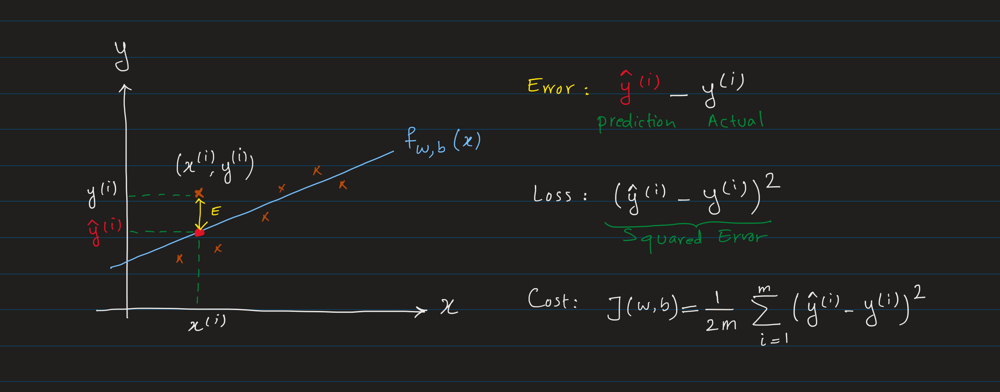
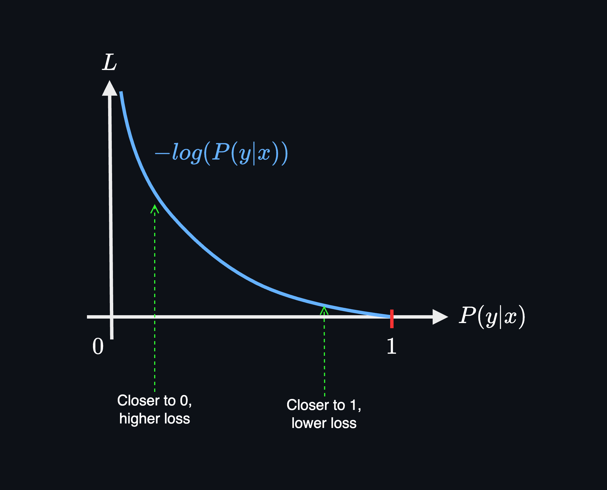
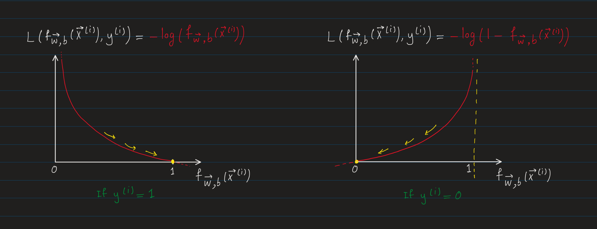

In machine learning, a **loss function** quantifies how well our model's predictions match the actual or true values from the data. Think of it as a measure of **error**:
- If the model's predictions are very good, the loss (error) is near zero.
- If the model's predictions deviate from the truth, the more it deviates, the higher the loss (error).

The main goal during the training of a machine learning model is to minimize this loss function to improve the accuracy of the model's predictions.

**Loss Function**: 
Formally, a loss function $L$ is a function that takes as input:

$$ L(\hat{y}, y) = \text{error }$$

where:
- $\hat{y}$: the predicted value output by the model for a single instance.
- $y$: the true value for that instance.
- $\text{error}$: A non-negative real number, interpreted as the **error** or **penalty** for the model's prediction.

> In some texts, the **loss function** is also denoted by a lowercase $\ell$ (the Greek letter “ell”):
>
>$$\ell\bigl(\hat{y}, y\bigr)$$

For the model $f_{w, b}$ which outputs predictions $\hat{y} = f_{w, b}(x)$, the loss for a single instance is  written as:
$$
L(\hat{y}, y) = L\bigl(f_{w, b}(x), y\bigr)
$$

where:
- $f$: The machine learning model that maps input features $x$ to output predictions $\hat{y}$. $x$ depending on the model and dataset could be a scalar, vector, or a matrix.
- $\hat{y}$: The predicted value output by the model. Depending on the problem, $\hat{y}$ could be a scalar, vector, or a matrix.
- $y$: The true value for that instance. Depending on the problem, $y$ could be a scalar, vector, or a matrix.
- $w$: The weights of the model, representing the learnable parameters associated with each input feature. $w$ could be a scalar, vector, or a matrix depending on the model and features of the dataset.
is a **matrix** whose shape depends on the type of model:
    - In **linear regression** or **logistic regression**, $w$ is actually a vector of shape $(n,)$, and denoted as $\vec{\mathbf{w}}$, where $n$ is the number of input features.
    - In **neural networks**, $w$ is a matrix of shape $(h, n)$, where $h$ is the number of neurons in the current layer, and $n$ is the number of inputs (or neurons in the previous layer). In this case, $w$ is denoted as $W$.
- $b$: The biases of the model. Like weights, biases could be a scalar, vector, or a matrix depending on the model and dataset.
  - It could be a scalar for simpler model like linear regression which we denote as $b$.
  - It could be referred as a vector $\vec{\mathbf{b}}$, when we are referring to the biases of a layer in a neural network.
  - Or it could be a matrix $B$ representing the biases of all the neurons in all the layers of a neural network.

We can also write the loss function as a function which takes the input features $x$, the true target $y$, and the model's parameters $w$ and $b$, and produce a scalar value which is the error between the model's prediction and the true target.

$$L(x,y; W, B) = error$$

Where:
- $x$: The input features. Depending on the model and dataset, $x$ could be a scalar, vector, or a matrix.

**Using $\theta$ (theta) notation**: 
For simplicity, it's common to show all the learnable parameters of the model (including weights and biases) as a single parameter set $\theta$.

$$
L(x, y; \theta) = L\bigl(f_{\theta}(x), y \bigr)
$$

where:
- $\theta$ encapsulates all the learnable parameters of the model, including weights $w$ and $b$.

**Loss function is a function of model's parameters**: 
The model $f$ is a function that maps input features $x$ to output predictions $\hat{y}$, given the parameters $\theta$.

$$\hat{y} = f_{\theta}(x)$$

The loss function is a function that maps the model's predicted output $\hat{y}$ (which itself depends on parameters $\theta$ and input $x$) and the true target $y$, and maps those inputs to a scalar error (a single real number).

$$ L(\hat{y}, y)= L(f_{\theta}(x), y)$$

Since both input value $x$ and the true target $y$ are fixed, the loss function is effectively a function of the model's learnable parameters $\theta$. In other words, the learnable parameters $\theta$ are the variables that change the output of the loss function. So, we usually denote the loss function as:

$$ L(\theta)$$

## Loss and Cost Functions

While the terms **loss** and **cost** are often used interchangeably, they have distinct meanings:

- **Loss Function**: Measures error for a **single instance** (or example) in the dataset. It quantifies how well the model's prediction matches the true value for that particular example in the training dataset.
- **Cost Function**: Aggregates the loss over the entire dataset, giving an overall measure of model performance. Typically, the cost function is the **average loss** across $m$ instances:

$$
J(\theta) = \frac{1}{m} \sum_{i=1}^{m} L(f_{\theta}(x^{(i)}), y^{(i)})
$$

Where:
- $J(\theta)$ is the cost function. Since this is just a average of the loss function, it's also a function of the model's parameters $\theta$.
- $i$ is the index of the training example.
- $m$ is the total number of training examples.

So the loss function for $i$-th example is:

$$L(f_{\theta}(x^{(i)}), y^{(i)})$$

> Note: Both Loss $L$ and Cost $J$ are scalar values (non-negative real numbers) that quantify the error between the model's predictions and the true values.

Choice of Loss function is tightly depend on the problem we are trying to solve. It's chosen based on the use-case, data, and objectives. The cost function is simply the average of these losses over the training set (or batch).

**Cost Function for batches** 
In practice, during the process of training, this averaging of losses is typically performed over a **subset** of the total training examples, known as a batch (or mini-batch). This batch-based averaging approach forms the basis of the commonly used [**mini-batch Stochastic Gradient Descent (SGD)**](gradient_descent.md#mini-batch-sgd) and its variants, where the model's parameters are updated incrementally after computing the cost function for each batch.

For example, in training neural networks, each batch (regardless of the size) goes through the following steps:
- forward pass for the batch.
- Cost computation for the batch
- backpropagation for the batch
- Update all the network parameters based on the gradients computed for the batch.

So, even though we run forward/backward pass for a batch, we update the parameters for the entire dataset.

>In simple terms, **Loss** is the error between the prediction of the model and actual ground truth label $y$ for one example from the training dataset. While **Cost** is the average of loss across all examples (or the batch) in the training dataset.
>
>The goal of training a machine learning model is to find most optimized values for the model's parameters ($w$ and $b$) that minimize the cost function $J(\theta)$. This is achieved by using optimization algorithms such as gradient descent and its variants.

## Loss and Cost Functions for Linear Regression

The Linear Regression model is defined as:

$$f_{\vec{\mathbf{w}},b}(\vec{\mathbf{x}}^{(i)}) = \vec{\mathbf{w}} \cdot \vec{\mathbf{x}}^{(i)} + b$$

where:
- $\vec{\mathbf{x}}^{(i)}$ is the feature vector for the $i^{th}$ instance.
- $\vec{\mathbf{w}}$ is the weight vector.
- $b$ is the bias term.

But, how do we know which values of $\vec{\mathbf{w}}$ and $b$ are the best? We need a way to measure how well the model is performing. In other words, how far or close the predicted value $\hat{y}$ is to the actual target value $y$ (labels).

So, the goal here is to find the best values for $\vec{\mathbf{w}}$ and $b$ that minimize the difference between the predicted value $\hat{y}$ and the actual target value $y$ for all training examples.

For simplicity, we use a univariate linear regression model $f_{w,b}(x) = wx + b$ where we have only one feature $x$. We use this model to explain the concept of cost function and how to minimize it.

**Error**: is the difference between the predicted value (by the model), and the actual target value.

$$Error =y_{pred} - y_{actual}$$

In a more formal way, Error is the difference between predicted value of the model for the $i^{th}$ training example (denoted as ${\hat{y}}^{(i)}$) and the actual target value $y^{(i)}$.

$$Error(\hat{y}^{(i)}, y^{(i)}) = \hat{y}^{(i)} - y^{(i)}$$

**Loss function**: 
A function that measures how well the model's prediction $\hat{y}$ for a single training example is compared to the actual target value $y$. We denote the loss function as:

$$L(\hat{y}^{(i)}, y^{(i)})$$

Or

And we have $\hat{y}^{(i)} = f_{\vec{\mathbf{w}},b}(\vec{\mathbf{x}}^{(i)})$, so we can write the loss function as:

$$L(f_{\vec{\mathbf{w}},b}(\vec{\mathbf{x}}^{(i)}), y^{(i)}; \vec{\mathbf{w}}, b)$$

For example, the _squared error_  and _absolute error_ are common [loss functions](https://developers.google.com/machine-learning/crash-course/linear-regression/loss#types_of_loss) used in regression models. Here, we will use the squared error loss function.

### Mean Squared Error (MSE)

The **Squared Error Loss** function is defined as:

$$L(\hat{y}^{(i)}, y^{(i)}) = (\hat{y}^{(i)} - y^{(i)})^2$$

This function measures the squared difference between the predicted value $\hat{y}^{(i)}$ and the actual target value $y^{(i)}$. By squaring the difference, we ensure that the loss is always a non-negative value, and heavily penalizes large errors by squaring them. This makes it pariticularly sensitive to larger errors.

Knowing that $\hat{y}^{(i)} = f_{\vec{\mathbf{w}},b}(\vec{\mathbf{x}}^{(i)})$, we can write the loss function as:

$$L(f_{\vec{\mathbf{w}},b}(\vec{\mathbf{x}}^{(i)}), y^{(i)}) = (f_{\vec{\mathbf{w}},b}(\vec{\mathbf{x}}^{(i)}) - y^{(i)})^2$$

As we discussed, the **Cost function** $J(\vec{\mathbf{w}},b)$ measures the average losses over all training examples.

$$J(\vec{\mathbf{w}},b) = \frac{1}{m} \sum\limits_{i = 1}^{m} L(f_{\vec{\mathbf{w}},b}(\vec{\mathbf{x}}^{(i)}), y^{(i)})$$

So, we can write the cost function for the squared error loss as:

$$J(\vec{\mathbf{w}},b) = \frac{1}{m} \sum\limits_{i = 1}^{m} \frac{1}{2}(f_{\vec{\mathbf{w}},b}(\vec{\mathbf{x}}^{(i)}) - y^{(i)})^2$$

> Note: The factor $\frac{1}{2}$ is introduced **purely for mathematical convenience** to simplify derivatives during gradient descent, as it cancels out the $2$ when taking the derivative of the squared term. It does not affect the optimization process or the final result.

This function is also called **Mean Squared Error (MSE)** which we moved the factor $\frac{1}{2}$ outside the sum.

$$J(\vec{\mathbf{w}},b) = \frac{1}{2m} \sum\limits_{i = 1}^{m} (f_{\vec{\mathbf{w}},b}(\vec{\mathbf{x}}^{(i)}) - y^{(i)})^2$$

## Cross-Entropy Loss
Cross-Entropy measures the dissimilarity between the predicted probability distribution and the true (actual) distribution by quantifying how far the predictions are from perfectly matching the true labels. It originates from information theory, where it quantifies the "surprise" or "information" difference between two probability distributions.

Imagine you are playing a guessing game, and you have to guess which box has candy inside. Cross-Entropy Loss is like a score that tells you how bad your guess is. If your guess is very far from the candy box, the score (or "loss") will be high. But if you make your guesses closer to the right box, the score gets smaller.

When we try to make the score as small as possible (minimize the loss), we are learning to guess better. In this case, it means we are getting closer to saying the right box has the highest chance (probability) of having the candy.

Let's compare Cross-Entropy Loss with Mean Squared Error (MSE) for better understanding. We know that Mean Squared Error (MSE) and Cross-Entropy Loss both measure the error between the model's predictions, but they do so in fundamentally different ways. MSE does this by measuring the distance between the predicted and true values, treating them as points in space and calculating how far apart they are. On the other hand, Cross-Entropy measures the unlikelihood of the true class by evaluating how much the predicted probability distribution deviates from assigning high probability to the correct class. In essence, while MSE focuses on minimizing the numerical distance between points, Cross-Entropy focuses on reducing the uncertainty and increasing confidence in the true class by penalizing unlikely predictions.

**Negative Log-Likelihood (NLL)**: 
Negative Log-Likelihood (NLL) is a broader topic in the field of statistics. It simply measures how well a proballistic model predicts the observed data.

For a single example, negative log-likelihood (NLL) is defined as:

$$
L_{\text{NLL}} = -\log(P(y|x;\theta))
$$

where:
- $L$ is the loss for a single example.
- $P(y|x;\theta)$ is the predicted probability of the correct label (class) $y$ given the input $x$ and model parameters $\theta$.

> Note: The above log function is the natural logarithm (base $e$) and not the logarithm with base 10. Usually in math texts, $log(x)$ without specifically indicating the base is considered as the natural logarithm $ln(x)$.

The NLL for all examples in a dataset is the average of the NLL for each example:

$$
J_{\text{NLL}} = -\frac{1}{m} \sum_{i=1}^m \log\bigl(P(y^{(i)}|x^{(i)};\theta)\bigr)
$$
where:
- $J$ is the average loss over all examples.
- $m$ is the number of examples.
- $P(y^{(i)}|x^{(i)}; \theta)$ is the predicted probability of the correct label $y^{(i)}$ given the input $x^{(i)}$ and model parameters $\theta$.

In multiclass classification problems in machine learning where the model outputs a probability distribution over two or more classes by using a sigmoid or softmax activation function, this NLL concept is used to define the Cross-Entropy Loss function.

$$
J_{\text{CE}} = -\frac{1}{m} \sum_{i=1}^m \log\bigl(P(y^{(i)}|x^{(i)};\theta)\bigr)
$$

Consequently, for multiclass classification, Cross-Entropy Loss is equivalent to the negative log-likelihood of the correct class label. Minimizing this loss directly increases the predicted probability of the true labels, making the model parameters more likely to match the observed data.

### Binary Cross-Entropy Loss
Binary Cross-Entropy Loss is a variant of the Cross-Entropy Loss which is commonly used in binary classification problems such as predicting whether an email is spam or not, or whether a tumor is malignant or benign. Here, the output of our model is a probability that the given input point belongs to a certain class.

In binary classification, the true label is either 0 or 1, and the model outputs a probability. If the true label is 1, we want the predicted probability to be as close to 1 as possible, and vice versa. The binary cross-entropy loss is high when the model's predictions are confident but wrong, and it's low when the predictions are confident and correct.

Formally, the binary cross-entropy loss function $L$ for a single data point is defined as:
$$
\begin{aligned}
  L(\hat{y}^{(i)}, y^{(i)}) = \begin{cases}
    - \log(\hat{y}^{(i)}) & \text{if $y^{(i)}=1$}\\
    - \log(1-\hat{y}^{(i)}) & \text{if $y^{(i)}=0$}
  \end{cases}
\end{aligned}
$$
where:
- $\hat{y}^{(i)}$ is the predicted probability for the $i^{th}$ instance.
- $y^{(i)}$ is the true label for the $i^{th}$ instance.

We know $\hat{y}^{(i)} = f_{\theta}(x^{(i)})$, so we can write the loss function as:

$$
L(f_{\theta}(x^{(i)}), y^{(i)}) = \begin{cases}
    - \log(f_{\theta}(x^{(i)})) & \text{if $y^{(i)}=1$}\\
    - \log(1 - f_{\theta}(x^{(i)})) & \text{if $y^{(i)}=0$}
  \end{cases}
$$

The following plots show the changes of the loss function for $f_{\vec{\mathbf{w}},b}(\vec{\mathbf{x}}^{(i)})$ as the predicted value $\hat{y}$ changes for the true label $y=1$ and $y=0$.

As we can see in the above plot:

When $y_{(i)}=1$: The goal is to penalize the model more when the predicted probability is low (close to 0).
- As $f_{\vec{\mathbf{w}},b}(\vec{\mathbf{x}}^{(i)})$ approaches 1, the loss approaches 0
- As $f_{\vec{\mathbf{w}},b}(\vec{\mathbf{x}}^{(i)})$ approaches 0, the loss approaches $\infty$

When $y_{(i)}=0$: The goal is to penalize the model more when the predicted probability is high (close to 1).
- As $f_{\vec{\mathbf{w}},b}(\vec{\mathbf{x}}^{(i)})$ approaches 0, the loss approaches 0
- As $f_{\vec{\mathbf{w}},b}(\vec{\mathbf{x}}^{(i)})$ approaches 1, the loss approaches $\infty$

>  This loss function penalizes the model heavily when predictions of the model $f_{\vec{\mathbf{w}},b}(\vec{\mathbf{x}}^{(i)})$ goes further away from the true label $y_{(i)}$. Using this loss, the model is strongly encouraged not to predict something too close to 0 or 1.

We can write the loss function $L$ in a more simpler way:

$$
L(f_{\theta}(x^{(i)}), y^{(i)}) = -y^{(i)} \log(f_{\theta}(x^{(i)})) - (1 - y^{(i)}) \log(1 - f_{\theta}(x^{(i)}))
$$

The above notation is embedding the if-else condition in a single equation. Since we know that $y^{(i)}$ is either 0 or 1, the term $-y^{(i)} \log(f_{\theta}(x^{(i)}))$ will be zero when $y^{(i)}=0$ and the term $-(1 - y^{(i)}) \log(1 - f_{\theta}(x^{(i)}))$ will be zero when $y^{(i)}=1$.

Now, knowing that $\hat{y}^{(i)} = f_{\theta}(x^{(i)})$, we can write the loss function as:

$$
L(\hat{y}^{(i)}, y^{(i)}) = -y^{(i)} \log(\hat{y}^{(i)}) - (1 - y^{(i)}) \log(1 - \hat{y}^{(i)})
$$

In binary classification tasks, the final layer of the neural network typically consists of a single output node with a sigmoid activation function, which gives us the probability $a$ that an instance belongs to class 1 (consequently, the probability that it belongs to class 0 is $1-a$).

Given the true label $y$ (where $y=1$ for class 1 and $y=0$ for class 0) and the predicted probability $a$, the Binary Cross-Entropy Loss $L$ for an individual instance is:

$$
L(a, y) = -y \log(a) - (1 - y) \log(1 - a)
$$

Where:
- $a$ is the predicted probability (output of the last layer).

This implies that if the true class is 1 ($y=1$), the loss becomes $-\log(a)$, and if the true class is 0 ($y=0$), the loss transforms to $-\log(1-a)$.

**Cost Function for Binary Cross-Entropy:** 
The cost function $J$ measures the average loss (error between the model's predictions and the true labels) for the entire training set of size $m$:

$$J(\theta) = \frac{1}{m} \sum_{i=1}^{m} L(f_{\theta}(x^{(i)}), y^{(i)})$$

If we substitute the loss function $L$ into the cost function $J$, we get:

$$
J(\theta) = -\frac{1}{m} \sum_{i=1}^{m} \left[ y^{(i)} \log(f_{\theta}(x^{(i)})) + (1 - y^{(i)}) \log(1 - f_{\theta}(x^{(i)})) \right]
$$

where:
- $m$ is the number of training examples.
- $f_{\theta}(x^{(i)})=\hat{y}^{(i)}$ is the output of the model for the $i^{th}$ example. This is the predicted probability that the $i^{th}$ with given input $x^{(i)}$ and model parameters $\theta$. The probability value indicates the likelihood of the instance belonging to class 1.

We can then write it in a simpler form:
$$
J(\theta) = -\frac{1}{m} \sum_{i=1}^{m} [y^{(i)} \log(\hat{y}^{(i)}) + (1 - y^{(i)}) \log(1 - \hat{y}^{(i)})]
$$

### Categorical Cross-Entropy Loss
The Cross-Entropy Loss function for multi-class classification is commonly referred to as **Categorical Cross-Entropy**.

**Categorical**: This term indicates that the problem at hand is a multi-class classification problem, where the aim is to predict the probability of each category. The target labels are categories (also called classes), represented as **one-hot encoded** vectors. A vector with the size of $N$ (number of classes) where the index of the true class is 1 and all other indices are 0. In other word, each input example belongs to exactly one clas

For example, if there are $N=5$ classes, a label for "Class 2" is represented as:

$$ y = \begin{bmatrix} 0 & 1 & 0 & 0 & 0 \end{bmatrix} $$

Here, the label is a vector of length $N$ with a 1 at the index corresponding to the class and 0s elsewhere.

**For a Single Example:**

The cross-entropy loss for one example $(i)$ is:

$$
L^{(i)} = - \sum_{j=1}^{N} y_j^{(i)} \log(\hat{y}_j^{(i)})
$$

where:
- $L^{(i)}$ is the loss for example $i_{th}$.
- $N$ is the number of classes.
- $y_j^{(i)}$ is the true label (1 for the correct class, 0 for all others) for example $i_{th}$ and class $j$.
- $\hat{y}_j^{(i)}$ is the predicted probability for example $i_{th}$ and class $j$ which is the output of the softmax function.

**Cost Function for the $m$ Examples:**

The **cost function** $J$ (average cross-entropy loss) is:

$$
J = \frac{1}{m} \sum_{i=1}^{m} L^{(i)} = - \frac{1}{m} \sum_{i=1}^{m} \sum_{j=1}^{N} y_j^{(i)} \log(\hat{y}_j^{(i)})
$$

where:
- $m$ is the number of examples in the batch.

### Sparse Categorical Cross-Entropy Loss
Sparse Categorical Cross-Entropy Loss is another version of Cross-Entropy Loss used specifically for multi-class classification tasks. However, unlike the standard Cross-Entropy Loss, it is applied when the true class labels are represented as integers instead of one-hot encoded vectors.

**Sparse**: This indicates that the labels are provided as integers, with each integer representing a class. For example, in a 10-class problem (like digit recognition, where classes are 0 to 9), the label for class 2 is simply the integer 2. Sparse representation is more memory-efficient comparing to the 'dense' representation, where each label is a one-hot encoded vector.

**Sparse Encoding**
$$ y = \begin{cases}
    \text{class 1} \Rightarrow y=1\\
    \text{class 2} \Rightarrow y=2\\
    \text{class 3} \Rightarrow y=3\\
    \vdots \\
    \text{class N} \Rightarrow y= N
\end{cases}$$

**Sparse Categorical Cross-Entropy** Loss for $N$ classes is defined as:

$$
\begin{aligned}
  L(\mathbf{\vec{a}},y)=\begin{cases}
    -log(a_1), & \text{if $y=1$}\\
    -log(a_2), & \text{if $y=2$}\\
        &\vdots\\
     -log(a_N), & \text{if $y=N$}
  \end{cases}
\end{aligned}
$$
where:
- $N$ is the number of classes.
- $y$ is the true class label for the instance.
- $\mathbf{\vec{a}}$ is the output of the softmax function which is predicted probability vector for a single example. $\vec{\mathbf{a}} = [a_1^{(i)}, a_2^{(i)}, ..., a_{N}^{(i)}]$, where $a_i^{(i)}$ is the predicted probability of class $j_{th}$ for the $i_{th}$ example in the
dataset (batch).

> In both Categorical and Sparse Categorical Cross-Entropy Loss, the output layer of the model has $N$ neurons, each representing a class. Then when the softmax function (output layer activation function) is applied, it converts the raw logits (linear transformation of the output layer) into a probability distribution over the classes $\mathbf{\vec{a}}$. Then we apply either Categorical Cross-Entropy Loss or Sparse Categorical Cross-Entropy Loss to compute the loss.

At anytime, only one of them true (the example can belong to one class at a time only). So, it means the rest of the lines above are zero. If the true class is $j$

$$
L(a_j, y) = -\log(a_j)
$$

Where:
- $a_j=\hat{y}_j$ is the predicted probability of the sample belonging to the correct class $j$.

>This is essentially equivalent to the standard Categorical Cross-Entropy Loss, but is computationally more efficient when the class labels are integers, as there's no requirement to convert them into one-hot encoded vectors.

As we discussed, that only the line that corresponds to the target contributes to the loss, other lines are zero. To write this in math terms we use an _indicator function_ that will be 1 when the index matches the target and zero otherwise.

$$\mathbf{1}\{y == n\} =\begin{cases}
1, & \text{if $y==n$}.\\
0, & \text{otherwise}.
\end{cases}$$

We can write the loss function as:

$$
L(\mathbf{\vec{a}},y) = - \sum_{j=1}^{N}  \mathbf{1}\{y == j\} \log(a_j)$$

Where:
- $N$ is the total number of classes.
- $j$ is the index of the output element in the vector $\mathbf{\vec{a}}$.

Since the last layer activation function is softmax, we can replace $a_j$ with the softmax output:

$$
a_j = \frac{e^{z_j}}{\sum_{k=1}^N e^{z_k}}
$$

Where:
- $z_j$ is the linear transformation (logit) of the output layer for class $j$.
- $N$ is the number of classes.

So, we can write the loss function as:

$$
\begin{aligned}
L(\mathbf{\vec{a}},y) = - \sum_{j=1}^{N}  1\left\{y == j\right\} \log \frac{e^{z_j}}{\sum_{k=1}^N e^{z_k} }
\end{aligned}
$$

**Numerical Stability**: 
The above representation also useful, because usually in practice for better numerical stability (preventing overflow and underflow), we pass on the logits directly to the Loss function instead of first calculating the softmax output $\mathbf{\vec{a}}$ and then passing it to the loss function. This is because the softmax function can produce very small values for large logits, which can lead to numerical instability when calculating the logarithm.

> **indicator function:** (denoted here as $\mathbf{1}\{y == n\}$) is a concept that behaves very similarly to the if-else construct in programming. It produces a binary output based on whether a specific condition is met.
>
>In this context, the condition is $y==n$, where $y$ is the target (actual) class and $n$ is the index of the class we're currently considering.
> The mathematical notation you're seeing is a piecewise function, which is a common way to represent indicator functions. Here's how it works:
>
>If $y==n$ then:
> $$\mathbf{1}\{y == n\} = 1$$
>If $y \neq n$ then:
>$$\mathbf{1}\{y == n\} = 0$$

**Cost Function**: 
The cost function $J$ is the average loss over all examples in the training set:

$$
J(\theta) = -\frac{1}{m} \left[ \sum_{i=1}^{m} \sum_{j=1}^{N} 1\{y^{(i)} == j\} \log \frac{e^{z_j^{(i)}}}{\sum_{k=1}^N e^{z_k^{(i)}} } \right]
$$

Where:
- $m$ is the number of examples in the batch.
- $N$ is the number of classes.
- $y^{(i)}$ is the true class label for the $i^{th}$ instance.
- $z_j$ is the input to the softmax function for class $j$. It's the logit for the class $j$.

To put this all together, if you're working on a multi-class classification problem with mutually exclusive classes (where each sample belongs to exactly one class), and you have class labels represented as integers, you would use Sparse Categorical Crossentropy as your loss function.

### Loss Function Summary

| Loss Function | Use Case | Description |
| --- | --- | --- |
| **Categorical Cross-Entropy** | Mutually Exclusive Multi-Class | - When each instance belongs to exactly one class   - Labels are one-hot encoded vectors. |
| **Sparse Categorical Cross-Entropy** | Mutually Exclusive Multi-Class | - When each instance belongs to exactly one class   - True labels are integers representing the class index. |
| **Binary Cross-Entropy** | - Mutually Exclusive Binary Class (N=2)  -Multi-Label Classification | It works for both binary classification (mutually exclusive classes, $N=2$) and multi-label classification by treating each class independently, calculating loss for each output probability separately and sum (or average) them to get the total loss. |
