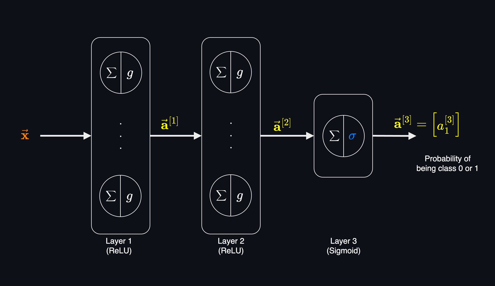
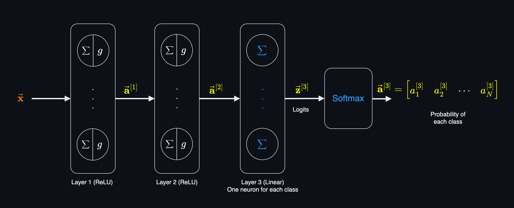
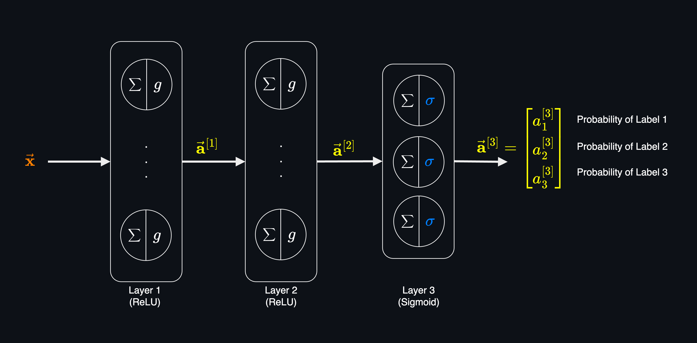

# Multiclass Classification
Multiclass classification is a classification task that the target variable can take on more than two values. In other words, the target variable $y$ can take on $N$ different classes, where $N > 2$.

Some of the examples of multiclass classification problems include:

| Question | Target Variable | Classes |
| --- | --- | --- |
| What type of tumor is this? | Malignant, Benign, Normal | $N=3$ |
| Hand written digit recognition | 0, 1, 2, 3, 4, 5, 6, 7, 8, 9 | $N=10$ |
| What type of animal is this? | Cat, Dog, Bird | $N=3$ |
| What type of vehicle is this? | Car, Truck, Bus, Motorcycle, Bicycle | $N=5$ |
| Next word (English) prediction in NLP | [Vocabulary of words/tokens](https://arxiv.org/abs/2406.16508) | $N=50,000+$ |

In binary classification, the target variable $y$ can take only two values, 0 or 1. That's why an algorithm like logistic regression which uses the sigmoid function is an appropriate choice for binary classification.

However, for multiclass classification, where $y$ can take on multiple values, we need a different algorithm such as **Softmax Regression** which is the generalization of logistic regression algorithm.

## Binary Classification
Let's start with the binary classification and then move on to the multiclass classification.

**In Binary Classification:** 
The model output a single value between 0 and 1, which is the probability of the target variable being 1.

In the output layer:

Logits: 

$$z^{[3]}_1 =  \vec{\mathbf{w}}^{[3]}.\vec{\mathbf{a}}^{[2]} + b^{[3]}$$

Activation function(Sigmoid): 
$$a^{[3]}_1 = \sigma(z^{[3]}_1) = \frac{1}{1 + e^{-z^{[3]}_1}}$$

The output of the model is the probability of the target variable $y$ being 1.

$$P(y=1|\vec{\mathbf{x}};\vec{\mathbf{w}},b) = a^{[3]}_1$$

The total probability of the target variable being 1 or 0 should be 1, so:

$$P(y=1|\vec{\mathbf{x}};\vec{\mathbf{w}},b) + P(y=0|\vec{\mathbf{x}};\vec{\mathbf{w}},b) = 1$$

So the probability of the target variable being 0 is:

$$P(y=0|\vec{\mathbf{x}};\vec{\mathbf{w}},b) = 1 - a^{[3]}_1$$

## Multiclass Classification

The output layer of multiclass classification is different from binary classification. The last layer first calculates the logits for each class, and then pass all the logits $\vec{\mathbf{z}}$ to the softmax function to get the probabilities of each class.

The final output of the model (after softmax) is a vector of $N$ values ($N$ is the number of classes) where each value is the probability of the target variable being that class.

Notes:
- The last layer doesn't have an activation function, or in other words have [Linear Activation Function](neural_networks_activation_functions.md#linear-activation-function). So, it only calculates the logits.
- The last layer has $N$ neurons, where $N$ is the number of classes in the target variable.
- Output of Softmax function is a vector of with the same size as the input vector (number of classes). Softmax function normalizes the input vector into a probability distribution.
- Logits are scalar values and can be any real number. The relative differences between logits are what matter, not their absolute values. The softmax function converts the logits into probabilities.

In the output layer:

Logits: 
$$z^{[3]}_1 =  \vec{\mathbf{w}}^{[3]}.\vec{\mathbf{a}}^{[2]} + b^{[3]}$$

Activation function (Softmax): 

$$\vec{\mathbf{a}}^{[3]} = softmax(\vec{\mathbf{z}}^{[3]})$$

### Softmax
Softmax regression is a generalization of logistic regression to the case where we want to handle multiple classes. In softmax regression, the output of the model is a vector of $N$ values, where $N$ is the number of classes. Each value is the probability of the target variable being that class.

Softmax function is used to convert the logits into probabilities. The softmax function takes a vector of $N$ real numbers (raw scores) and normalizes them into a probability distribution consisting of $N$ probabilities with the sum of probabilities equal to 1.

Given a vector of logits $\vec{\mathbf{z}}$:

$$\vec{\mathbf{z}} = \begin{bmatrix} z_1 & z_2 & \dots & z_n \end{bmatrix}$$

The softmax function of the logits is:

$$a_1 = \frac{e^{z_1}}{e^{z_1} + e^{z_2} + ... + e^{z_N}} = P(y=1|x;\vec{\mathbf{w}},b)$$
$$\vdots$$
$$a_N = \frac{e^{z_N}}{e^{z_1} + e^{z_2} + ... + e^{z_N}}= P(y=N|x;\vec{\mathbf{w}},b)$$

Which we can rewrite as:

$$a_i = \frac{e^{z_i}}{\sum_{j=1}^{N} e^{z_j}}$$

Where:
- $a_i$ is the probability of the target variable being class $i$.
- $z_i$ is the logit of class $i$.

> In some text or implementation where we start the index from 0, the softmax function is written as:
> $$a_i = \frac{e^{z_i}}{\sum_{j=0}^{N-1} e^{z_j}}$$
> In this case, the index $i$ starts from 0.

The final output of the model (after softmax) is a vector of $N$ values, where each value is the probability of the target variable being that class.

$$\vec{\mathbf{a}} = g(\vec{\mathbf{z}})= \begin{bmatrix} a^{[3]}_1 & a^{[3]}_2 & \cdots & a^{[3]}_N \end{bmatrix}$$

Which each of the values in the output vector is the probability of the target variable being that class.

$$\vec{\mathbf{a}} = \begin{bmatrix} P(y=1|x;\vec{\mathbf{w}},b) &
P(y=2|x;\vec{\mathbf{w}},b) & \cdots & P(y=N|x;\vec{\mathbf{w}},b) \end{bmatrix}$$

Where:
- $g$ is the softmax function.
- $\vec{\mathbf{z}}^{[3]}$ is the vector of logits of the output layer.

> The key difference between the softmax function and other activation functions is that they are the activation function of the logit of a **single** neuron (element-wise operation), whereas the softmax function is function of **all** neurons, and applied to the logits of **all** the neurons in the output layer.

**Key characteristics of Softmax function:**
1. Normalization: The softmax function ensures the sum of all probabilities is equal to 1 by dividing each exponentiated logit by the sum of all exponentiated logits.

2. Exponentiation: The softmax function uses exponentiation to amplify the differences between logits. This means that larger logits will have a disproportionately larger impact on the resulting probabilities, which is important for making clear distinctions between classes.

3. Gradient Descent: The softmax function is differentiable and its gradient is well-defined, which is crucial for optimization algorithms like gradient descent used in training neural networks.

Example: 
In the neural network shown above, where we have 3 layers, let's say we have 3 classes (N=3) to predict, then in the last layer of the model:

**For class 1:** 
Logit: 
$$z^{[3]}_1 =  \vec{\mathbf{w}}^{[3]}.\vec{\mathbf{a}}^{[2]} + b^{[3]}$$

Softmax: 
$$a^{[3]}_1 = \frac{e^{z^{[3]}_1}}{e^{z^{[3]}_1} + e^{z^{[3]}_2} + e^{z^{[3]}_3}}$$

**For class 2:** 
Logit: 
$$z^{[3]}_2 =  \vec{\mathbf{w}}^{[3]}.\vec{\mathbf{a}}^{[2]} + b^{[3]}$$

Softmax: 
$$a^{[3]}_2 = \frac{e^{z^{[3]}_2}}{e^{z^{[3]}_1} + e^{z^{[3]}_2} + e^{z^{[3]}_3}}$$

**For class 3:** 
Logit: 
$$z^{[3]}_3 =  \vec{\mathbf{w}}^{[3]}.\vec{\mathbf{a}}^{[2]} + b^{[3]}$$
Softmax: 
$$a^{[3]}_3 = \frac{e^{z^{[3]}_3}}{e^{z^{[3]}_1} + e^{z^{[3]}_2} + e^{z^{[3]}_3}}$$

As we discussed, each value in the output vector is the probability of the target variable being that class. The total probability of all classes should be 1:

Probability of class 1: 
$$P(y=1|\vec{\mathbf{x}};\vec{\mathbf{w}},b) = a^{[3]}_1$$
Probability of class 2: 
$$P(y=2|\vec{\mathbf{x}};\vec{\mathbf{w}},b) = a^{[3]}_2$$
$$...$$
Probability of class N: 
$$P(y=N|\vec{\mathbf{x}};\vec{\mathbf{w}},b) = a^{[3]}_N$$

Total probability of all classes should be 1.
$$a^{(1)}_1 + a^{(1)}_2 + ... + a^{(1)}_N = 1$$

Which can be written as:
$$P(y=1|x;\vec{\mathbf{w}},b) + P(y=2|x;\vec{\mathbf{w}},b) + ... + P(y=N|x;\vec{\mathbf{w}},b) = 1$$

And can be summarized as:
$$\sum_{i=1}^{N} P(y=i|x;\vec{\mathbf{w}},b) = 1$$

For example if $N=3$ and we have the following probabilities:
$$\vec{\mathbf{a}}^{[3]} = [0.12, 0.23, 0.65]$$

Then we interpret it as:

Total probability of all classes:
$$0.12 + 0.23 + 0.65 = 1$$

Probability of class 1: 12% 
Probability of class 2: 23% 
Probability of class 3: 65% 

It means there is 12% chance that the predicted output is class 1, 23% chance that it's class 2, and 65% chance it's class 3.

## Loss Function
The loss function for multiclass classification is the [Cross-Entropy Loss](loss_and_cost_functions.md#cross-entropy-loss) function. The cross-entropy loss function is used to measure the difference between the predicted probability distribution and the true probability distribution.

Softmax output is a vector of probabilities for each class. When we have multiple classes (1 to N where N>2), we can defined each class as an integer from 1 to N. In this case, the target variable $y$ is a single integer from 1 to N.

Classes:
- Class 1: $y=1$
- Class 2: $y=2$
- ...
- Class N: $y=N$

Each prediction is a vector of probabilities, where each value is the probability of the target variable being that class. But the true target label $\hat{y}$ is just one of the classes (a number from 1 to N).

In this case, we use [Sparse Categorical Cross-Entropy](loss_and_cost_functions.md#sparse-categorical-cross-entropy-loss) loss function.

For see the details of the Cross-Entropy Loss, Negative Log-Likelihood and Sparse Categorical Cross-Entropy see [this](loss_and_cost_functions.md#cross-entropy-loss).

## Multi-label Classification
In multi-label classification, the target variable $y$ can take multiple classes at the same time. For example, when classifying images, an image can **at the same time** contain people, cars and trees. In this case, the target variable $y$ is a binary vector of size $N$ where $N$ is the number of classes.

For example, if we have 3 classes, then the target variable $y$ can be:

If an input image:
- Contains people = yes
- Contains cars = no
- Contains trees = yes

Then the target variable $y$ is a binary vector of size 3:
$$y = [1, 0, 1]$$

Or if an image:
- Contains people = yes
- Contains cars = yes
- Contains trees = yes

Then the target variable $y$ is:
$$y = [1, 1, 1]$$

and so on.

This is different from multiclass classification where the target variable $y$ can take only **one** class at a time. Multi-lable classification can be seen as combination of multiple **binary** classification** tasks.

There are two approaches to solve these kind of problems:

**1. One model for each class:** 
In this approach, we train a separate model for detecting each class and the probability of that class being present in the input.

The key disadvantage of this approach is that we need to train $N$ models, and also the complete inference process is slower because we need to run $N$ models to get the final output which is the probability of each class being present in the input.

**2. One model for all classes:** 
The more common approach is to use a single model which has output layer with $N$ neurons where $N$ is the number of classes. The output layer has a sigmoid activation function for each neuron. This means the model predicts $N$ binary classification tasks at the same time, one for each class.

This approach is like we are solving $N$ binary classification problems at the same time. That's why the output layer provides a vector of $N$ values.

For example in the previous example where we have 3 labels (people, cars, trees), the output of the model is a vector of 3 values where each value is the probability of the corresponding class being present in the input.

The output of the model:

- $a^{[3]}_1$ is the probability of the people being present in the input.
- $a^{[3]}_2$ is the probability of the car being present in the input.
- $a^{[3]}_3$ is the probability of the tree being present in the input.

**Cost Function:** 
Since the multi-label classification is a combination of multiple binary classification tasks, the loss function is the sum (or average) of the [Binary Cross-Entropy Loss](loss_and_cost_functions.md#binary-cross-entropy-loss) of each label.

In the above example where we have 3 labels, the loss function is the sum of the loss of each class:

$$J(W,\vec{\mathbf{b}}) = \frac{1}{m} \sum_{i=1}^{m} \sum_{j=1}^{N} -y^{(i)}_j \log(a^{[3](i)}_j) - (1-y^{(i)}_j) \log(1-a^{[3](i)}_j)$$

Where:
- $m$ is the number of samples.
- $N$ is the number of labels.
- $y^{(i)}_j$ is the true label of the $j^{th}$ label of the $i^{th}$ sample.

> Both taking average or sum of the loss function is common and can be used.
