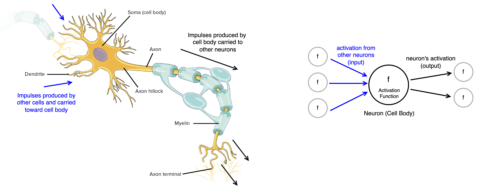
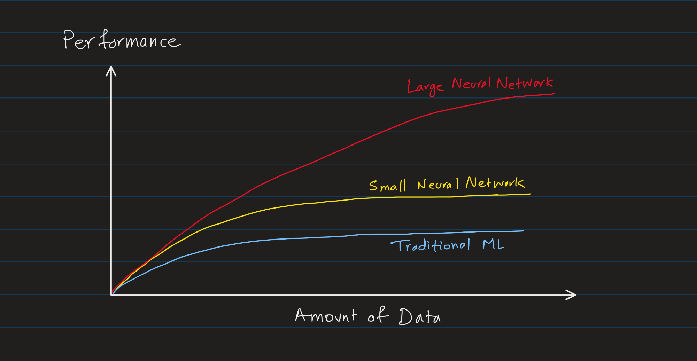
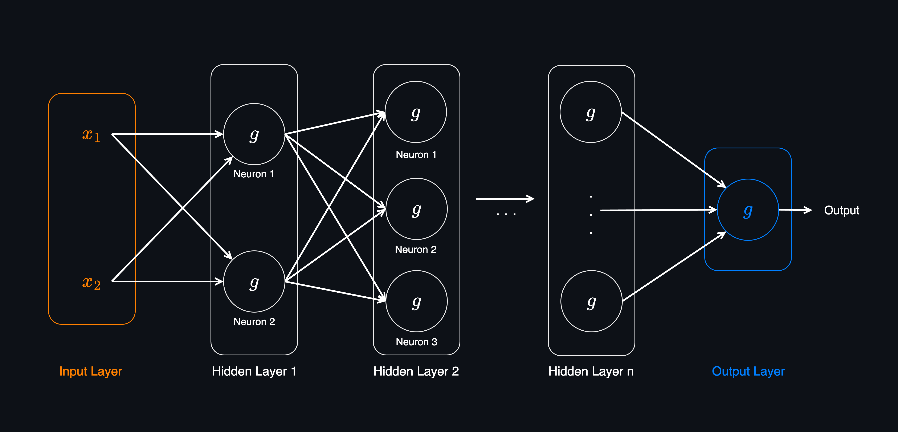
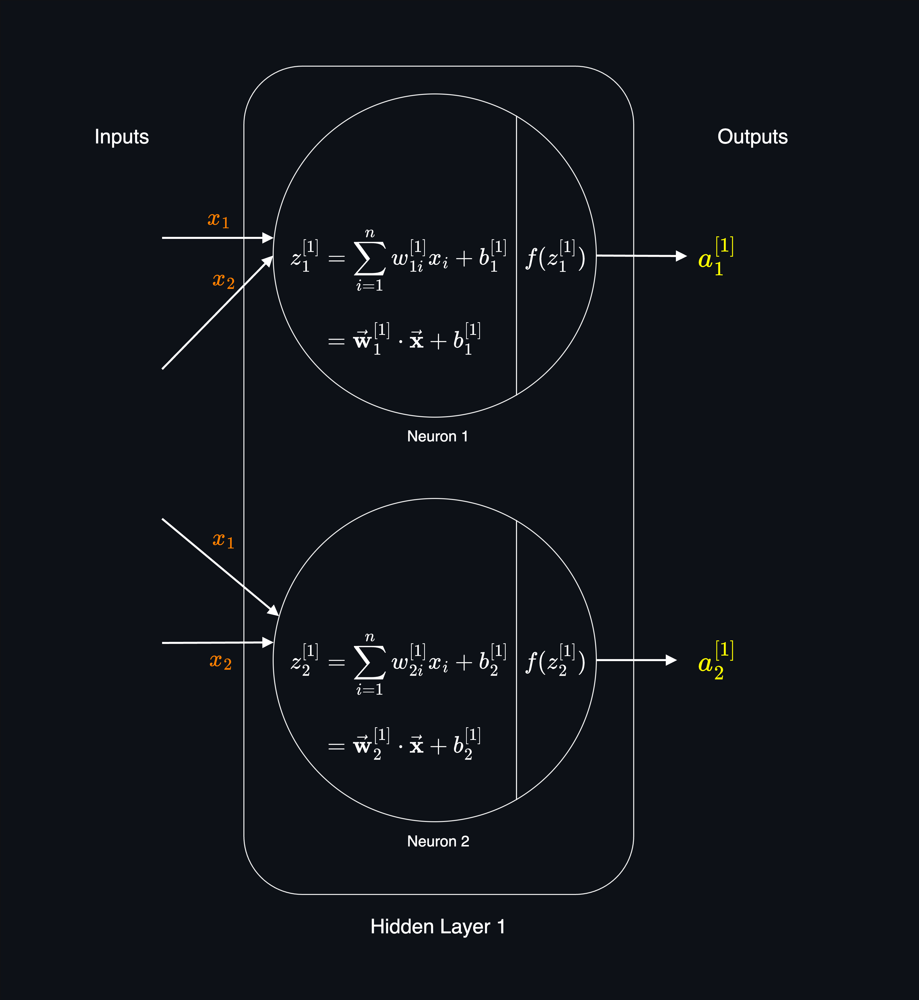
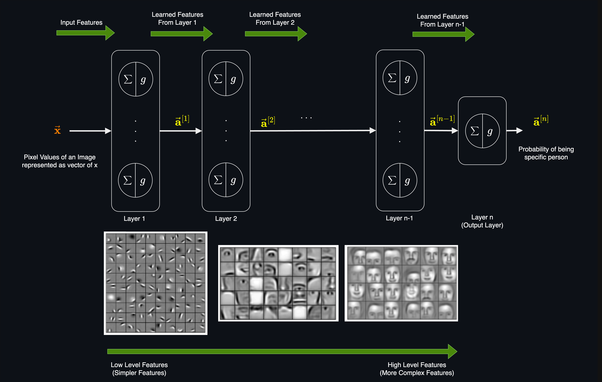
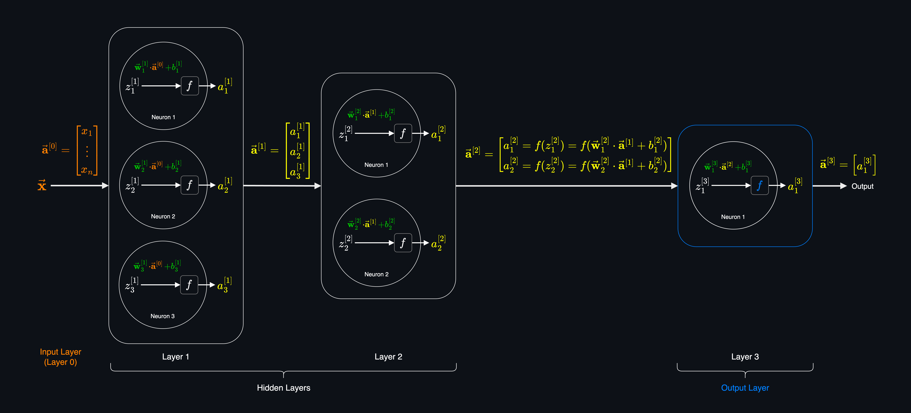
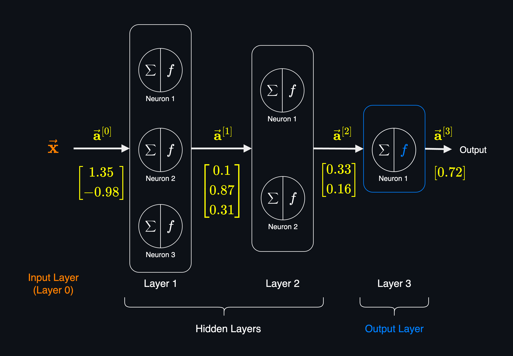

# Neural Networks
Neural Networks are a class of machine learning algorithms that are inspired by the structure of the human brain. This idea started in 1940s to build algorithms that could mimic the human brain.

While Neural Networks have been around for a long time, they resurge in poplularity in 2000s due to the increase in computational power and the availability of large datasets, under new branding as **Deep Learning**

_Artificial Neural Networks (ANN)_ is another name for neural networks which explicitly distinguishes them from biological neural networks (human brain).


Source: [Khan Academy - Overview of neuron structure and function](https://www.khanacademy.org/science/biology/human-biology/neuron-nervous-system/a/overview-of-neuron-structure-and-function)

Although the structure of a neural network is inspired by the human brain, not only it's a very simplified version of it, but also we still have a very little understanding of how the human brain works. So, it's good to know the origin and similarities, but we should see the neural networks as a mathematical and engineering model rather than the biological motivation behind neural networks.

**Performance of ML Algorithms with respect to Data Size:**<br>
During time as the amount of data available to train models has increased, AI researchers have found that the performance of traditional algorithms (Linear Regression, Logistic Regression, Decision Trees, etc.) plateaus after a certain amount of data. In other words, the performance of these algorithms does not improve significantly after a certain amount of data is provided to them. After that point, no matter how much more data we provide, the performance of these algorithms does not improve significantly.

However, the performance of Neural Networks continues to improve with more data.



So, if we have a large amount of data, a large neural network can effectively learn from it and provide the best possible performance in comparison to other ML algorithms.

This capability of Neural Networks comes from the fact, that Neural Networks can have many layers of neurons, and more neurons mean more parameters to learn. This allows them to learn complex patterns from the large amount of data.

We also should note that training large neural networks with large datasets requires a lot of computational power. So, both the increase in size of datasets and computational power (GPUs, etc) have contributed to the resurgence of Neural Networks in recent decades, which will be continued as both of these factors continue to grow.


## Structure of a Neural Network



**Neurons**:<br>
Think of a neuron as a simple function that takes some inputs, does some calculations and produces an output. Neurons are also called **nodes** or **units**.

Inspired by the human brain neurons, the following terms are used in neural networks, where a neuron is a computational unit and generate an activation which send down to the other downstream neurons.
- **Activation Unit**: A neuron.
- **Activation**: The output of a neuron denoted as $a$. It also called _activation value_ or _activation output_. In some text, it's also denoted as $h$.
- **Activation Function**: The internal function of a neuron that calculates the output of the neuron. The activation function is denoted as $g$.

All the inputs to a neuron are multiplied by some weights (parameters of the neuron), summed up to calculate the **Linear Transformation** of the neuron, and then passed through an **activation function** to produce the output of the neuron.


Some of the most common activation functions are:
- ReLU (Rectified Linear Unit) Function
- Sigmoid Function
- Tanh Function
- Softmax Function

**Layers:**<br>
Neural Network is a collection of layers of neurons. Each layer is a collection of neurons that are connected to the neurons in the previous layer. The first layer is called the **Input Layer** and the last layer is called the **Output Layer**. The layers between the input and output layers are called **Hidden Layers**.

> The term **hidden** inspired by the fact that these layers are not directly connected to the input or output of the network. When we have a training dataset, we can observe both input $X$ and output $Y$ of the dataset. But we can't observe the output of the hidden layers in the training set. So, they are called hidden layers.

In a semantic way, each neuron represents a **feature**.
- If a neuron is in the input layer, it represents an input feature.
- If a neuron is in hidden layers, it represents a learned feature.
- If a neuron is in the output layer, it represents an output class.

A layer can have one or more neurons. The number of neurons in the input layer is determined by the number of input features in the dataset. The number of neurons in the output layer is determined by the number of classes which we want to predict.

Think of a neural networks of multiple layers which each layer inputs a vector of features and outputs another vector of features. The output of the previous layer is the input of the next layer.

**Depth and Width**: The number of layers in a neural network is called the **depth** of the network. The more layers, the deeper the network. The number of neurons in a layer is called the **width** of the network. The more neurons, the wider the network.

**Neural Network Architecture**: When creating a neural network, we should decide the depth and width (number of layers and number of neurons in each layer) of the network. This is called **architecture** of the network. The architecture of the network is a hyperparameter that we should decide before training the network.


### Types of Layers and Neuron Connections
The connection between neurons in different layers is called **edges**. Each edge has a **weight** which is a parameter that the neural network learns during training.

Depending on the type of the layer, the connections between neurons can be different. There are three main types of layers in a neural network:

- Fully Connected Layers (Dense Layers):
  - Every neuron in this layer is connected to every neuron in the previous layer.
- Convolutional Layers (CNNs):
  - Every neuron in this layer is connected to a subset of neurons in the previous layer.
- Recurrent Layers (RNNs):
  - Every neuron in this layer is connected to every neuron in the previous layer and also to itself.

A neural network can (and often does) consist of both fully connected layers and other types of layers. These layers are combined depending on the task, type of data, and the architecture of the model. However, a neural network can also consist of only fully connected layers.

**Fully Connected Layers (Dense Layers)**:<br>
A fully connected layer (also called a **dense layer**) is a layer where every input neuron is connected to every output neuron by a weight. This means that:

Every feature in the input affects every neuron in the output (controlled by the weights of that connection). Each neuron first perform the **linear transformation** (weighted sum of it's inputs) and then apply an **activation function** to the result.

Fully Connected means there are no skipped connections—every input influences every output. This is different from convolutional layers, where connections are local (each neuron only looks at a small region of the input).

During training, model tries to learn the best weights for the connections between neurons. The weight of a connection determines the impact of the neuron (feature or learned feature) on the output of the current neuron. The larger the weight, the larger the impact of the feature on the output of the neuron.

> The term **Perceptron** is original name for one neuron (one computational unit) which was introduced in 1950s. The term **Perceptron** is still used in some contexts to refer to a single neuron (a single activation unit). The term **Multi-Layer Perceptron (MLP)** is used to refer to a neural network with multiple layers of neurons.


### Inside the Neurons of a Layer
Let dive a bit deeper into the internal structure of a neurons in a layer.



**Notation For Layers and Neurons**:<br>
To denote the layers and neurons in a neural network, we use the following notation:

$$z^{[layer]}_{neuron} \quad \vec{\mathbf{w}}^{[layer]}_{neuron} \quad b^{[layer]}_{neuron} \quad a^{[layer]}_{neuron}$$

Where:
- Superscript $[layer]$ is the number of the layer.
- Subscript $neuron$ is the number of the neuron in the layer.

**Each Neuron Performs Two Steps of Calculation**:<br>

1. **Linear Transformation:** Compute $\vec{\mathbf{w}} \cdot \vec{\mathbf{x}} + b$ to output the $z$. This is also called _pre-activation_.

2. **Activation Step:** Apply the activation function on the output of linear transformation of the neuron. Activation function usually is a non-linear function.


**Linear Transformation**:<br>
The weighted sum of the inputs to the neuron which is denoted as:


$$z^{[l]}_{n}$$

Where:
- $[l]$ is the layer number.
- $n$ is the neuron number in the layer.

For example, Linear Transformation of the second neuron in the first layer is denoted as:

$$z^{[1]}_2$$


The Linear Transformation of the first neuron in the first layer is calculated as:

$$z^{[1]}_1 = w^{[1]}_{11} \cdot x_1 + w^{[1]}_{12} \cdot x_2 + b^{[1]}_1$$

Where:

- $w^{[1]}_{11}$ is the weight for input feature $x_1$ to node 1 of layer 1.
- $w^{[1]}_{12}$ is the weight for input feature $x_2$ to node 1 of layer 1.
- $b^{[1]}_1$ is the bias term for node 1 of layer 1. We have only one bias term for each neuron in the layer.

We can write the above as:

$$z^{[1]}_1 = \sum_{i=1}^{n} w^{[1]}_{1i}x_i + b^{[1]}_1$$

> Weight and bias terms for a neuron are denoted as:
> $$w^{[l]}_{ji} \quad \text{and} \quad b^{[l]}_j$$
> Where:
> - $[l]$ indicates the layer number.
> - $j$ indicates the neuron number in the current layer.
> - $i$ indicates the input feature (the neuron number from the previous layer).
>
> Note: We don't have $i$ for the bias term because the bias term is not connected to any neuron in the previous layer. It's just a constant term that is added to the weighted sum of the inputs.

We can also write the Linear Transformation in a simpler form as a dot product of the weight vector and the input feature vector.

$$z^{[1]}_1 = \vec{\mathbf{w}}_1^{[1]} \cdot \vec{\mathbf{x}} + b^{[1]}_1$$

Where:
- $\vec{\mathbf{w}}_1^{[1]}$ is the vector of weights for input features to the first neuron of the first layer.

**Activation of a Neuron**:<br>

The activation of a neuron is defined as:

$$a^{[layer]}_{neuron} = g(z^{[layer]}_{neuron})$$

So, the activation of the first neuron in the first layer is:

$$a^{[1]}_1 = g(z^{[1]}_1)$$

where:
- $[1]$ is the index of the layer, i.e. layer 1.
- subscript $1$ is the index of the neuron in the layer, i.e. neuron 1.

For example, if we choose Sigmoid Function as the activation function, the activation of the first neuron in the first layer is:

$$a^{[1]}_1 = \sigma(z^{[1]}_1)$$


So, the activation $a^{[1]}_1$ of the first neuron in the first layer is calculated as:

$$a^{[1]}_1 = \sigma(z^{[1]}_1) = \sigma(\vec{\mathbf{w}}_1^{[1]} \cdot \vec{\mathbf{x}} + b^{[1]}_1)$$

Which we can write the sigmoid function explicitly as:

$$a^{[1]}_1 = \frac{1}{1 + e^{-(\vec{\mathbf{w}}_1^{[1]} \cdot \vec{\mathbf{x}} + b^{[1]}_1)}}$$


**Output of a Layer**:<br>
The output of a layer $\vec{\mathbf{a}}^{[layer]}$ is a vector of activation values of the neurons in that layer. For example, the output of the first layer is:

$$\vec{\mathbf{a}}^{[1]} = \begin{bmatrix} a^{[1]}_1\\
a^{[1]}_2 \\
\vdots \\
a^{[1]}_n
\end{bmatrix}$$

where:
- $a^{[1]}_n$ is the activation value of the $n^{th}$ neuron in the first layer.

**Neurons of a Layer has the Same Activation Function**:<br>
Although in theory mathematically we can have different activation functions for each neuron in a layer, in practice, all neurons in a layer have the same activation function.

However, not only possible for a neural network to have some layers have different activation functions than other layers, but also it's a common practice in some architectures. For example, in many architectures, the hidden layers have the same activation function (like ReLU) and the output layer has a different activation function (like Softmax or Sigmoid) depending on the problem we are solving.

### Each Layer Learns From the Previous Layer
This is the key reason why neural networks are so capable and can learn complex patterns from the data. Because they can learn **new** features from the input features, and then learn **new** features from those learned features, and so on. The deeper (more layers) the neural network, the more new learned features it can have, so the more complex patterns it can learn.

**Learned features** in hidden layers are the features that neural network learns on its own from the learned features of the previous layer. The first hidden layer learns features from the input features. The second hidden layer learns from the **learned features** of the first hidden layer, and so on. So, each layer learns higher level features and more complex patterns from the learned features of the previous layer.


This is the key difference comparing to othe ML algorithms which the model is limited to the features that we provide to it. As we discussed in [feautre engineering](feature_engineering.md), we can engineer new features from the existing features, but this is a manual process and in many cases we can't engineer all possible relevant features. Also, we could see that engineering new features can cause problems like [curse of dimensionality](feature_engineering.md#dimensionality-reduction) and [overfitting](generalization.md#overfitting). But in neural networks, the model can learn new features automatically and much more efficiently than manual feature engineering.

**Last Hidden Layer and Output Layer**:<br>
An intuitive way to think about a neural network is that just look at the last hidden layer and the output layer. This about the last hidden layer output as the input feature and the output layer as the model that predicts the target variable. But the key difference is that the last hidden layer features are **not** the original input features from our training dataset, but they are the **learned** and more complex features that learned from previous layers (other learned features) until they reach the last hidden layer. So, we changing the original input features with these learned features, to make the model more capable to learn complex patterns from the original data.

**Example**<br>
Let's say we want to classify images of persons. An image is a matrix of pixels. For example for a $100 \times 100$ pixel image, we have $10,000$ pixels. If the image is grayscale (black and white), each pixel has only one value between 0 and 255 which called _pixel intensity_ (a value between 0 which is the complete black and 255 which is the complete white). So, this image can be represented as a $100\times100$ matrix of scalar values between 0 and 255. We can flatten this matrix as a vector of $10,000$ values.


$$
\vec{\mathbf{x}} = \begin{bmatrix} x_1\\
x_2 \\
\vdots \\
x_{10000}
\end{bmatrix}
= \begin{bmatrix} 38\\
231 \\
\vdots \\
85
\end{bmatrix}
$$

Where $x_i$ is the intensity of the $i^{th}$ pixel. $x_1$ is the first pixel in the first row, $x_2$ is the second pixel in the first row, $x_{101}$ is the first pixel in the second row, and so on.


Colored images use the RGB (Red, Green, Blue) color channels. In those images, each pixel has 3 values (one for each channel) between 0 and 255. So, a $100 \times 100$ image in RGB color has $30,000$ values. We can then flatten that image as a vector of $30,000$ values.

> Flattening the dimensions of the features is not always necessary. It depends on the type of neural network and the data. For a _Fully Connected Layers_ (Linear) flattening is necessary as these layers require all features to be in a vector form. But for _Convolutional Layers (CNN)_ or _Recurrent Layers (RNN)_ flattening is not necessary.


**Each layer learns a more complex feature from learned-features of the previous layer**<br>
The first layer of the neural network can learn features like edges, corners, and textures from the input image. The second layer can learn features like shapes, objects, and patterns from the learned features of the first layer. The third layer can learn features like faces, objects, and scenes from the learned features of the second layer. And so on.




Source: [Convolutional Deep Belief Networks
for Scalable Unsupervised Learning of Hierarchical Representations](https://web.eecs.umich.edu/~honglak/icml09-ConvolutionalDeepBeliefNetworks.pdf)


So, the neural network can learn complex patterns from the input data by learning new features from the learned features of the previous layer on its own. We don't need to engineer these features manually or even know what these features are. The neural network learns these features from low level features (like edges, corners, and textures) to high level features (like faces, objects, and scenes) completely on its own.


Further reading here: [Understanding Neural Networks Through Deep Visualization](https://arxiv.org/abs/1506.06579)

## Inference (Forward Pass)
Forward pass (also called **Forward Propagation**) is the process of passing the input features $\vec{\mathbf{x}}$ through the first layer, then calculate the output of the first layer $\vec{\mathbf{a}}^{[1]}$, then pass this output to the second layer and calculate the output of the second layer $\vec{\mathbf{a}}^{[2]}$, and so on until we reach the output layer.

As the name suggests, in the forward pass, we _pass_ the input features _forward_ through the network layer by layer to reach the output layer. In other words, we _propagate_ the activations of neurons from the input layer to the output layer.

**Each Layer Inputs a Vector and Outputs another Vector**:<br>
As we discussed, each layer inputs a vector of scalar values (features) and outputs another vector of scalar values (activation values of the neurons in that layer). The output of the layer is the input of the next layer and so on.

So, $\vec{\mathbf{a}}^{[1]}$ is the input vector (features) for the second layer, $\vec{\mathbf{a}}^{[2]}$ is the input vector for the third layer, and so on.

We can also denote input layer features $\vec{\mathbf{x}}$ as $\vec{\mathbf{a}}^{[0]}$ which represents the the output of the layer zero (input layer) and input vector of the layer 1.

> By convention, when we say a neural network has $l$ layers, it means it has $l-1$ hidden layers and 1 output layer. So, we count the output layer as a layer, but we don't count the input layer. The above example has 3 layers, 2 hidden layers and 1 output layer.

The following shows the details of the input and output of each layer and how they are calculated and connected to each other.



**Weights and Biases of Neurons**:<br>
Each neuron has a weight for each input feature and a bias term. So, if the input vector for a layer has $n$ features, each neuron in that layer has $n$ weights and 1 bias term. We denote them as $\vec{\mathbf{w}}^{[layer]}_{neuron}$ and $b^{[layer]}_{neuron}$. The weight vector is a vector of weights for each input feature to the neuron. For example, $\vec{\mathbf{w}}^{[2]}_{1}$ and $b^{[2]}_{1}$ are the weight vector and bias term for the first neuron in the second layer.

Each neuron has one weight for each input and one bias in total, so for the above example, the second layer (which is a [fully connected layer](#types-of-layers-and-neuron-connections)):

- Neuron 1: has 3 weights and 1 bias term.
- Neuron 2: has 3 weights and 1 bias term.


In the above example, if the number of input features is 4, then the neural network has total of $26$ parameters.

| Layer | Neurons | Param | Output |
|-|--|-|-|
| 1 | $3$ | $15 = 4 \times 3 + 3$ | $3$ |
| 2 | $2$ | $8 = 3 \times 2 + 2$ | $2$ |
| 3 | $1$ | $3 = 2 \times 1 + 1$ | $1$ |

**Linear Transformation of a Neuron**:<br>
Linear Transformation of a neuron is calculated by dot product of the weight vector for that neuron and the input vector of the layer (output of the previous layer) plus the bias term:

$$
z^{[l]}_j = \sum_{i=1}^{n^{[l-1]}} w^{[l]}_{j,i} a^{[l-1]}_i + b^{[l]}_j
$$

We can rewrite the above as:

$$z^{[l]}_{j} = \vec{\mathbf{w}}^{[l]}_{j} \cdot \vec{\mathbf{a}}^{[l-1]} + b^{[l]}_{j}$$


Where:
- $l$ is the layer number.
- $j$ is the neuron number in the layer.
- $\vec{\mathbf{w}}^{[l]}_{j}$ is the weight vector for the neuron $j$ in the layer $l$.
- $\vec{\mathbf{a}}^{[l-1]}$ is the output vector of the previous layer (input vector of the current layer).

So, the activation value of neuron $j$ in layer $l$ is calculated as:

```math
a^{[l]}_{j} = g(z^{[l]}_{j}) = g(\vec{\mathbf{w}}^{[l]}_{j} \cdot \vec{\mathbf{a}}^{[l-1]} + b^{[l]}_{j})
```

**Calculation of the Output of a Layer in Practice**:<br>
In practice, to increase the efficiency of the computation, we use matrix multiplication for the **entire layer** instead of calculating the output of each neuron separately.

$$
\vec{\mathbf{z}}^{[l]} = \mathbf{W}^{[l]} \vec{\mathbf{a}}^{[l-1]} + \vec{\mathbf{b}}^{[l]}
$$

Where:
- $\mathbf{W}^{[l]}$ is the **weight matrix** of shape $(n^{[l]}, n^{[l-1]})$. $n^{[l]}$ is the number of neurons in layer $l$ and $n^{[l-1]}$ is the number of neurons in the previous layer $l-1$.
- $\vec{\mathbf{a}}^{[l-1]}$ is the **activation vector** from the previous layer of shape $(n^{[l-1]}, 1)$.
- $\vec{\mathbf{b}}^{[l]}$ is the **bias vector** of shape $(n^{[l]}, 1)$, where each neuron has its own bias term.
- $\vec{\mathbf{z}}^{[l]}$ is the **linear transformation output** (pre-activation values) of shape $(n^{[l]}, 1)$.


Weight matrix for layer $l$:
$$
\mathbf{W}^{[l]} =
\begin{bmatrix}
w^{[l]}_{1,1} & w^{[l]}_{1,2} & \cdots & w^{[l]}_{1,n^{[l-1]}} \\
w^{[l]}_{2,1} & w^{[l]}_{2,2} & \cdots & w^{[l]}_{2,n^{[l-1]}} \\
\vdots & \vdots & \ddots & \vdots \\
w^{[l]}_{n^{[l]},1} & w^{[l]}_{n^{[l]},2} & \cdots & w^{[l]}_{n^{[l]},n^{[l-1]}}
\end{bmatrix}
$$

Where:
- $w^{[l]}_{j,i}$ is the weight for the input feature $i$ to the neuron $j$ in the layer $l$. In a fully connected layer, each neuron in layer $l$ has a weight for output of each neuron in the previous layer $l-1$. So, $n^{l}$ is the number of neurons in the layer $l$ and $n^{[l-1]}$ is the number of neurons in the previous layer $l-1$.

Shape ($n^{[l]}, n^{[l-1]}$):<br>
Simply matrix of of $j \times n$ where $j$ is the number of neurons in the layer $l$ and $n$ is the number of neurons in the previous layer $l-1$. So, we can simply say shape of $(j, n)$. However, to denote this as part of layers of a neural network, we use the notation $n^{[l]}$ and $n^{[l-1]}$. $n$ indicates the number of neurons in the layer.

- $n^{[l]} = j$ is the number of neurons in the layer $l$.
- $n^{[l-1]} = n$ is the number of neurons in the previous layer $l-1$ which are the input features to the layer $l$.

So, weight matrix is a 2D matrix with $n^{[l]}$ rows (number of neurons) and $n^{[l-1]}$ columns (number of input features):
- Each **row** represents the weights of one neuron in layer $ l $. So a layer with 3 neurons has 3 rows.
- Each **column** corresponds to a connection (output) from a neuron in previous layer $ l-1 $. So, if the previous layer has 4 neurons, the weight matrix has 4 columns.

This [example]() shows how this matrix multiplication is done in practice.

> In PyTorch, the weight matrix of a layer is represented as above with a matrix of shape $(n^{[l]}, n^{[l-1]})$.
> ```python
> # 4 inputs > 3 neurons
> layer = nn.Linear(in_features=4, out_features=3)
>
> print(layer.weight.shape)
> # Output: torch.Size([3, 4])
> ```
> In some text, the weight matrix is denoted as transpose of the above matrix ${W^{[l]}}^\top$. However, the concept is the same.

The output of the layer $l$ is calculated as:

$$\vec{\mathbf{a}}^{[l]} = g(\vec{\mathbf{z}}^{[l]})$$

Where:
- $\vec{\mathbf{a}}^{[l]}$ is the output vector of the layer $l$.
- $\vec{\mathbf{z}}^{[l]} = [z_1^{[l]}, z_2^{[l]}, \dots, z_n^{[l]}]$ is the vector of Linear Transformation of neurons in the layer $l$.

For example:<br>
If the activation vector from the previous layer with 4 neurons is:

$$
\vec{\mathbf{a}}^{[l-1]} =
\begin{bmatrix}
a^{[l-1]}_1 \\
a^{[l-1]}_2 \\
a^{[l-1]}_3 \\
a^{[l-1]}_4
\end{bmatrix}
$$

Then, the **linear transformation** (before activation) for the dense layer with 3 neurons is:

$$
\vec{\mathbf{z}}^{[l]} =
\mathbf{W}^{[l]} \vec{\mathbf{a}}^{[l-1]} + \vec{\mathbf{b}}^{[l]}
$$

```math
=\begin{bmatrix}
w^{[l]}_{1,1} & w^{[l]}_{1,2} & w^{[l]}_{1,3} & w^{[l]}_{1,4} \\
w^{[l]}_{2,1} & w^{[l]}_{2,2} & w^{[l]}_{2,3} & w^{[l]}_{2,4} \\
w^{[l]}_{3,1} & w^{[l]}_{3,2} & w^{[l]}_{3,3} & w^{[l]}_{3,4}
\end{bmatrix}
\begin{bmatrix}
a^{[l-1]}_1 \\
a^{[l-1]}_2 \\
a^{[l-1]}_3 \\
a^{[l-1]}_4
\end{bmatrix}
+
\begin{bmatrix}
b^{[l]}_1 \\
b^{[l]}_2 \\
b^{[l]}_3
\end{bmatrix}
```

Resulting in:

$$
\vec{\mathbf{z}}^{[l]} =
\begin{bmatrix}
z^{[l]}_1 \\
z^{[l]}_2 \\
z^{[l]}_3
\end{bmatrix}
$$

Which by applying the activation function $g$ to the linear transformation, we get the output of the layer $l$:

$$
\vec{\mathbf{a}}^{[l]} = g(\vec{\mathbf{z}}^{[l]}) =
\begin{bmatrix}
a^{[l]}_1 \\
a^{[l]}_2 \\
a^{[l]}_3
\end{bmatrix}
$$

> This matrix multiplication is why deep learning framework such as TensorFlow and PyTorch use 2D tensors to represent parameters and activations. Also, this is why GPUs are very efficient for deep learning because they are optimized for matrix multiplication.

**Activation Values are Scalar Numbers**<br>
Remember that these input and output vectors are the vectors of activation values which are scalar numbers. For example using imaginary numbers, the input and output of each layer can be represented as:




- $\vec{\mathbf{x}}=\vec{\mathbf{a}}^{[0]}$ is a vector of 2 numbers which is the input vector for the first layer.
- $\vec{\mathbf{a}}^{[1]}$ is the output of the first layer which is a vector of 3 numbers. This vector is the input vector for the second layer.
- $\vec{\mathbf{a}}^{[2]}$ is the output of the second layer which is a vector of 2 numbers. This vector is the input vector for the third layer.
- $\vec{\mathbf{a}}^{[3]}$ is the output of the third layer (output layer) which is a vector of 1 number. This number is the output of the neural network and based on that we can predict the target variable $\hat{y}$.

**Activation Functions for Each Layer**:<br>
Each layer can have a different activation function.
- The hidden layers can have the same activation function or different activation functions depending on the problem and performance.
- The **output layer** is determined by the type of the problem we are solving. The output of this layer should provide the model's prediction, so we choose the activation function of this layer based on what we are predicting. For example, if we are solving a binary classification problem, we can use the Sigmoid Function as the activation function of the output layer, and if we are solving a multi-class classification problem, we can use the **Softmax** Function as the activation function of the output layer.

**Logit**:<br>
For the classification problems, where the output layer has an activation function like **Softmax** or **Sigmoid**, the Linear Transformation of the output layer is also called **Logit**. The logit is the output of the output layer before applying the activation function.


**Derive the Prediction of $\hat{y}$ from the Output of the Neural Network**:<br>

The output of the neural network is the output of the output layer. The output layer is the last layer of the neural network.

Depending on the problem we are solving and the output layer activation function, we derive the prediction of the target variable $\hat{y}$ in different ways. For example, if we are solving regression problems, the output of the neural network is the prediction of the target variable $\hat{y}$ without any further processing. But if we are solving classification problems, we usually use **Softmax** or **Sigmoid** activation functions in the output layer, and the output of the neural network need further processing to derive the prediction of the target variable $\hat{y}$.


Let's say in the above example we are solving a binary classification problem, and we designed the output layer to have only one neuron with Sigmoid function as the activation function. The output of the neural network is the output of this neuron:

```math
\vec{\mathbf{a}}^{[3]} = \begin{bmatrix} a^{[3]}_1 \\
\end{bmatrix}
```

Which

```math
a^{[3]}_1 = \sigma(z^{[3]}_1) = \sigma(\vec{\mathbf{w}}^{[3]}_{1} \cdot \vec{\mathbf{a}}^{[2]} + b^{[3]}_{1})
```


We interpret it as the conditional probability that the class label $y$ is **1** given the input $\vec{\mathbf{x}}$:

$$a^{[3]}_1=P(y = 1 \mid \vec{\mathbf{x}})$$

If we set our decision threshold to $0.5$, we can define the predicted class:

$$
\hat{y} =
\begin{cases}
1, & P(y = 1 \mid \vec{\mathbf{x}}) \geq 0.5 \\
0, & P(y = 1 \mid \vec{\mathbf{x}}) < 0.5
\end{cases}
$$

Which means if the output of the neural network is greater than or equal to $0.5$, we predict the class label as $1$, otherwise we predict the class label as $0$.

The above can be also written as in a more compact form:

$$\hat{y} = \mathbb{1} \{ P(y = 1 \mid \vec{\mathbf{x}}) \geq 0.5 \}$$

where $\mathbb{1} \{\cdot\}$ is the **indicator function** that returns $1$ if the condition inside is true and $0$ otherwise.


For our specific example which the output of the neural network is $0.72$:

$$
a^{[3]}_1 = P(y = 1 \mid \vec{\mathbf{x}}) = 0.72 \quad \Rightarrow \quad \hat{y} = 1
$$


### Neural Network as a Function
A nerual network can be seen as a composite function made of one or many internal functions (activation functions and their parameters).

We can write a neural network as a function $f$ that takes an input vector $\vec{\mathbf{x}}$ and produces an output vector $\vec{\mathbf{y}}$:

$$
f_{\mathbf{W}, \mathbf{B}}(\mathbf{x})
\;=\;
f^{(l)}\bigl(\,f^{(l-1)}(\cdots f^{(1)}(\mathbf{x})\cdots)\bigr),
$$


Where:
- $\mathbf{W}$ represent the **collection** of all weight matrices $\mathbf{W}^{(1)}, \mathbf{W}^{(2)},\dots,\mathbf{W}^{(L)}$ in each layer, flattened or treated together as one “big” parameter vector/matrix.
- $\mathbf{B}$ can represent the **collection** of all bias vectors (one bias vector per layer), similarly combined.
- $f^{(l)}$ is the function of the layer $l$ which takes the output of the previous layer $l-1$ as input and produces the output of the layer $l$.


$$f_{{\mathbf{W}}, {\mathbf{B}}} (\vec{\mathbf{x}}) = \hat{y}$$


> Note that $\mathbf{W}$ and $\mathbf{B}$ can each be a collection of layer-wise matrices/vectors rather than a single matrix or vector. However, grouping them into “big” parameter objects is quite standard in many notations.

Using the simplified notation, we can denote all the weights and biases of the neural network as $\theta$:

$$f_{\theta}(\vec{\mathbf{x}}) = \hat{y}$$

Where $\theta$ is the collection of all weights and biases of the neural network.


### Neural Network with One Neuron
In the most simplest form, a neural network can have only one layer with one neuron. This is called a **Single Layer Perceptron**.

**Neuron with No Activation Function**:<br>
As we discussed, each neuron has two steps of calculation, the linear step (Linear Transformation) and the activation step. If we drop the second step (activation step), the output of the neuron is the Linear Transformation of the neuron.

```math
a^{[l]}_{j} = z^{[l]}_{j} = \vec{\mathbf{w}}^{[l]}_{j} \cdot \vec{\mathbf{a}}^{[l-1]} + b^{[l]}_{j}
```

Knowing that we have only one neuron and one layer, we can drop the superscript $l$ and subscript $j$, and write $\vec{\mathbf{x}}$ instead of $\vec{\mathbf{a}}^{[l-1]}$:

Linear Transformation:

$$z = \vec{\mathbf{w}} \cdot \vec{\mathbf{x}} + b$$

Activation Function:

$$\text{No Activation Function}$$
So, the output of the neuron is the Linear Transformation of the neuron.

$$z = a$$

Since there is only one neuron in the layer, and the model has only one layer, the output of the neuron is the output of the whole neural network. Also, since there is no activation function, the output of the neuron is the Linear Transformation of the neuron.

$$ z = a = \hat{y} $$

Therefore, the function of the neural network is:

$$f_{{\mathbf{W}}, {\mathbf{B}}} (\vec{\mathbf{x}}) = z$$

So, a neural network with one neuron in one layer without the activation function (no activation step) is equivalent to the linear transformation of the input features (Linear Transformation):

$$f_{{\mathbf{W}}, {\mathbf{B}}} (\vec{\mathbf{x}}) = \vec{\mathbf{w}} \cdot \vec{\mathbf{x}} + b$$


Recall, the above is equivalent to the linear regression model which is defined as:

$$f_{\vec{\mathbf{w}}, b}(\vec{\mathbf{x}}^{(i)}) = \vec{\mathbf{w}} \cdot \vec{\mathbf{x}}^{(i)} + b$$

Where $\vec{\mathbf{x}}^{(i)}$ is the $i^{th}$ input feature vector.


**Single Neuron with Activation Function**:<br>
Now if we take the previous example and add an activation function to the neuron, the output of the neuron is the output of the activation function applied to the Linear Transformation of the neuron.

Linear Transformation:
$$z = \vec{\mathbf{w}} \cdot \vec{\mathbf{x}} + b$$

Activation Function:

$$a = g(z)$$

Since $a$ in the neural network with one layer and one neuron is the output of the whole neural network, the output of the neural network is:

$$f_{{\mathbf{W}}, {\mathbf{B}}} (\vec{\mathbf{x}}) = a = g(z)$$

If we choose the Sigmoid Function as the activation function, the output of the neuron is:


$$f_{{\mathbf{W}}, {\mathbf{B}}} (\vec{\mathbf{x}}) = \sigma(z)$$

$$f_{{\mathbf{W}}, {\mathbf{B}}} (\vec{\mathbf{x}}) = \frac{1}{1 + e^{-(\vec{\mathbf{w}} \cdot \vec{\mathbf{x}} + b)}}$$

The above is the equivalent of a logistic regression model. So, we can say that a neural network with one neuron in one layer with the Sigmoid activation function is equivalent to a logistic regression model.

See this in action [here](https://github.com/pooyavahidi/examples/blob/main/ai/nn_neurons_and_layers.ipynb).

## Activation Functions Types
Activation functions are the internal functions of neurons that calculate the output of the neuron. Activation functions are non-linear functions. The non-linearity of the activation functions is a key factor in the success of neural networks which make them different from linear models like linear regression and make them capable of learning complex patterns from the data.

**Common Activation Functions**:<br>
- Sigmoid Function
- Tanh Function
- ReLU (Rectified Linear Unit) Function
- Softmax Function

**Sigmoid Function**:<br>

$$g(z) =\sigma(z) = \frac{1}{1 + e^{-z}}$$

The Sigmoid function is mainly used in the output layer rather than hidden layers. It's used in the output layer of binary classification problems. More on that [here](classification.md#sigmoid-function).

**ReLU (Rectified Linear Unit) Function**:<br>

$$g(z) = \max(0, z)$$

Currently ReLU function is one the most commonly used activation function in neural networks for hidden layers. It's simple and computationally efficient.

### Implementation of Forward Pass

In the following we use `pytorch` to implement the neural network shown in the above example and how forward pass works.

`x` is the input feature from the dataset. Let's say we 4 input features, so `x` is a [_Tensor_](../math/vectors_and_matrices.md#tensor) of 2 numbers.

```python
import torch.nn as nn
import torch.nn.functional as F

class NeuralNetwork(nn.Module):
    def __init__(self):
        super().__init__()

        # First hidden Layer - fully connected layer (Dense)
        self.layer_1 = nn.Linear(in_features=4, out_features=3)

        # Second hidden Layer - fully connected layer (Dense)
        self.layer_2 = nn.Linear(in_features=3, out_features=2)

        # Output Layer - fully connected layer (Dense)
        self.layer_3 = nn.Linear(in_features=2, out_features=1)

    def forward(self, x):
        # z1 = linear transformation of x passed to layer 1
        z1 = self.layer_1(x)
        # a1 = activation of z1
        a1 = F.relu(z1)

        # z2 = linear transformation of a1 passed to layer 2
        z2 = self.layer_2(a1)
        # a2 = activation of z2
        a2 = F.relu(z2)

        # z3 = final linear transformation (logits)
        z3 = self.layer_3(a2)
        # a3 = activation of z3 (final activation)
        a3 = F.sigmoid(z3)

        return a3
```
We can see how the output of each layer is passed as the input to the next layer, hence the **forward pass**.


In a more simpler way we can write the above code as:

```python
class NeuralNetwork(nn.Module):
    def __init__(self):
        super().__init__()

        self.fc_stack= nn.Sequential(
            nn.Linear(in_features=4, out_features=3),
            nn.ReLU(),
            nn.Linear(in_features=3, out_features=2),
            nn.ReLU(),
            nn.Linear(in_features=2, out_features=1),
            nn.Sigmoid()
        )

    def forward(self, x):
        output = self.fc_stack(x)
        return output
```
Using `Sequential` we can simply stack the layers on top of each other and then the input of $X$ which is a [2D tensor](../math/vectors_and_matrices.md#tensor) is passed to `Sequential` which it pass it to the first layer and then takes care of passing the output of each layer to the next layer until the final output is produced.

**Prediction**:<br>
In this example, to derive $\hat{y}$ from the output of the neural network, we can simply check the value of $a3$ and if it's greater than or equal to the threshold (in this example 0.5):

```python
# Create an instance of the model
model = NeuralNetwork()

# Get model's prediction by passing the input feature x.
a3 = model(x)

# Derive the classifcation prediction from the output.
if a3 >= 0.5:
    y_hat = 1
else:
    y_hat = 0
```

**Input Features**:<br>
In `PyTorch`, fully connected (linear) layers expect the input to be a 2D tensor with shape of:

`(rows = number of examples, columns=number of features)`.

- The first dimension is the batch size (number of examples).
- The second dimension is the number of features per example.

So, for exmple for a dataset with 4 input features, a batch of 32 samples should have shape `(32, 4)`.

More on [PyTorch Neural Network](https://pytorch.org/tutorials/beginner/basics/buildmodel_tutorial.html#define-the-class)
