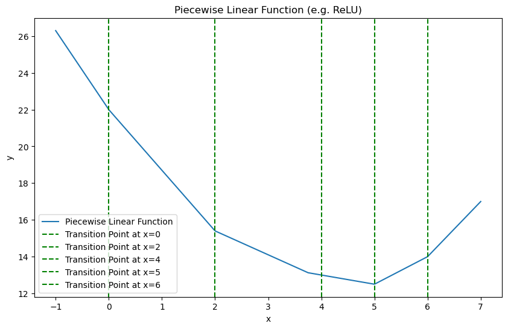

# Neural Networks Activation Functions
Activation functions are the internal functions of neurons that calculate the output of the neuron. Activation functions are non-linear functions. The non-linearity of the activation functions is a key factor in the success of neural networks which make them different from linear models like linear regression and make them capable of learning complex patterns from the data.

Let's discuss some of the common activation functions.

## Sigmoid Function

$$g(z) =\sigma(z) = \frac{1}{1 + e^{-z}}$$

The Sigmoid function is mainly used in the output layer rather than hidden layers. It's used in the output layer of binary classification problems. More on that [here](classification.md#sigmoid-function).

## ReLU (Rectified Linear Unit) Function

$$g(z) = \max(0, z)$$

Currently ReLU function is one the most commonly used activation function in neural networks for hidden layers. It's simple and computationally efficient.

**Faster than Sigmoid**: Computation of gradient is faster in ReLU than Sigmoid function due to the fact that ReLU only get's flat in one side (when $z < 0$) and the gradient is 0 in that side. However, Sidmoig tends to get flat in both sides which makes the gradients very small and gradient descent very slow.

## Linear Activation Function

$$g(z) = z$$

As we discussed in [Neural Network with One Neuron](neural_networks_inference.md#neural-network-with-one-neuron), we can have a neuron which has no activation function. In that case, the output of the neuron will be the linear transformation of the input.

This is also called **No Activation Function**: We can argue that this is not an activation function as we output the linear transformation of the input as is. However, it's sometimes categorized as an Activation Function and can be used as the output layer, especially in regression problems.

> Choosing No Activation Function (Linear Activation Function) only may be used for neurons of the output layer of regression problems. For hidden layers, avoid using Linear Activation Function as it will make the whole neural network equivalent to a linear model. More on that below.

## Activation Functions Adds Non-Linearity
We can think of neural networks as a series of linear transformations layer by layer. If we don't have any element of _non-linearity_, the whole neural network will be a linear transformation of the input. In that case, no matter how many layers and neurons we add, the neural network will be equivalent to a linear model like linear regression.

We know from linear algebra, that linear function of a linear function is still a linear function. So, regardless of how many layers and neurons we add, if all of them are just linear transformations, then the whole neural network will be equivalent to a linear regression model and can't learn complex patterns from the data.

Example: 
Let's say we have a neural network with 2 layers without any activation function:
- Input dataset $\vec{\mathbf{x}}$ has 1 feature.
- Layer 1 has 2 neurons.
- Layer 2 (output layer) has 1 neuron.

**Layer 1**: 
$$g(z) = z$$

Neuron 1:

$$a^{[1]}_1 = g(z^{[1]}_1) = z^{[1]}_1 = w^{[1]}_1 \cdot x + b^{[1]}_1$$

Neuron 2:
$$a^{[1]}_2 = g(z^{[1]}_2) = z^{[1]}_2 = w^{[1]}_2 \cdot x + b^{[1]}_2$$

Layer 1 output:
$$\vec{\mathbf{a}}^{[1]} = \begin{bmatrix} a^{[1]}_1 \\ a^{[1]}_2 \end{bmatrix} = \begin{bmatrix} w^{[1]}_1 \cdot x + b^{[1]}_1 \\ w^{[1]}_2 \cdot x + b^{[1]}_2 \end{bmatrix}$$

**Layer 2**: 
Neuron 1:

$$z^{[2]}_1 = w^{[2]}_1 \cdot a^{[1]}_1 + w^{[2]}_2 \cdot a^{[1]}_2 + b^{[2]}$$

$$a^{[2]}_1 = g(z^{[2]}_1) = z^{[2]}_1 = w^{[2]}_1 \cdot (w^{[1]}_1 \cdot x + b^{[1]}_1) + w^{[2]}_2 \cdot (w^{[1]}_2 \cdot x + b^{[1]}_2) + b^{[2]}$$

If we expand the above equation, we get:

$$a^{[2]}_1 = w^{[2]}_1 \cdot w^{[1]}_1 \cdot x + w^{[2]}_1 \cdot b^{[1]}_1 + w^{[2]}_2 \cdot w^{[1]}_2 \cdot x + w^{[2]}_2 \cdot b^{[1]}_2 + b^{[2]}$$

Now if we simplify the above equation, we get:

$$a^{[2]}_1 = \underbrace{(w^{[2]}_1 \cdot w^{[1]}_1 + w^{[2]}_2 \cdot w^{[1]}_2) \cdot}_{w} x + \underbrace{(w^{[2]}_1 \cdot b^{[1]}_1 + w^{[2]}_2 \cdot b^{[1]}_2 + b^{[2]})}_{b}$$

So, overall it becomes a linear transformation of the input $x$.

$$a^{[2]}_1 = w \cdot x + b$$

So, as we see the output of the neural network with no activation function (only linear transformations) is again a linear transformation of the input.

> Even if we only add activation function to the output layer, and keep the rest of the layers with no activation function, then the whole network up to the output layer becomes just a large linear transformation of the input. Then if the output layer is for example a Sigmoid function, the whole network will be equivalent to just a logistic regression model.

**Non-Linearity**: 
So, it's crucial for neural networks to have non-linear activation functions in the neurons of the hidden layers. We need non-linearity to be added to the model to make it capable of learning complex patterns from the data.

This non-linearity is added by the activation functions in each neuron.

**ReLU is a Piecewise Linear Function**: 
When looking at the ReLU function, we may think this is also a linear funciton as it's just a linear function with a threshold at 0. However, to be accurate, ReLU is a **piecewise linear** function which means it has a **off** range where the output is zero. This range let the ReLU function to make non-linear output.

We can create a non-linear output by composing linear pieces (piecewise linear).

The above plot shows an overall non-linear output which is made of 5 piecewise linear functions. ReLU's non-linear behavior provides the ability to turn functions **off** until they are needed.

ReLU is defined as:
$$\text{ReLU}(x) = \max(0, x)$$

In the above example: 

- 1st linear piece: $\text{ReLU}(x)$

- 2nd linear piece: $\text{ReLU}(2x - 4)$

- 3rd linear piece: $\text{ReLU}(-0.8x + 3)$

- 4th linear piece: $\text{ReLU}(-2x + 10)$

- 5th linear piece: $\text{ReLU}(-1.5x + 9)$

So, now to find the overall function made of these linear pieces, we add them up:

$y= \text{ReLU}(x) + \text{ReLU}(2x - 4) + \text{ReLU}(-0.8x + 3) + \text{ReLU}(-2x + 10) + \text{ReLU}(-1.5x + 9)$

See more details and the code sample of the above [here]().

At transition points (shown by dotted green lines), a new linear function is added which add a new piece to the overall function and produce a new slope. The new function which is added at the transition point, does not contribute to the output prior to that point (defined by the bias). The linear piece stay turned off until it reaches the transition point. From the point onward, it will contribute to the output.

Important note, is that when the linear piece is turned on, then it continue to contribute (impact) the output from the transition point onward. So, the final linear piece is a combined influences of all the activated linear pieces.

Example: 
We have a neural network with 2 layers.
- Layer 1 has 5 neurons with ReLU activation function.
- Layer 2 (output layer) 1 neuron with activation function $g$.

Each neuron in layer 1 is responsible for one piece of the overall output which then feed to the second layer.

**Layer 1 Neurons**: 
$$g(z) = \text{ReLU}(z)$$

Neuron 1 has $w^{[1]}_1 = 1$, $b^{[1]}_1 = 0$ 
$$z= x + 0$$
$$a^{[1]}_1 = \text{ReLU}(x + 0 ) = \text{ReLU}(x)$$

Neuron 2 has $w^{[1]}_2 = 2$, $b^{[1]}_2 = -4$ 
$$z= 2x - 4$$
$$a^{[1]}_2 = \text{ReLU}(2x - 4)$$

Neuron 3 has $w^{[1]}_3 = -0.8$, $b^{[1]}_3 = 3$ 
$$z= -0.8x + 3$$
$$a^{[1]}_3 = \text{ReLU}(-0.8x + 3)$$

Neuron 4 has $w^{[1]}_4 = -2$, $b^{[1]}_4 = 10$ 
$$z= -2x + 10$$
$$a^{[1]}_4 = \text{ReLU}(-2x + 10)$$

Neuron 5 has $w^{[1]}_5 = -1.5$, $b^{[1]}_5 = 9$ 
$$z= -1.5x + 9$$
$$a^{[1]}_5 = \text{ReLU}(-1.5x + 9)$$

**Layer 2 Neuron**: 
$$z^{[2]}_1 = w^{[2]}_1 \cdot a^{[1]}_1 + w^{[2]}_2 \cdot a^{[1]}_2 + w^{[2]}_3 \cdot a^{[1]}_3 + w^{[2]}_4 \cdot a^{[1]}_4 + w^{[2]}_5 \cdot a^{[1]}_5 + b^{[2]}$$

Which can be written as:
$$z^{[2]}_1 = w^{[2]}_1 \cdot \text{ReLU}(x) + w^{[2]}_2 \cdot \text{ReLU}(2x - 4) + w^{[2]}_3 \cdot \text{ReLU}(-0.8x + 3) + w^{[2]}_4 \cdot \text{ReLU}(-2x + 10) + w^{[2]}_5 \cdot \text{ReLU}(-1.5x + 9) + b^{[2]}$$

Each unit in the first layer is responsible for a piece of the overall function. Unit 1 is responsible for the first piece ($x \leq 0$), unit 2 is responsible for the second piece ($x > 0$ and $x \leq 2$) and it stay quiet until after the transition point when $x > 2$. Similarly, unit 3 is responsible for the third piece ($x > 2$ and $x \leq 4$), and so on.

So, the input to the second layer neuron is the sum of the outputs of the piecewise linear functions of the first layer neurons which has complex non-linear patterns thanks to the **off** ability of the ReLU function. ReLU keep the unit quiet until after the transition point.

The non-linear activation function is responsible for disabling the input prior to and sometimes after the transition points. The **off** ability of the ReLU enables models to combine together linear segments to create complex non-linear functions. Enough number of these piecewise linear functions with different slopes can create a complex non-linear patterns. This is how the non-linearity is added to the model.

## Choosing the Activation Function

**Output Layer**: 
Choosing the activation function is directly related to the target label and the problem we are trying to solve.
- For **binary classification** problems, we usually use the **Sigmoid** function in the output layer.
- For **multi-class classification** problems, we use the **Softmax** function in the output layer.
- For **regression** problems, we usually use the **Linear** activation function (no activation function) in the output layer.

**Hidden Layers**: 
Regardless of the problem and output layer, the activation function in the hidden layers can be independent of the output layer. Currently **ReLU** is the default and most commonly used activation function for hidden layers of majority of neural networks regardless of the problem and output layer's activation function.
