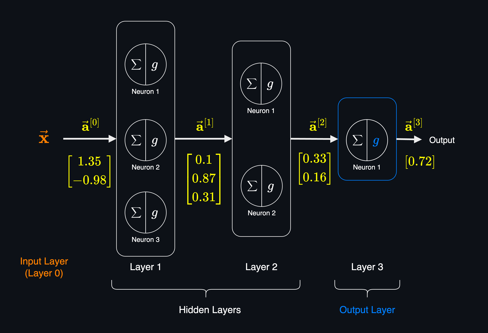

# Neural Networks Inference (Forward Pass)
Forward pass (also called **Forward Propagation**) is the process of passing the input features $\vec{\mathbf{x}}$ through the first layer, then calculate the output of the first layer $\vec{\mathbf{a}}^{[1]}$, then pass this output to the second layer and calculate the output of the second layer $\vec{\mathbf{a}}^{[2]}$, and so on until we reach the output layer.

As the name suggests, in the forward pass, we _pass_ the input features _forward_ through the network layer by layer to reach the output layer. In other words, we _propagate_ the activations of neurons from the input layer to the output layer.

**Each Layer Inputs a Vector and Outputs another Vector**:<br>
As we discussed, each layer inputs a vector of scalar values (features) and outputs another vector of scalar values (activation values of the neurons in that layer). The output of the layer is the input of the next layer and so on.

So, $\vec{\mathbf{a}}^{[1]}$ is the input vector (features) for the second layer, $\vec{\mathbf{a}}^{[2]}$ is the input vector for the third layer, and so on.

We can also denote input layer features $\vec{\mathbf{x}}$ as $\vec{\mathbf{a}}^{[0]}$ which represents the the output of the layer zero (input layer) and input vector of the layer 1.

> By convention, when we say a neural network has $l$ layers, it means it has $l-1$ hidden layers and 1 output layer. So, we count the output layer as a layer, but we don't count the input layer. The above example has 3 layers, 2 hidden layers and 1 output layer.

The following shows the details of the input and output of each layer and how they are calculated and connected to each other.


## Weights and Biases of Neurons
Each neuron has a weight for each input feature and a bias term. So, if the input vector for a layer has $n$ features, each neuron in that layer has $n$ weights and 1 bias term. We denote them as $\vec{\mathbf{w}}^{[layer]}_{neuron}$ and $b^{[layer]}_{neuron}$. The weight vector is a vector of weights for each input feature to the neuron. For example, $\vec{\mathbf{w}}^{[2]}_{1}$ and $b^{[2]}_{1}$ are the weight vector and bias term for the first neuron in the second layer.

Each neuron has one weight for each input and one bias in total, so for the above example, the second layer (which is a [fully connected layer](#types-of-layers-and-neuron-connections)):

- Neuron 1: has 3 weights and 1 bias term.
- Neuron 2: has 3 weights and 1 bias term.


In the above example, if the number of input features is 4, then the neural network has total of $26$ parameters.

| Layer | Neurons | Param | Output |
|-|--|-|-|
| 1 | $3$ | $15 = 4 \times 3 + 3$ | $3$ |
| 2 | $2$ | $8 = 3 \times 2 + 2$ | $2$ |
| 3 | $1$ | $3 = 2 \times 1 + 1$ | $1$ |

## Linear Transformation of a Neuron
Linear Transformation of a neuron is calculated by dot product of the weight vector for that neuron and the input vector of the layer (output of the previous layer) plus the bias term:

$$
z^{[l]}_j = \sum_{i=1}^{n^{[l-1]}} w^{[l]}_{j,i} a^{[l-1]}_i + b^{[l]}_j
$$

We can rewrite the above as:

$$z^{[l]}_{j} = \vec{\mathbf{w}}^{[l]}_{j} \cdot \vec{\mathbf{a}}^{[l-1]} + b^{[l]}_{j}$$


Where:
- $l$ is the layer number.
- $j$ is the neuron number in the layer.
- $\vec{\mathbf{w}}^{[l]}_{j}$ is the weight vector for the neuron $j$ in the layer $l$.
- $\vec{\mathbf{a}}^{[l-1]}$ is the output vector of the previous layer (input vector of the current layer).

So, the activation value of neuron $j$ in layer $l$ is calculated as:

```math
a^{[l]}_{j} = g(z^{[l]}_{j}) = g(\vec{\mathbf{w}}^{[l]}_{j} \cdot \vec{\mathbf{a}}^{[l-1]} + b^{[l]}_{j})
```

## Forward Pass Calculation in Practice
In practice, to increase the efficiency of the computation, we use [matrix multiplication](../math/vectors_and_matrices.md#matrix-multiplication) for the **entire layer** instead of calculating the output of each neuron separately.

Most deep learning frameworks like TensorFlow and PyTorch use this matrix multiplication for the entire layer, where data is organized with batch examples in rows $(m, n)$ where $m$ is the number of examples in the batch and $n$ is the number of features.

So, for $m$ examples in the batch:

$$
Z^{[l]} = A^{[l-1]}{W^{[l]}}^\top  + \vec{\mathbf{b}}^{[l]}
$$

Where:
- $Z^{[l]}$ is the output matrix of the layer $l$ with shape of $(m, n^{[l]})$ where $m$ is the number of examples in the batch and $n^{[l]}$ is the number of neurons in the layer $l$.
- $A^{[l-1]}$ is the matrix of activations from the previous layer of shape $(m, n^{[l-1]})$ where $m$ is the number of examples in the batch and $n^{[l-1]}$ is the number of neurons in the previous layer $l-1$. Each row of this matrix is the activation vector of a single example in the batch.
- $W^{[l]}$ is the weight matrix of the layer $l$ with shape of $(n^{[l]}, n^{[l-1]})$ where $n^{[l]}$ is the number of neurons in the layer $l$ and $n^{[l-1]}$ is the number of neurons in the previous layer $l-1$. However, to perform matrix multiplication (activation vector for each example multiple by the corresponding weight vector), the weight matrix is transposed to have the shape of $(n^{[l-1]}, n^{[l]})$.
- $\vec{\mathbf{b}}^{[l]}$ is the bias vector of the layer $l$ with shape of $(n^{[l]})$ where $n^{[l]}$ is the number of neurons in the layer $l$. The bias vector is broadcasted to each row of the output matrix. In other words, it will be converted to a matrix of shape $(1, n^{[l]})$ and then added to each row of the output matrix.

Activation matrix, where each row is the activation vector of a single example in the batch:

$$A^{[l-1]}=\begin{bmatrix}
{\vec{\mathbf{a}}^{[l-1]}}^{(1)} \\
{\vec{\mathbf{a}}^{[l-1]}}^{(2)} \\
\vdots \\
{\vec{\mathbf{a}}^{[l-1]}}^{(m)}
\end{bmatrix}$$


Where:
- ${\vec{\mathbf{a}}^{[l-1]}}^{(j)}$ is the activation vector of the $j^{th}$ example in the batch.

If we expand that, each row of the activation matrix has features of a single example in the batch:

$$A^{[l-1]}=\begin{bmatrix}
{a^{[l-1]}_{1}}^{(1)} & {a^{[l-1]}_{2}}^{(1)} & \cdots & {a^{[l-1]}_{n^{[l-1]}}}^{(1)} \\
{a^{[l-1]}_{1}}^{(2)} & {a^{[l-1]}_{2}}^{(2)} & \cdots & {a^{[l-1]}_{n^{[l-1]}}}^{(2)} \\
\vdots & \vdots & \ddots & \vdots \\
{a^{[l-1]}_{1}}^{(m)} & {a^{[l-1]}_{2}}^{(m)} & \cdots & {a^{[l-1]}_{n^{[l-1]}}}^{(m)}
\end{bmatrix}$$

Where:
- ${a^{[l-1]}_{i}}^{(j)}$ is the $i^{th}$ feature of the $j^{th}$ example in the batch.

This rule applies to the layer zero (input layer) where each row of the input matrix is a single example in the batch:

$$X = A^{[0]} = \begin{bmatrix}
\vec{\mathbf{x}}^{(1)} \\
\vdots \\
\vec{\mathbf{x}}^{(m)}
\end{bmatrix}$$


Weight matrix for layer $l$:<br>
Each column of the weight matrix is the weight vector of a neuron in the layer $l$. Each row of the weight matrix is the weight for the input feature (output of the previous layer) to the neuron. That's why we have $n^{[l-1]}$ rows, one for each output of the previous layer (input feature to this layer).

$$
W^{[l]} = \begin{bmatrix}
\uparrow & & \uparrow \\
\vec{\mathbf{w}}^{[l]}_{1} & \cdots & \vec{\mathbf{w}}^{[l]}_{n^{[l]}} \\
\downarrow & & \downarrow
\end{bmatrix}
$$

Which in more details, the weight matrix is:

$$
W^{[l]} =
\begin{bmatrix}
w^{[l]}_{1,1} & w^{[l]}_{1,2} & \cdots & w^{[l]}_{1,n^{[l-1]}} \\
w^{[l]}_{2,1} & w^{[l]}_{2,2} & \cdots & w^{[l]}_{2,n^{[l-1]}} \\
\vdots & \vdots & \ddots & \vdots \\
w^{[l]}_{n^{[l]},1} & w^{[l]}_{n^{[l]},2} & \cdots & w^{[l]}_{n^{[l]},n^{[l-1]}}
\end{bmatrix}
$$

Where:
- $w^{[l]}_{j,i}$ is the weight for the input feature $i$ to the neuron $j$ in the layer $l$. In a fully connected layer, each neuron in layer $l$ has a weight for output of each neuron in the previous layer $l-1$. So, $n^{[l]}$ is the number of neurons in the layer $l$ and $n^{[l-1]}$ is the number of neurons in the previous layer $l-1$.

**Transpose of $W^{[l]}$**:<br>
The shape of $W^{[l]}$ is $(n^{[l]}, n^{[l-1]})$. However to produce matrix $Z$ where each row corresponding to the linear transformation of a neuron for each example in the batch, we need to calculaate the dot produce of rows of $A^{[l-1]}$ with the weight vector of first neuron, second neuron, and so on. So, we need the weight vector of the neuron to be stacked as a column. So, we transpose the weight matrix to have the shape of $(n^{[l-1]}, n^{[l]})$.

[Transpose](/math/vectors_and_matrices.md#transpose-of-a-matrix) of $W^{[l]}$ is denoted as ${W^{[l]}}^\top$ which the weights of the neurons are stacked as columns, meaning that each column represents the weight vector of a neuron.

The output of the layer $l$ is calculated as:
$$A^{[l]} = g(Z^{[l]})$$


Where:
- $A^{[l]}$ is the output matrix of the layer $l$ with shape of $(m, n^{[l]})$ where $m$ is the number of examples in the batch and $n^{[l]}$ is the number of neurons in the layer $l$.
- $Z^{[l]}$ is the output matrix of the linear transformation of the neurons in the layer $l$ with shape of $(m, n^{[l]})$ where $m$ is the number of examples in the batch and $n^{[l]}$ is the number of neurons in the layer $l$.

> By convention, deep learning frameworks like TensorFlow and PyTorch, a batch of examples is represented as a matrix (2D tensor) where each **row** is a single example in the batch and each column is a feature of the example. This convention goes throughout the calculations of linear transformation matrix $Z$ and activation matrix $A$.
>
> In some text, you may see $Z^{[l]} = {A^{[l-1]}}^\top W^{[l]} + \vec{\mathbf{b}}^{[l]}$ where the input matrix is transposed. This is mathematically equivalent to the above, but with the difference that input examples are represented as **columns** instead of rows. However, it's more common to represent examples as rows in deep learning frameworks.


**Example:**<br>
If we have:
- Layer $l$ with $2$ neurons. Layer $l$ is a fully connected layer (dense).
- Layer $l-1$ has $3$ neurons.
- We have batch size of $3$ (3 examples).

The input from layer $l-1$ to layer $l$ is a matrix of shape $(3, 3)$ where each row is the activation vector of a single example in the batch:

$$ A^{[l-1]} = \begin{bmatrix} {a^{[l-1]}_{1}}^{(1)} & {a^{[l-1]}_{2}}^{(1)} & {a^{[l-1]}_{3}}^{(1)} \\
{a^{[l-1]}_{1}}^{(2)} & {a^{[l-1]}_{2}}^{(2)} & {a^{[l-1]}_{3}}^{(2)} \\
{a^{[l-1]}_{1}}^{(3)} & {a^{[l-1]}_{2}}^{(3)} & {a^{[l-1]}_{3}}^{(3)} \end{bmatrix}$$

Where:
- ${a^{[l-1]}_{i}}^{(j)}$ is the $i^{th}$ feature of the $j^{th}$ example in the batch, outputed from the layer $l-1$.

Then, the linear transformation (before activation) for the dense layer with 2 neurons is:

$$
Z^{[l]} = A^{[l-1]} W^{[l]^T} + \vec{\mathbf{b}}^{[l]}
$$

Where:

```math
=\begin{bmatrix}
{a^{[l-1]}_{1}}^{(1)} & {a^{[l-1]}_{2}}^{(1)} & {a^{[l-1]}_{3}}^{(1)} \\
{a^{[l-1]}_{1}}^{(2)} & {a^{[l-1]}_{2}}^{(2)} & {a^{[l-1]}_{3}}^{(2)} \\
{a^{[l-1]}_{1}}^{(3)} & {a^{[l-1]}_{2}}^{(3)} & {a^{[l-1]}_{3}}^{(3)}
\end{bmatrix}
\begin{bmatrix}
w^{[l]}_{1,1} & w^{[l]}_{2,1}  \\
w^{[l]}_{1,2} & w^{[l]}_{2,2} \\
w^{[l]}_{1,3} & w^{[l]}_{2,3}
\end{bmatrix}
+
\begin{bmatrix}
b^{[l]}_1 & b^{[l]}_2 & b^{[l]}_3 \\
\end{bmatrix}
```
Resulting in:

```math
Z^{[l]} = \begin{bmatrix}
z^{[l]}_{1,1} & z^{[l]}_{2,2} \\
z^{[l]}_{1,2} & z^{[l]}_{2,2} \\
z^{[l]}_{1,3} & z^{[l]}_{2,3}
\end{bmatrix}
```

Where:
- $z^{[l]}_{j,i}$ is the linear transformation of the $i^{th}$ example in the batch for the $j^{th}$ neuron in the layer $l$.

Which by applying the activation function $g$ to the linear transformation, we get the output of the layer $l$:

$$
A^{[l]} = g(Z^{[l]}) =
\begin{bmatrix}
{\vec{\mathbf{a}}^{[l]}}^{(1)} \\
{\vec{\mathbf{a}}^{[l]}}^{(2)} \\
{\vec{\mathbf{a}}^{[l]}}^{(3)}
\end{bmatrix}
$$

Where:
- ${\vec{\mathbf{a}}^{[l]}}^{(j)}$ is the activation vector of the $j^{th}$ example in the batch.

So the output of the layer $l$ is the activation matrix where each row is the activation vector of a single example in the batch, and each column is the activation value of the neurons in the layer $l$.

$$A^{[l]}=\begin{bmatrix}
{a^{[l]}_{1}}^{(1)} & {a^{[l]}_{2}}^{(1)} \\
{a^{[l]}_{1}}^{(2)} & {a^{[l]}_{2}}^{(2)} \\
{a^{[l]}_{1}}^{(3)} & {a^{[l]}_{2}}^{(3)}
\end{bmatrix}$$

Where:
- ${a^{[l]}_{i}}^{(j)}$ is the activation value of $i^{th}$ neuron for the $j^{th}$ example in the batch.

This matrix multiplication is why deep learning becomes very scalable in particular with GPUs. GPUs are optimized for matrix multiplication and can perform these operations very efficiently. This is why deep learning framework such as TensorFlow and PyTorch use 2D tensors to represent parameters and activations.


See this in code example [here]().


## Activation Values are Scalar Numbers
Remember that these input and output vectors are the vectors of activation values which are scalar numbers.

For example using imaginary numbers, the input and output of each layer for a single training example can be represented as:




- $\vec{\mathbf{x}}=\vec{\mathbf{a}}^{[0]}$ is a vector of 2 numbers which is the input vector for the first layer.
- $\vec{\mathbf{a}}^{[1]}$ is the output of the first layer which is a vector of 3 numbers. This vector is the input vector for the second layer.
- $\vec{\mathbf{a}}^{[2]}$ is the output of the second layer which is a vector of 2 numbers. This vector is the input vector for the third layer.
- $\vec{\mathbf{a}}^{[3]}$ is the output of the third layer (output layer) which is a vector of 1 number. This number is the output of the neural network and based on that we can predict the target variable $\hat{y}$.

## Activation Functions for Each Layer
Each layer can have a different activation function.
- The hidden layers can have the same activation function or different activation functions depending on the problem and performance.
- The **output layer** is determined by the type of the problem we are solving. The output of this layer should provide the model's prediction, so we choose the activation function of this layer based on what we are predicting. For example, if we are solving a binary classification problem, we can use the Sigmoid Function as the activation function of the output layer, and if we are solving a multi-class classification problem, we can use the **Softmax** Function as the activation function of the output layer.

**Logit**:<br>
For the classification problems, where the output layer has an activation function like **Softmax** or **Sigmoid**, the Linear Transformation of the output layer is also called **Logit**. The logit is the output of the output layer before applying the activation function.


**Derive the Prediction of $\hat{y}$ from the Output of the Neural Network**:<br>

The output of the neural network is the output of the output layer. The output layer is the last layer of the neural network.

Depending on the problem we are solving and the output layer activation function, we derive the prediction of the target variable $\hat{y}$ in different ways. For example, if we are solving regression problems, the output of the neural network is the prediction of the target variable $\hat{y}$ without any further processing. But if we are solving classification problems, we usually use **Softmax** or **Sigmoid** activation functions in the output layer, and the output of the neural network need further processing to derive the prediction of the target variable $\hat{y}$.


Let's say in the above example we are solving a binary classification problem, and we designed the output layer to have only one neuron with Sigmoid function as the activation function. The output of the neural network is the output of this neuron:

```math
\vec{\mathbf{a}}^{[3]} = \begin{bmatrix} a^{[3]}_1 \\
\end{bmatrix}
```

Which

```math
a^{[3]}_1 = \sigma(z^{[3]}_1) = \sigma(\vec{\mathbf{w}}^{[3]}_{1} \cdot \vec{\mathbf{a}}^{[2]} + b^{[3]}_{1})
```


We interpret it as the conditional probability that the class label $y$ is **1** given the input $\vec{\mathbf{x}}$:

$$a^{[3]}_1=P(y = 1 \mid \vec{\mathbf{x}})$$

If we set our decision threshold to $0.5$, we can define the predicted class:

$$
\hat{y} =
\begin{cases}
1, & P(y = 1 \mid \vec{\mathbf{x}}) \geq 0.5 \\
0, & P(y = 1 \mid \vec{\mathbf{x}}) < 0.5
\end{cases}
$$

Which means if the output of the neural network is greater than or equal to $0.5$, we predict the class label as $1$, otherwise we predict the class label as $0$.

The above can be also written as in a more compact form:

$$\hat{y} = \mathbb{1} \{ P(y = 1 \mid \vec{\mathbf{x}}) \geq 0.5 \}$$

where $\mathbb{1} \{\cdot\}$ is the **indicator function** that returns $1$ if the condition inside is true and $0$ otherwise.


For our specific example which the output of the neural network is $0.72$:

$$
a^{[3]}_1 = P(y = 1 \mid \vec{\mathbf{x}}) = 0.72 \quad \Rightarrow \quad \hat{y} = 1
$$


## Neural Network as a Function
A nerual network can be seen as a composite function made of one or many internal functions (activation functions and their parameters).

We can write a neural network as a function $f$ that takes an input vector $\vec{\mathbf{x}}$ and produces an output vector $\vec{\mathbf{y}}$:

$$
f_{\mathbf{W}, \mathbf{B}}(\mathbf{x})
\;=\;
f^{(l)}\bigl(\,f^{(l-1)}(\cdots f^{(1)}(\mathbf{x})\cdots)\bigr),
$$


Where:
- $\mathbf{W}$ represent the **collection** of all weight matrices $\mathbf{W}^{(1)}, \mathbf{W}^{(2)},\dots,\mathbf{W}^{(L)}$ in each layer, flattened or treated together as one “big” parameter vector/matrix.
- $\mathbf{B}$ can represent the **collection** of all bias vectors (one bias vector per layer), similarly combined.
- $f^{(l)}$ is the function of the layer $l$ which takes the output of the previous layer $l-1$ as input and produces the output of the layer $l$.


$$f_{{\mathbf{W}}, {\mathbf{B}}} (\vec{\mathbf{x}}) = \hat{y}$$


> Note that $\mathbf{W}$ and $\mathbf{B}$ can each be a collection of layer-wise matrices/vectors rather than a single matrix or vector. However, grouping them into “big” parameter objects is quite standard in many notations.

Using the simplified notation, we can denote all the weights and biases of the neural network as $\theta$:

$$f_{\theta}(\vec{\mathbf{x}}) = \hat{y}$$

Where $\theta$ is the collection of all weights and biases of the neural network.


## Neural Network with One Neuron
In the most simplest form, a neural network can have only one layer with one neuron. This is called a **Single Layer Perceptron**.

**Neuron with No Activation Function**:<br>
As we discussed, each neuron has two steps of calculation, the linear step (Linear Transformation) and the activation step. If we drop the second step (activation step), the output of the neuron is the Linear Transformation of the neuron.

```math
a^{[l]}_{j} = z^{[l]}_{j} = \vec{\mathbf{w}}^{[l]}_{j} \cdot \vec{\mathbf{a}}^{[l-1]} + b^{[l]}_{j}
```

Knowing that we have only one neuron and one layer, we can drop the superscript $l$ and subscript $j$, and write $\vec{\mathbf{x}}$ instead of $\vec{\mathbf{a}}^{[l-1]}$:

Linear Transformation:

$$z = \vec{\mathbf{w}} \cdot \vec{\mathbf{x}} + b$$

Activation Function:

$$\text{No Activation Function}$$
So, the output of the neuron is the Linear Transformation of the neuron.

$$z = a$$

Since there is only one neuron in the layer, and the model has only one layer, the output of the neuron is the output of the whole neural network. Also, since there is no activation function, the output of the neuron is the Linear Transformation of the neuron.

$$ z = a = \hat{y} $$

Therefore, the function of the neural network is:

$$f_{{\mathbf{W}}, {\mathbf{B}}} (\vec{\mathbf{x}}) = z$$

So, a neural network with one neuron in one layer without the activation function (no activation step) is equivalent to the linear transformation of the input features (Linear Transformation):

$$f_{{\mathbf{W}}, {\mathbf{B}}} (\vec{\mathbf{x}}) = \vec{\mathbf{w}} \cdot \vec{\mathbf{x}} + b$$


Recall, the above is equivalent to the linear regression model which is defined as:

$$f_{\vec{\mathbf{w}}, b}(\vec{\mathbf{x}}^{(i)}) = \vec{\mathbf{w}} \cdot \vec{\mathbf{x}}^{(i)} + b$$

Where $\vec{\mathbf{x}}^{(i)}$ is the $i^{th}$ input feature vector.


**Single Neuron with Activation Function**:<br>
Now if we take the previous example and add an activation function to the neuron, the output of the neuron is the output of the activation function applied to the Linear Transformation of the neuron.

Linear Transformation:
$$z = \vec{\mathbf{w}} \cdot \vec{\mathbf{x}} + b$$

Activation Function:

$$a = g(z)$$

Since $a$ in the neural network with one layer and one neuron is the output of the whole neural network, the output of the neural network is:

$$f_{{\mathbf{W}}, {\mathbf{B}}} (\vec{\mathbf{x}}) = a = g(z)$$

If we choose the Sigmoid Function as the activation function, the output of the neuron is:


$$f_{{\mathbf{W}}, {\mathbf{B}}} (\vec{\mathbf{x}}) = \sigma(z)$$

$$f_{{\mathbf{W}}, {\mathbf{B}}} (\vec{\mathbf{x}}) = \frac{1}{1 + e^{-(\vec{\mathbf{w}} \cdot \vec{\mathbf{x}} + b)}}$$

The above is the equivalent of a logistic regression model. So, we can say that a neural network with one neuron in one layer with the Sigmoid activation function is equivalent to a logistic regression model.

See this in action [here](https://github.com/pooyavahidi/examples/blob/main/ai/nn_neurons_and_layers.ipynb).

## Activation Functions Types
Activation functions are the internal functions of neurons that calculate the output of the neuron. Activation functions are non-linear functions. The non-linearity of the activation functions is a key factor in the success of neural networks which make them different from linear models like linear regression and make them capable of learning complex patterns from the data.

**Common Activation Functions**:<br>
- Sigmoid Function
- Tanh Function
- ReLU (Rectified Linear Unit) Function
- Softmax Function

**Sigmoid Function**:<br>

$$g(z) =\sigma(z) = \frac{1}{1 + e^{-z}}$$

The Sigmoid function is mainly used in the output layer rather than hidden layers. It's used in the output layer of binary classification problems. More on that [here](classification.md#sigmoid-function).

**ReLU (Rectified Linear Unit) Function**:<br>

$$g(z) = \max(0, z)$$

Currently ReLU function is one the most commonly used activation function in neural networks for hidden layers. It's simple and computationally efficient.

## Implementation of Forward Pass

In the following we use `pytorch` to implement the neural network shown in the above example and how forward pass works.

`x` is the input feature from the dataset. Let's say we 4 input features, so `x` is a [_Tensor_](../math/vectors_and_matrices.md#tensor) of 2 numbers.

```python
import torch.nn as nn
import torch.nn.functional as F

class NeuralNetwork(nn.Module):
    def __init__(self):
        super().__init__()

        # First hidden Layer - fully connected layer (Dense)
        self.layer_1 = nn.Linear(in_features=4, out_features=3)

        # Second hidden Layer - fully connected layer (Dense)
        self.layer_2 = nn.Linear(in_features=3, out_features=2)

        # Output Layer - fully connected layer (Dense)
        self.layer_3 = nn.Linear(in_features=2, out_features=1)

    def forward(self, x):
        # z1 = linear transformation of x passed to layer 1
        z1 = self.layer_1(x)
        # a1 = activation of z1
        a1 = F.relu(z1)

        # z2 = linear transformation of a1 passed to layer 2
        z2 = self.layer_2(a1)
        # a2 = activation of z2
        a2 = F.relu(z2)

        # z3 = final linear transformation (logits)
        z3 = self.layer_3(a2)
        # a3 = activation of z3 (final activation)
        a3 = F.sigmoid(z3)

        return a3
```
We can see how the output of each layer is passed as the input to the next layer, hence the **forward pass**.


In a more simpler way we can write the above code as:

```python
class NeuralNetwork(nn.Module):
    def __init__(self):
        super().__init__()

        self.fc_stack= nn.Sequential(
            nn.Linear(in_features=4, out_features=3),
            nn.ReLU(),
            nn.Linear(in_features=3, out_features=2),
            nn.ReLU(),
            nn.Linear(in_features=2, out_features=1),
            nn.Sigmoid()
        )

    def forward(self, x):
        output = self.fc_stack(x)
        return output
```
Using `Sequential` we can simply stack the layers on top of each other and then the input of $X$ which is a [2D tensor](../math/vectors_and_matrices.md#tensor) is passed to `Sequential` which it pass it to the first layer and then takes care of passing the output of each layer to the next layer until the final output is produced.

**Prediction**:<br>
In this example, to derive $\hat{y}$ from the output of the neural network, we can simply check the value of $a3$ and if it's greater than or equal to the threshold (in this example 0.5):

```python
# Create an instance of the model
model = NeuralNetwork()

# Get model's prediction by passing the input feature x.
a3 = model(x)

# Derive the classifcation prediction from the output.
if a3 >= 0.5:
    y_hat = 1
else:
    y_hat = 0
```

**Input Features**:<br>
In `PyTorch`, fully connected (linear) layers expect the input to be a 2D tensor with shape of:

`(rows = number of examples, columns=number of features)`.

- The first dimension is the batch size (number of examples).
- The second dimension is the number of features per example.

So, for exmple for a dataset with 4 input features, a batch of 32 samples should have shape `(32, 4)`.

More on [PyTorch Neural Network](https://pytorch.org/tutorials/beginner/basics/buildmodel_tutorial.html#define-the-class)
