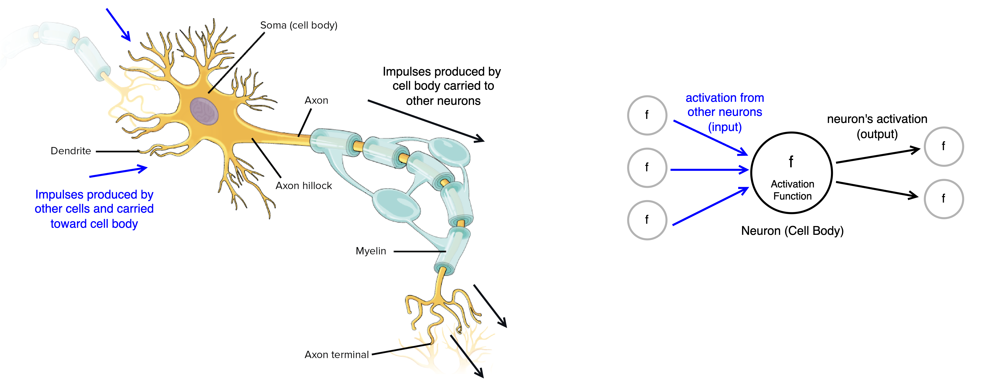
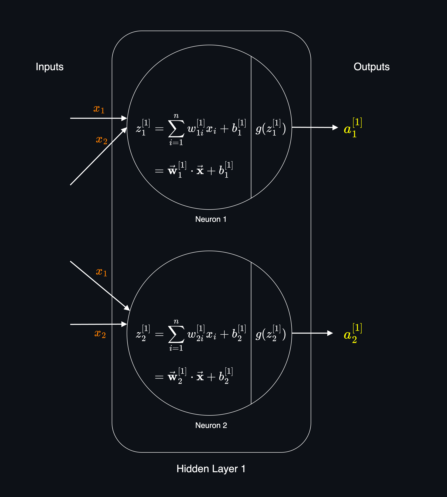

Neural Networks are a class of machine learning algorithms that are inspired by the structure of the human brain. This idea started in 1940s to build algorithms that could mimic the human brain.

While Neural Networks have been around for a long time, they resurge in poplularity in 2000s due to the increase in computational power and the availability of large datasets, under new branding as **Deep Learning**

_Artificial Neural Networks (ANN)_ is another name for neural networks which explicitly distinguishes them from biological neural networks (human brain).

Source: [Khan Academy - Overview of neuron structure and function](https://www.khanacademy.org/science/biology/human-biology/neuron-nervous-system/a/overview-of-neuron-structure-and-function)

Although the structure of a neural network is inspired by the human brain, not only it's a very simplified version of it, but also we still have a very little understanding of how the human brain works. So, it's good to know the origin and similarities, but we should see the neural networks as a mathematical and engineering model rather than the biological motivation behind neural networks.

**Performance of ML Algorithms with respect to Data Size:** 
During time as the amount of data available to train models has increased, AI researchers have found that the performance of traditional algorithms (Linear Regression, Logistic Regression, Decision Trees, etc.) plateaus after a certain amount of data. In other words, the performance of these algorithms does not improve significantly after a certain amount of data is provided to them. After that point, no matter how much more data we provide, the performance of these algorithms does not improve significantly.

However, the performance of Neural Networks continues to improve with more data.

So, if we have a large amount of data, a large neural network can effectively learn from it and provide the best possible performance in comparison to other ML algorithms.

This capability of Neural Networks comes from the fact, that Neural Networks can have many layers of neurons, and more neurons mean more parameters to learn. This allows them to learn complex patterns from the large amount of data.

We also should note that training large neural networks with large datasets requires a lot of computational power. So, both the increase in size of datasets and computational power (GPUs, etc) have contributed to the resurgence of Neural Networks in recent decades, which will be continued as both of these factors continue to grow.

## Structure of a Neural Network

**Neurons**: 
Think of a neuron as a simple function that takes some inputs, does some calculations and produces an output. Neurons are also called **nodes** or **units**.

Inspired by the human brain neurons, the following terms are used in neural networks, where a neuron is a computational unit and generate an activation which send down to the other downstream neurons.
- **Activation Unit**: A neuron.
- **Activation**: The output of a neuron denoted as $a$. It also called _activation value_ or _activation output_. In some text, it's also denoted as $h$.
- **Activation Function**: The internal function of a neuron that calculates the output of the neuron. The activation function is denoted as $g$.

All the inputs to a neuron are multiplied by some weights (parameters of the neuron), summed up to calculate the **Linear Transformation** of the neuron, and then passed through an **activation function** to produce the output of the neuron.

Some of the most common activation functions are:
- ReLU (Rectified Linear Unit) Function
- Sigmoid Function
- Tanh Function
- Softmax Function

More on activation functions [here](neural_networks_activation_functions.md).

**Layers:** 
Neural Network is a collection of layers of neurons. Each layer is a collection of neurons that are connected to the neurons in the previous layer. The first layer is called the **Input Layer** and the last layer is called the **Output Layer**. The layers between the input and output layers are called **Hidden Layers**.

> The term **hidden** inspired by the fact that these layers are not directly connected to the input or output of the network. When we have a training dataset, we can observe both input $X$ and output $Y$ of the dataset. But we can't observe the output of the hidden layers in the training set. So, they are called hidden layers.

In a semantic way, each neuron represents a **feature**.
- If a neuron is in the input layer, it represents an input feature.
- If a neuron is in hidden layers, it represents a learned feature.
- If a neuron is in the output layer, it represents an output class.

A layer can have one or more neurons. The number of neurons in the input layer is determined by the number of input features in the dataset. The number of neurons in the output layer is determined by the number of classes which we want to predict.

Think of a neural networks of multiple layers which each layer inputs a vector of features and outputs another vector of features. The output of the previous layer is the input of the next layer.

**Depth and Width**: The number of layers in a neural network is called the **depth** of the network. The more layers, the deeper the network. The number of neurons in a layer is called the **width** of the network. The more neurons, the wider the network.

**Neural Network Architecture**: When creating a neural network, we should decide the depth and width (number of layers and number of neurons in each layer) of the network. This is called **architecture** of the network. The architecture of the network is a hyperparameter that we should decide before training the network.

### Types of Layers and Neuron Connections
The connection between neurons in different layers is called **edges**. Each edge has a **weight** which is a parameter that the neural network learns during training.

Depending on the type of the layer, the connections between neurons can be different. There are three main types of layers in a neural network:

- [**Fully Connected Layers (Dense Layers)**](neural_networks_layers.md#fully-connected-layer-dense):
  - Every neuron in this layer is connected to every neuron in the previous layer.
- Convolutional Layers (CNNs):
  - Every neuron in this layer is connected to a subset of neurons in the previous layer.
- Recurrent Layers (RNNs):
  - Every neuron in this layer is connected to every neuron in the previous layer and also to itself.

During training, model tries to learn the best weights for the connections between neurons. The weight of a connection determines the impact of the neuron (feature or learned feature) on the output of the current neuron. The larger the weight, the larger the impact of the feature on the output of the neuron.

A neural network can (and often does) consist of both fully connected layers and other types of layers. These layers are combined depending on the task, type of data, and the architecture of the model. However, a neural network can also consist of only fully connected layers.

More on the neural networks layers [here](neural_networks_layers.md).

**Fully Connected Layers (Dense Layers)**: 
> The term **Perceptron** is original name for one neuron (one computational unit) which was introduced in 1950s. The term **Perceptron** is still used in some contexts to refer to a single neuron (a single activation unit). The term **Multi-Layer Perceptron (MLP)** is used to refer to a neural network with multiple layers of neurons.

### Inside the Neurons of a Layer
Let dive a bit deeper into the internal structure of a neurons in a layer.

**Notation For Layers and Neurons**: 
To denote the layers and neurons in a neural network, we use the following notation:

$$z^{[layer]}_{neuron} \quad \vec{\mathbf{w}}^{[layer]}_{neuron} \quad b^{[layer]}_{neuron} \quad a^{[layer]}_{neuron}$$

Where:
- Superscript $[layer]$ is the number of the layer.
- Subscript $neuron$ is the number of the neuron in the layer.

**Each Neuron Performs Two Steps of Calculation**: 

1. **Linear Transformation:** Compute $\vec{\mathbf{w}} \cdot \vec{\mathbf{x}} + b$ to output the $z$. This is also called _pre-activation_.

2. **Activation Step (non-linearity):** Apply the activation function on the output of linear transformation of the neuron. Activation function is responsible for adding [non-linearity](neural_networks_activation_functions.md#activation-functions-adds-non-linearity) to the model.

**Linear Transformation**: 
The weighted sum of the inputs to the neuron which is denoted as:

$$z^{[l]}_{n}$$

Where:
- $[l]$ is the layer number.
- $n$ is the neuron number in the layer.

For example, Linear Transformation of the second neuron in the first layer is denoted as:

$$z^{[1]}_2$$

The Linear Transformation of the first neuron in the first layer is calculated as:

$$z^{[1]}_1 = w^{[1]}_{11} \cdot x_1 + w^{[1]}_{12} \cdot x_2 + b^{[1]}_1$$

Where:

- $w^{[1]}_{11}$ is the weight for input feature $x_1$ to node 1 of layer 1.
- $w^{[1]}_{12}$ is the weight for input feature $x_2$ to node 1 of layer 1.
- $b^{[1]}_1$ is the bias term for node 1 of layer 1. We have only one bias term for each neuron in the layer.

We can write the above as:

$$z^{[1]}_1 = \sum_{i=1}^{n} w^{[1]}_{1i}x_i + b^{[1]}_1$$

> Weight and bias terms for a neuron are denoted as:
> $$w^{[l]}_{ji} \quad \text{and} \quad b^{[l]}_j$$
> Where:
> - $[l]$ indicates the layer number.
> - $j$ indicates the neuron number in the current layer.
> - $i$ indicates the input feature (the neuron number from the previous layer).
>
> Note: We don't have $i$ for the bias term because the bias term is not connected to any neuron in the previous layer. It's just a constant term that is added to the weighted sum of the inputs.

We can also write the Linear Transformation in a simpler form as a dot product of the weight vector and the input feature vector.

$$z^{[1]}_1 = \vec{\mathbf{w}}_1^{[1]} \cdot \vec{\mathbf{x}} + b^{[1]}_1$$

Where:
- $\vec{\mathbf{w}}_1^{[1]}$ is the vector of weights for input features to the first neuron of the first layer.

**Activation of a Neuron**: 

The activation of a neuron is defined as:

$$a^{[layer]}_{neuron} = g(z^{[layer]}_{neuron})$$

So, the activation of the first neuron in the first layer is:

$$a^{[1]}_1 = g(z^{[1]}_1) = g(\vec{\mathbf{w}}_1^{[1]} \cdot \vec{\mathbf{x}} + b^{[1]}_1)$$

Where:
- $[1]$ is the index of the layer, i.e. layer 1.
- subscript $1$ is the index of the neuron in the layer, i.e. neuron 1.

For example, if we choose Sigmoid Function as the activation function, the activation of the first neuron in the first layer is:

$$a^{[1]}_1 = \sigma(z^{[1]}_1)$$

So, the activation $a^{[1]}_1$ of the first neuron in the first layer is calculated as:

$$a^{[1]}_1 = \sigma(z^{[1]}_1) = \sigma(\vec{\mathbf{w}}_1^{[1]} \cdot \vec{\mathbf{x}} + b^{[1]}_1)$$

Which we can write the sigmoid function explicitly as:

$$a^{[1]}_1 = \frac{1}{1 + e^{-(\vec{\mathbf{w}}_1^{[1]} \cdot \vec{\mathbf{x}} + b^{[1]}_1)}}$$

**Output of a Layer**: 
The output of a layer $\vec{\mathbf{a}}^{[layer]}$ is a vector of activation values of the neurons in that layer. For example, the output of the first layer is:

$$\vec{\mathbf{a}}^{[1]} = \begin{bmatrix} a^{[1]}_1\\
a^{[1]}_2 \\
\vdots \\
a^{[1]}_n
\end{bmatrix}$$

where:
- $a^{[1]}_n$ is the activation value of the $n^{th}$ neuron in the first layer.

**Neurons of a Layer has the Same Activation Function**: 
Although in theory mathematically we can have different activation functions for each neuron in a layer, in practice, all neurons in a layer have the same activation function.

However, not only possible for a neural network to have some layers have different activation functions than other layers, but also it's a common practice in some architectures. For example, in many architectures, the hidden layers have the same activation function (like ReLU) and the output layer has a different activation function (like Softmax or Sigmoid) depending on the problem we are solving.

### Each Layer Learns From the Previous Layer
This is the key reason why neural networks are so capable and can learn complex patterns from the data. Because they can learn **new** features from the input features, and then learn **new** features from those learned features, and so on. The deeper (more layers) the neural network, the more new learned features it can have, so the more complex patterns it can learn.

**Learned features** (also called _hidden features_) are the features that neural network learns on its own. They are not provided by the training dataset. The first hidden layer learns features from the input features. The second hidden layer learns from the **learned features** of the first hidden layer, and so on. So, each layer learns higher level features and more complex patterns from the learned features of the previous layer.

This is the key difference comparing to othe ML algorithms which the model is limited to the features that we provide to it. As we discussed in [feautre engineering](feature_engineering.md), we can engineer new features from the existing features, but this is a manual process and in many cases we can't engineer all possible relevant features. Also, we could see that engineering new features can cause problems like [curse of dimensionality](feature_engineering.md#dimensionality-reduction) and [overfitting](generalization.md#overfitting). But in neural networks, the model can learn new features automatically and much more efficiently than manual feature engineering.

**Last Hidden Layer and Output Layer**: 
An intuitive way to think about a neural network is that just look at the last hidden layer and the output layer. This about the last hidden layer output as the input feature and the output layer as the model that predicts the target variable. But the key difference is that the last hidden layer features are **not** the original input features from our training dataset, but they are the **learned** and more complex features that learned from previous layers (other learned features) until they reach the last hidden layer. So, we changing the original input features with these learned features, to make the model more capable to learn complex patterns from the original data.

**Example** 
Let's say we want to classify images of persons. An image is a matrix of pixels. For example for a $100 \times 100$ pixel image, we have $10,000$ pixels. If the image is grayscale (black and white), each pixel has only one value between 0 and 255 which called _pixel intensity_ (a value between 0 which is the complete black and 255 which is the complete white). So, this image can be represented as a $100\times100$ matrix of scalar values between 0 and 255. We can flatten this matrix as a vector of $10,000$ values.

$$
\vec{\mathbf{x}} = \begin{bmatrix} x_1\\
x_2 \\
\vdots \\
x_{10000}
\end{bmatrix}
= \begin{bmatrix} 38\\
231 \\
\vdots \\
85
\end{bmatrix}
$$

Where $x_i$ is the intensity of the $i^{th}$ pixel. $x_1$ is the first pixel in the first row, $x_2$ is the second pixel in the first row, $x_{101}$ is the first pixel in the second row, and so on.

Colored images use the RGB (Red, Green, Blue) color channels. In those images, each pixel has 3 values (one for each channel) between 0 and 255. So, a $100 \times 100$ image in RGB color has $30,000$ values. We can then flatten that image as a vector of $30,000$ values.

> Flattening the dimensions of the features is not always necessary. It depends on the type of neural network and the data. For a _Fully Connected Layers_ (Linear) flattening is necessary as these layers require all features to be in a vector form. But for _Convolutional Layers (CNN)_ or _Recurrent Layers (RNN)_ flattening is not necessary.

**Each layer learns a more complex feature from learned-features of the previous layer** 
The first layer of the neural network can learn features like edges, corners, and textures from the input image. The second layer can learn features like shapes, objects, and patterns from the learned features of the first layer. The third layer can learn features like faces, objects, and scenes from the learned features of the second layer. And so on.

Source: [Convolutional Deep Belief Networks
for Scalable Unsupervised Learning of Hierarchical Representations](https://web.eecs.umich.edu/~honglak/icml09-ConvolutionalDeepBeliefNetworks.pdf)

So, the neural network can learn complex patterns from the input data by learning new features from the learned features of the previous layer on its own. We don't need to engineer these features manually or even know what these features are. The neural network learns these features from low level features (like edges, corners, and textures) to high level features (like faces, objects, and scenes) completely on its own.

Further reading here: [Understanding Neural Networks Through Deep Visualization](https://arxiv.org/abs/1506.06579)

## Inference (Forward Pass)

See [Neural Networks Inference (Forward Pass)](neural_networks_inference.md)

## Training
Similar to training a [linear regression model](regression.md), training a neural network involves finding the optimal weights and biases that minimize the error between the predicted output and the actual output. The steps of training a neural network are very similar to those of training a linear regression model:

**1. Define the model**: Specify the neural network model $f_{W,B}(X)=?$ by defining the input, output and internal architecture of the network:
   - The [number and types of layers](neural_networks_layers.md) and the number of neurons in each layer.
   - The [activation functions](neural_networks_activation_functions.md) in each layer, and particularly the activation function of the output layer based on the type of the problem (regression, binary classification, or multi-class classification, etc).
   - The [loss function](loss_and_cost_functions.md) according to output layer.

[**2. Gradient Descent**](gradient_descent.md): This is the optimization algorithm to minimize the error between the predicted output and the actual output by updating the weights and biases step by step. See the steps of the gradient descent algorithm in the [gradient descent algorithm](gradient_descent.md#gradient-descent-algorithm).

The key components of gradient descent is calculating the _partial derivatives_ of the loss function with respect to the weights and biases of the network. In neural network this alogrithm is called [**backpropagation**](neural_networks_backpropagation.md).
